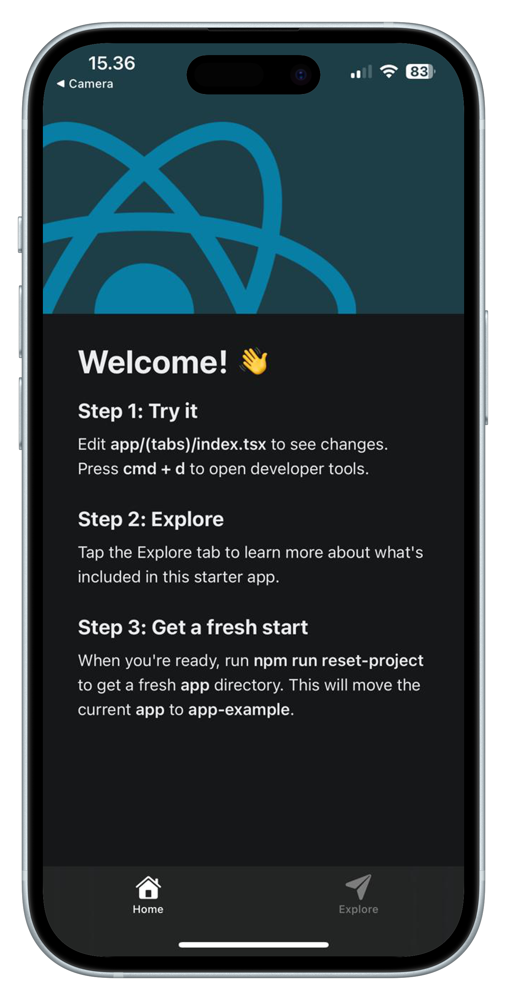
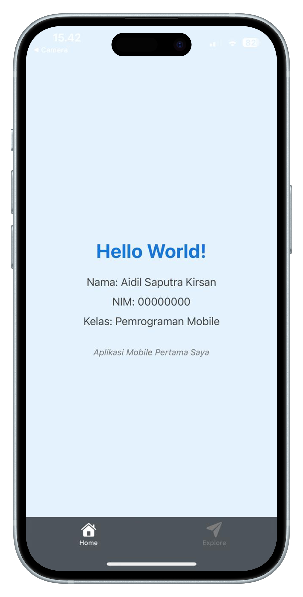

# Modul Praktikum Week 1
## Introduction to Mobile Development dengan React Native

**Mata Kuliah:** Pemrograman Mobile  
**Durasi:** 3 jam (1 sesi praktikum)  
**Tools:** VS Code, Node.js, Expo CLI, Expo Go

---

## 🎯 Learning Objectives

Setelah menyelesaikan praktikum ini, mahasiswa diharapkan mampu:

1. Memahami perbedaan fundamental antara web development dan mobile development
2. Menginstall dan mengkonfigurasi environment React Native dengan Expo terbaru
3. Membuat aplikasi mobile pertama dengan Expo Router
4. Menjalankan aplikasi di smartphone dan web browser
5. Memahami struktur project React Native dengan Expo Router

---

## 📋 Prerequisites

- **Hardware:** Laptop/PC dengan RAM minimal 4GB
- **Software:** 
  - Node.js (versi 16 atau lebih baru)
  - VS Code
  - Koneksi internet stabil
- **Mobile Device:** Smartphone Android/iOS (opsional tapi direkomendasikan)
- **Knowledge:** Dasar JavaScript, HTML, CSS (dari mata kuliah web programming)

---

## 📖 Teori Singkat

### Perbedaan Web vs Mobile Development

| Aspek | Web Development | Mobile Development |
|-------|----------------|-------------------|
| **Platform** | Browser (Chrome, Firefox, etc.) | OS Khusus (Android, iOS) |
| **UI Components** | HTML elements (div, p, button) | Native components (View, Text, TouchableOpacity) |
| **Styling** | CSS | StyleSheet objects |
| **Navigation** | URL-based routing | Stack/Tab based navigation |
| **Storage** | localStorage, cookies | AsyncStorage, SQLite |
| **Performance** | Network dependent | Device dependent |

### Mengapa React Native?

- **Code Reusability:** Satu kodebase untuk Android & iOS
- **Familiar Syntax:** Menggunakan JavaScript dan JSX seperti React
- **Hot Reload:** Perubahan kode langsung terlihat tanpa rebuild
- **Large Community:** Banyak library dan tutorial tersedia
- **Career Opportunity:** Banyak perusahaan menggunakan React Native

### Apa itu Expo Router?

- **Modern Navigation:** File-based routing system
- **Tab Navigation:** Built-in tab navigation
- **Type Safety:** Full TypeScript support
- **Better Developer Experience:** Hot reload yang lebih baik

---

## 🛠️ Bagian 1: Setup Environment

### Step 1: Verifikasi Node.js

Buka **Command Prompt** atau **Terminal**, lalu jalankan:

```bash
node --version
npm --version
```

**Expected Output:**
```
v18.17.0 (atau versi 16+)
9.6.7 (atau versi terbaru)
```

> ⚠️ **Jika Node.js belum terinstall:** Download dari [nodejs.org](https://nodejs.org) dan install versi LTS.

### Step 2: Update NPM (Opsional)

Jika ada notifikasi update NPM:
```bash
npm install -g npm@latest
```

### Step 3: Verifikasi Expo CLI

Test command:
```bash
npx @expo/cli@latest --version
```

### Step 4: Setup Expo Account

1. Buka [expo.dev](https://expo.dev) di browser
2. Klik **Sign Up** dan buat akun baru
3. Verifikasi email Anda
4. Login di terminal (opsional):

```bash
npx @expo/cli@latest login
```

### Step 5: Install Expo Go di Smartphone (Opsional)

- **Android:** Download "Expo Go" dari Google Play Store
- **iOS:** Download "Expo Go" dari App Store
- Login dengan akun Expo yang sama

---

## 🚀 Bagian 2: Membuat Project Pertama

### Step 1: Create New Project

Buka terminal di folder tempat Anda ingin menyimpan project:

```bash
cd Desktop
mkdir ReactNativeProjects
cd ReactNativeProjects
```

Buat project baru:
```bash
npx create-expo-app HelloWorld
```

### Step 2: Masuk ke Folder Project

```bash
cd HelloWorld
```

### Step 3: Explore Struktur Project

Buka project di VS Code:
```bash
code .
```

**Struktur Project:**
```
HelloWorld/
├── app/                    # Main app directory
│   ├── (tabs)/            # Tab navigation
│   │   ├── index.tsx      # Home screen
│   │   ├── explore.tsx    # Second tab
│   │   └── _layout.tsx    # Tab layout config
│   ├── +html.tsx          # HTML template
│   ├── +not-found.tsx     # 404 page
│   └── _layout.tsx        # Root layout
├── assets/                # Images, icons, fonts
│   ├── images/
│   └── fonts/
├── components/            # Reusable components
│   ├── ui/
│   ├── Collapsible.tsx
│   ├── ExternalLink.tsx
│   └── ThemedText.tsx
├── constants/             # App constants
│   └── Colors.ts
├── hooks/                 # Custom hooks
├── scripts/               # Build scripts
├── node_modules/          # Dependencies
├── app.json              # Expo configuration
├── package.json          # Dependencies and scripts
├── tsconfig.json         # TypeScript config
└── README.md
```

### Step 4: Analisis File Utama

Buka `app/(tabs)/index.tsx` dan perhatikan kodenya:

```typescript
import { Image, StyleSheet, Platform } from 'react-native';
import { HelloWave } from '@/components/HelloWave';
import ParallaxScrollView from '@/components/ParallaxScrollView';
import { ThemedText } from '@/components/ThemedText';
import { ThemedView } from '@/components/ThemedView';

export default function HomeScreen() {
  return (
    <ParallaxScrollView
      headerBackgroundColor={{ light: '#A1CEDC', dark: '#1D3D47' }}
      headerImage={
        <Image
          source={require('@/assets/images/partial-react-logo.png')}
          style={styles.reactLogo}
        />
      }>
      <ThemedView style={styles.titleContainer}>
        <ThemedText type="title">Welcome!</ThemedText>
        <HelloWave />
      </ThemedView>
      {/* More content... */}
    </ParallaxScrollView>
  );
}

const styles = StyleSheet.create({
  titleContainer: {
    flexDirection: 'row',
    alignItems: 'center',
    gap: 8,
  },
  reactLogo: {
    height: 178,
    width: 290,
    bottom: 0,
    left: 0,
    position: 'absolute',
  },
});
```

File ini menggunakan TypeScript dan komponen-komponen yang sudah dibuat sebelumnya untuk membuat tampilan yang menarik.

---

## 📱 Bagian 3: Menjalankan Aplikasi

### Step 1: Start Development Server

Di terminal (pastikan masih di folder project):

```bash
npx expo start
```

Terminal akan menampilkan informasi development server dan QR code untuk testing di smartphone.

Browser akan otomatis terbuka menampilkan Expo Developer Tools.

### Step 2: Testing di Web Browser (Paling Mudah)

**Tekan `w`** di terminal atau klik **"Open in web browser"** di Expo Developer Tools.

Aplikasi akan terbuka di browser menampilkan welcome screen dengan tabs di bawah.

### Step 3: Testing di Smartphone

#### **Untuk Android:**
1. Buka aplikasi **Expo Go**
2. Scan QR code dengan Expo Go app
3. Tunggu aplikasi loading

#### **Untuk iOS:**
1. Buka aplikasi **Expo Go** 
2. Scan QR code dengan Expo Go app
3. Tunggu aplikasi loading

Jika QR code tidak bisa di-scan, gunakan tunnel mode:
```bash
npx expo start --tunnel
```

### Step 4: Tampilan Aplikasi Default

Setelah aplikasi berhasil running, Anda akan melihat tampilan seperti ini:

**Tampilan di Mobile Phone:**
<div align="center" style="max-width: 320px; margin: 15px auto;">
  
</div>

Aplikasi menampilkan welcome screen dengan tabs navigation di bawah. Ini adalah template default Expo Router.

---

## ✏️ Bagian 4: Modifikasi Kode

### Exercise 1: Hello World Personal

Edit file `app/(tabs)/index.tsx` dan ganti semua kode dengan:

```typescript
import { StyleSheet, Text, View } from 'react-native';

export default function HomeScreen() {
  return (
    <View style={styles.container}>
      <Text style={styles.title}>Hello World!</Text>
      <Text style={styles.subtitle}>Nama: [Ganti dengan nama Anda]</Text>
      <Text style={styles.subtitle}>NIM: [Ganti dengan NIM Anda]</Text>
      <Text style={styles.subtitle}>Kelas: [Ganti dengan kelas Anda]</Text>
      <Text style={styles.subtitle}>Hobi: [Ganti dengan hobi Anda]</Text>
      <Text style={styles.info}>Aplikasi Mobile Pertama Saya 🚀</Text>
    </View>
  );
}

const styles = StyleSheet.create({
  container: {
    flex: 1,
    backgroundColor: '#E3F2FD',
    alignItems: 'center',
    justifyContent: 'center',
    padding: 20,
  },
  title: {
    fontSize: 32,
    fontWeight: 'bold',
    color: '#1976D2',
    marginBottom: 20,
    textAlign: 'center',
  },
  subtitle: {
    fontSize: 18,
    color: '#424242',
    marginBottom: 15,
    textAlign: 'center',
  },
  info: {
    fontSize: 16,
    color: '#757575',
    marginTop: 30,
    fontStyle: 'italic',
    textAlign: 'center',
  },
});
```

Ganti placeholder dengan data asli Anda dan save file (Ctrl+S). Aplikasi akan otomatis reload.

**Hasil Setelah Edit - Mobile Phone:**
<div align="center" style="max-width: 320px; margin: 15px auto;">
  
</div>

### Exercise 2: Tambah Warna dan Style

Untuk tampilan yang lebih menarik, ganti bagian `styles` dengan:

```typescript
const styles = StyleSheet.create({
  container: {
    flex: 1,
    backgroundColor: '#FF6B6B',
    alignItems: 'center',
    justifyContent: 'center',
    padding: 20,
  },
  title: {
    fontSize: 36,
    fontWeight: 'bold',
    color: '#FFFFFF',
    marginBottom: 30,
    textAlign: 'center',
    shadowColor: '#000',
    shadowOffset: { width: 2, height: 2 },
    shadowOpacity: 0.3,
    shadowRadius: 4,
  },
  subtitle: {
    fontSize: 20,
    color: '#FFE5E5',
    marginBottom: 15,
    textAlign: 'center',
    fontWeight: '500',
  },
  info: {
    fontSize: 16,
    color: '#FFB3B3',
    marginTop: 30,
    fontStyle: 'italic',
    textAlign: 'center',
  },
});
```


### Screenshot Setelah Edit

📸 **Contoh hasil akhir aplikasi Anda:**
- **Mobile:** `screenshots/after_edit_mobile.jpg` 
- **Web:** `screenshots/after_edit_web.jpg`

---

## 🔧 Troubleshooting

### Problem 1: "expo command not found" atau "npx not working"
**Solutions:**
```bash
# Update NPM
npm install -g npm@latest

# Clear NPM cache
npm cache clean --force

# Test npx
npx --version
```

### Problem 2: QR Code tidak bisa di-scan
**Solutions:**
- Pastikan HP dan laptop terhubung ke WiFi yang sama
- Gunakan mode Tunnel: `npx expo start --tunnel`
- Coba restart expo server: `Ctrl+C` lalu `npx expo start`
- Pastikan menggunakan Expo Go app, bukan Camera app

### Problem 3: App tidak loading di HP
**Solutions:**
- Check koneksi internet
- Restart Expo Go app
- Clear cache: shake HP → "Reload"
- Coba tunnel mode jika belum

### Problem 4: Metro bundler error
**Solutions:**
```bash
npx expo start --clear
```

### Problem 5: Port sudah digunakan
**Solutions:**
```bash
npx expo start --port 8082
```

### Problem 6: TypeScript errors (untuk yang belum familiar)
**Solutions:**
- File `.tsx` adalah TypeScript, tapi bisa ditulis seperti JavaScript
- Jika ada type error, ganti extension dari `.tsx` ke `.jsx`
- Atau install type definitions: `npm install @types/react-native`

---

## 📝 Tugas Praktikum

### Tugas 1: Personalisasi App (Wajib)

Modifikasi `app/(tabs)/index.tsx` dengan requirements:

1. **Personal Info:**
   - Nama lengkap
   - NIM
   - Kelas
   - Hobi
   - Motto hidup (tambahan)

2. **Styling Requirements:**
   - Background color selain putih
   - Minimal 3 warna berbeda untuk text
   - Minimal 2 ukuran font berbeda
   - Text alignment center
   - Padding/margin yang rapi
   - Tambahan: shadow effects atau border radius

3. **Components:**
   - Minimal menggunakan 1 View dan 5 Text component
   - Proper spacing dengan margin/padding

### Tugas 2: Testing & Documentation (Wajib)

1. **Testing di 2 platform:**
   - Web browser
   - Smartphone (atau emulator)

2. **Dokumentasi:**
   - Catat masalah yang dihadapi dan solusinya
   - Bandingkan experience antara web dan mobile

3. **Pastikan aplikasi berjalan dengan baik di kedua platform**

### Tugas 3: Eksplorasi Tab Navigation (Bonus)

Coba edit tab kedua di `app/(tabs)/explore.tsx`:
- Tambahkan info tentang React Native
- Ganti warna theme yang berbeda
- Tambahkan emoji atau icon

### Tugas 4: Documentation (Bonus)

Buat file `PRAKTIKUM_REPORT.md` dengan isi:
- Screenshot before/after
- Masalah yang dihadapi dan solusinya
- Perbedaan yang ditemukan antara web dan mobile development

---

## 📤 Submission

**Deadline:** [Sesuaikan dengan jadwal]

**Yang dikumpulkan:**

1. **Source Code:** 
   - Zip folder project `HelloWorld`
   - Nama file: `NIM_Nama_Week1_ReactNative.zip`

2. **Dokumentasi (Opsional):**
   - `PRAKTIKUM_REPORT.md` berisi pengalaman dan masalah yang dihadapi

3. **Upload ke:** [Platform LMS yang digunakan]

---

## 📚 Resources

### Documentation
- [React Native Docs](https://reactnative.dev/docs/getting-started)
- [Expo Documentation](https://docs.expo.dev/)
- [Expo Router Docs](https://docs.expo.dev/router/introduction/)
- [React Native Styling](https://reactnative.dev/docs/style)

### Video Tutorials
- [React Native with Expo Router - 2024](https://youtube.com/watch?v=your-updated-link)
- [Expo Router Complete Guide](https://youtube.com/watch?v=your-expo-router-guide)

### Tools
- [React Native Snippets - VS Code Extension](https://marketplace.visualstudio.com/items?itemName=dsznajder.es7-react-js-snippets)
- [Expo Tools - VS Code Extension](https://marketplace.visualstudio.com/items?itemName=expo.vscode-expo-tools)
- [Expo Snack - Online Editor](https://snack.expo.dev/)

### Updated Commands Cheat Sheet
```bash
# Create new project
npx create-expo-app ProjectName

# Start development server  
npx expo start

# Start with tunnel (for external devices)
npx expo start --tunnel

# Clear cache
npx expo start --clear

# Open in web browser
# Press 'w' in terminal

# Check Expo CLI version
npx @expo/cli@latest --version
```

---

## 🎉 Summary

Hari ini Anda telah berhasil:

- Setup environment React Native dengan Expo CLI
- Membuat aplikasi mobile dengan Expo Router
- Menjalankan aplikasi di smartphone dan browser
- Memahami struktur project Expo Router
- Melakukan styling dengan StyleSheet
- Memahami konsep file-based routing

---

*Good luck dan jangan ragu untuk bertanya jika ada kesulitan! 🚀*