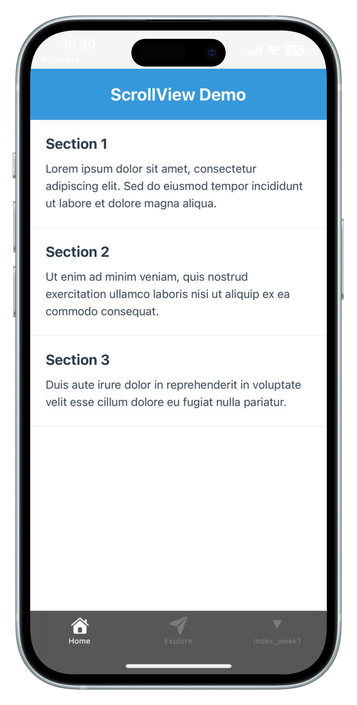
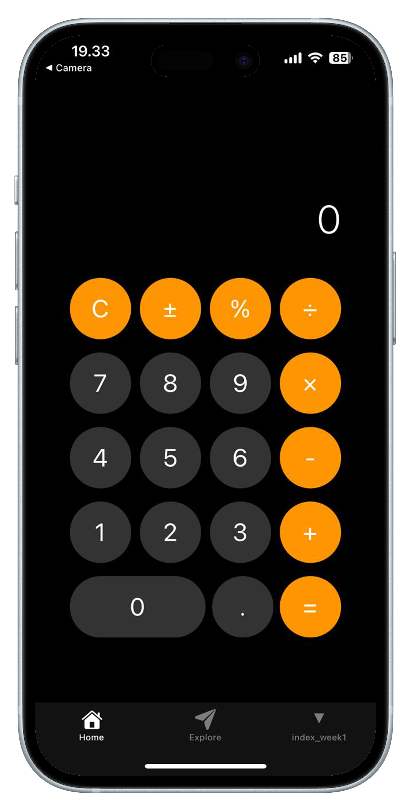

# Modul Praktikum Week 2
## React Native Fundamentals - Core Components & Styling

**Mata Kuliah:** Pemrograman Mobile  
**Durasi:** 3 jam (1 sesi praktikum)  
**Tools:** VS Code, Node.js, Expo CLI, Expo Go

---

## 🎯 Learning Objectives

Setelah menyelesaikan praktikum ini, mahasiswa diharapkan mampu:

1. Memahami dan menggunakan core components React Native (View, Text, Image, ScrollView)
2. Menerapkan styling dengan StyleSheet secara efektif
3. Membuat layout yang responsive dengan Flexbox
4. Membangun UI profile card yang menarik
5. Membuat layout calculator sederhana
6. Memahami perbedaan styling React Native vs CSS web

---

## 📋 Prerequisites

- **Hasil Week 1:** Environment React Native sudah tersetup
- **Hardware:** Laptop/PC dengan RAM minimal 4GB
- **Software:** 
  - VS Code dengan project HelloWorld dari Week 1
  - Node.js, Expo CLI, Expo Go
  - Koneksi internet stabil
- **Knowledge:** 
  - Dasar React Native dari Week 1
  - Pemahaman JavaScript dan JSX
  - Konsep dasar styling

---

## 📖 Teori Singkat

### Core Components React Native

React Native menyediakan built-in components yang dioptimasi untuk mobile development:

| Component | Fungsi | Equivalent Web |
|-----------|--------|---------------|
| **View** | Container element | `<div>` |
| **Text** | Display text | `<p>`, `<span>`, `<h1>` |
| **Image** | Display images | `` |
| **ScrollView** | Scrollable container | `<div>` dengan overflow scroll |
| **TextInput** | Input field | `<input>`, `<textarea>` |
| **TouchableOpacity** | Touchable button | `<button>` |

### StyleSheet vs CSS

| Aspek | React Native StyleSheet | CSS Web |
|-------|------------------------|---------|
| **Syntax** | JavaScript object | CSS rules |
| **Units** | Unitless numbers | px, em, rem, % |
| **Flexbox** | Default flex direction: column | Default: row |
| **Properties** | camelCase (backgroundColor) | kebab-case (background-color) |
| **Selectors** | Direct style props | Class/ID selectors |

### Flexbox di React Native

- **Default flex direction:** `column` (berbeda dengan web yang `row`)
- **Flex:** `flex: 1` artinya komponen mengambil ruang yang tersedia
- **Main Axis:** Sejajar dengan flex direction
- **Cross Axis:** Tegak lurus dengan main axis

---

## 🛠️ Bagian 1: Setup untuk Week 2

### Step 1: Gunakan Project HelloWorld

```bash
# Masuk ke project HelloWorld dari Week 1
cd ReactNativeProjects/HelloWorld

# Backup hasil Week 1 (opsional)
cp "app/(tabs)/index.tsx" "app/(tabs)/index_week1.tsx"
```

### Step 2: Start Development Server

```bash
npx expo start --tunnel
```

### Step 3: Test di Mobile

Scan QR code dengan Expo Go dan pastikan aplikasi berjalan dengan hasil Week 1.

### Tips Organizasi Project

Karena kita menggunakan project HelloWorld yang sama:

1. **Backup Strategy:**
   ```bash
   # Sebelum mulai Week baru
   cp "app/(tabs)/index.tsx" "app/(tabs)/index_week[X].tsx"
   ```

2. **Git Branches (Advanced):**
   ```bash
   git checkout -b week2-development
   # Develop Week 2
   git add . && git commit -m "Week 2 complete"
   git checkout main
   ```

3. **Screenshots Organization:**
   - Buat folder `screenshots/` di root project
   - Save hasil setiap week dengan nama yang jelas

4. **Code Comments:**
   ```typescript
   // ===================
   // WEEK 2: Fundamentals
   // ===================
   ```

Approach ini lebih **efisien storage** dan **real-world development practice**!

---

## 🧱 Bagian 2: Core Components Exploration

### Exercise 1: Memahami View Component

Edit `app/(tabs)/index.tsx` dengan kode berikut:

```typescript
import { StyleSheet, Text, View } from 'react-native';

export default function HomeScreen() {
  return (
    <View style={styles.container}>
      <View style={styles.header}>
        <Text style={styles.title}>React Native Components</Text>
      </View>
      
      <View style={styles.content}>
        <Text style={styles.subtitle}>View Component Demo</Text>
        <Text style={styles.text}>
          View adalah container dasar di React Native, 
          seperti div di HTML tapi dioptimasi untuk mobile.
        </Text>
      </View>
      
      <View style={styles.footer}>
        <Text style={styles.footerText}>Footer Area</Text>
      </View>
    </View>
  );
}

const styles = StyleSheet.create({
  container: {
    flex: 1,
    backgroundColor: '#f5f5f5',
  },
  header: {
    backgroundColor: '#3498db',
    padding: 20,
    alignItems: 'center',
    justifyContent: 'center',
    marginTop: 50,
  },
  content: {
    flex: 1,
    padding: 20,
    justifyContent: 'center',
  },
  footer: {
    backgroundColor: '#2c3e50',
    padding: 15,
    alignItems: 'center',
  },
  title: {
    fontSize: 24,
    fontWeight: 'bold',
    color: 'white',
  },
  subtitle: {
    fontSize: 20,
    fontWeight: '600',
    color: '#2c3e50',
    marginBottom: 10,
  },
  text: {
    fontSize: 16,
    lineHeight: 24,
    color: '#34495e',
    textAlign: 'center',
  },
  footerText: {
    color: 'white',
    fontSize: 14,
  },
});
```

Save dan lihat hasilnya di mobile. Perhatikan bagaimana View membagi layout menjadi header, content, dan footer.

### Exercise 2: Text Styling Variations

Ganti bagian content dengan berbagai variasi Text:

```typescript
<View style={styles.content}>
  <Text style={styles.heading1}>Heading 1</Text>
  <Text style={styles.heading2}>Heading 2</Text>
  <Text style={styles.paragraph}>
    Ini adalah paragraf dengan text yang lebih panjang untuk menunjukkan 
    bagaimana text wrapping bekerja di React Native.
  </Text>
  <Text style={styles.boldText}>Bold Text</Text>
  <Text style={styles.italicText}>Italic Text</Text>
  <Text style={styles.coloredText}>Colored Text</Text>
</View>
```

Tambahkan styles baru:

```typescript
heading1: {
  fontSize: 28,
  fontWeight: 'bold',
  color: '#2c3e50',
  marginBottom: 10,
},
heading2: {
  fontSize: 24,
  fontWeight: '600',
  color: '#3498db',
  marginBottom: 10,
},
paragraph: {
  fontSize: 16,
  lineHeight: 24,
  color: '#34495e',
  marginBottom: 15,
  textAlign: 'justify',
},
boldText: {
  fontSize: 16,
  fontWeight: 'bold',
  color: '#e74c3c',
  marginBottom: 5,
},
italicText: {
  fontSize: 16,
  fontStyle: 'italic',
  color: '#9b59b6',
  marginBottom: 5,
},
coloredText: {
  fontSize: 16,
  color: '#27ae60',
  backgroundColor: '#ecf0f1',
  padding: 10,
  borderRadius: 5,
},
```

### Exercise 3: ScrollView untuk Content Panjang

Jika content melebihi screen, gunakan ScrollView:

```typescript
import { StyleSheet, Text, View, ScrollView } from 'react-native';

export default function HomeScreen() {
  return (
    <View style={styles.container}>
      <View style={styles.header}>
        <Text style={styles.title}>ScrollView Demo</Text>
      </View>
      
      <ScrollView style={styles.scrollContent} showsVerticalScrollIndicator={false}>
        <View style={styles.section}>
          <Text style={styles.sectionTitle}>Section 1</Text>
          <Text style={styles.sectionText}>
            Lorem ipsum dolor sit amet, consectetur adipiscing elit. 
            Sed do eiusmod tempor incididunt ut labore et dolore magna aliqua.
          </Text>
        </View>
        
        <View style={styles.section}>
          <Text style={styles.sectionTitle}>Section 2</Text>
          <Text style={styles.sectionText}>
            Ut enim ad minim veniam, quis nostrud exercitation ullamco 
            laboris nisi ut aliquip ex ea commodo consequat.
          </Text>
        </View>
        
        {/* Repeat sections for scrolling demo */}
        <View style={styles.section}>
          <Text style={styles.sectionTitle}>Section 3</Text>
          <Text style={styles.sectionText}>
            Duis aute irure dolor in reprehenderit in voluptate velit esse 
            cillum dolore eu fugiat nulla pariatur.
          </Text>
        </View>
      </ScrollView>
    </View>
  );
}
```

Tambahkan styles:

```typescript
scrollContent: {
  flex: 1,
  backgroundColor: 'white',
},
section: {
  padding: 20,
  borderBottomWidth: 1,
  borderBottomColor: '#ecf0f1',
},
sectionTitle: {
  fontSize: 20,
  fontWeight: 'bold',
  color: '#2c3e50',
  marginBottom: 10,
},
sectionText: {
  fontSize: 16,
  lineHeight: 24,
  color: '#34495e',
},
```

**Hasil ScrollView:**
<div align="center" style="max-width: 320px; margin: 15px auto;">
  
</div>

---

## 👤 Bagian 3: Membuat Profile Card UI

### Exercise 4: Profile Card Component

Buat profile card yang menarik:

```typescript
import { StyleSheet, Text, View, ScrollView, Image } from 'react-native';

export default function HomeScreen() {
  return (
    <ScrollView style={styles.container}>
      <View style={styles.profileCard}>
        <View style={styles.avatarContainer}>
          <View style={styles.avatar}>
            <Text style={styles.avatarText}>JD</Text>
          </View>
        </View>
        
        <View style={styles.profileInfo}>
          <Text style={styles.name}>Aidil Saputra Kirsan</Text>
          <Text style={styles.title}>Mobile Developer</Text>
          <Text style={styles.company}>Tech Company</Text>
        </View>
        
        <View style={styles.statsContainer}>
          <View style={styles.statItem}>
            <Text style={styles.statNumber}>150</Text>
            <Text style={styles.statLabel}>Projects</Text>
          </View>
          <View style={styles.statDivider} />
          <View style={styles.statItem}>
            <Text style={styles.statNumber}>2.5k</Text>
            <Text style={styles.statLabel}>Followers</Text>
          </View>
          <View style={styles.statDivider} />
          <View style={styles.statItem}>
            <Text style={styles.statNumber}>180</Text>
            <Text style={styles.statLabel}>Following</Text>
          </View>
        </View>
        
        <View style={styles.bioContainer}>
          <Text style={styles.bioTitle}>About</Text>
          <Text style={styles.bioText}>
            Passionate mobile developer with 5 years of experience in React Native. 
            Love creating beautiful and functional mobile applications.
          </Text>
        </View>
        
        <View style={styles.skillsContainer}>
          <Text style={styles.skillsTitle}>Skills</Text>
          <View style={styles.skillsRow}>
            <View style={styles.skillTag}>
              <Text style={styles.skillText}>React Native</Text>
            </View>
            <View style={styles.skillTag}>
              <Text style={styles.skillText}>JavaScript</Text>
            </View>
            <View style={styles.skillTag}>
              <Text style={styles.skillText}>TypeScript</Text>
            </View>
          </View>
          <View style={styles.skillsRow}>
            <View style={styles.skillTag}>
              <Text style={styles.skillText}>Node.js</Text>
            </View>
            <View style={styles.skillTag}>
              <Text style={styles.skillText}>MongoDB</Text>
            </View>
          </View>
        </View>
      </View>
    </ScrollView>
  );
}

const styles = StyleSheet.create({
  container: {
    flex: 1,
    backgroundColor: '#f8f9fa',
  },
  profileCard: {
    backgroundColor: 'white',
    margin: 20,
    borderRadius: 15,
    padding: 20,
    shadowColor: '#000',
    shadowOffset: {
      width: 0,
      height: 2,
    },
    shadowOpacity: 0.1,
    shadowRadius: 8,
    elevation: 5,
  },
  avatarContainer: {
    alignItems: 'center',
    marginBottom: 20,
  },
  avatar: {
    width: 100,
    height: 100,
    borderRadius: 50,
    backgroundColor: '#3498db',
    justifyContent: 'center',
    alignItems: 'center',
  },
  avatarText: {
    fontSize: 36,
    fontWeight: 'bold',
    color: 'white',
  },
  profileInfo: {
    alignItems: 'center',
    marginBottom: 25,
  },
  name: {
    fontSize: 28,
    fontWeight: 'bold',
    color: '#2c3e50',
    marginBottom: 5,
  },
  title: {
    fontSize: 18,
    color: '#3498db',
    marginBottom: 3,
  },
  company: {
    fontSize: 16,
    color: '#7f8c8d',
  },
  statsContainer: {
    flexDirection: 'row',
    justifyContent: 'space-around',
    paddingVertical: 20,
    borderTopWidth: 1,
    borderBottomWidth: 1,
    borderColor: '#ecf0f1',
    marginBottom: 25,
  },
  statItem: {
    alignItems: 'center',
  },
  statNumber: {
    fontSize: 24,
    fontWeight: 'bold',
    color: '#2c3e50',
  },
  statLabel: {
    fontSize: 14,
    color: '#7f8c8d',
    marginTop: 2,
  },
  statDivider: {
    width: 1,
    backgroundColor: '#ecf0f1',
  },
  bioContainer: {
    marginBottom: 25,
  },
  bioTitle: {
    fontSize: 20,
    fontWeight: 'bold',
    color: '#2c3e50',
    marginBottom: 10,
  },
  bioText: {
    fontSize: 16,
    lineHeight: 24,
    color: '#34495e',
    textAlign: 'justify',
  },
  skillsContainer: {
    marginBottom: 10,
  },
  skillsTitle: {
    fontSize: 20,
    fontWeight: 'bold',
    color: '#2c3e50',
    marginBottom: 15,
  },
  skillsRow: {
    flexDirection: 'row',
    flexWrap: 'wrap',
    marginBottom: 10,
  },
  skillTag: {
    backgroundColor: '#e3f2fd',
    borderRadius: 20,
    paddingHorizontal: 15,
    paddingVertical: 8,
    marginRight: 10,
    marginBottom: 5,
  },
  skillText: {
    fontSize: 14,
    color: '#1976d2',
    fontWeight: '500',
  },
});
```

**Hasil Profile Card:**
<div align="center" style="max-width: 320px; margin: 15px auto;">
  
</div>

---

## 🔢 Bagian 4: Simple Calculator Layout

### Exercise 5: Calculator UI

Buat layout calculator sederhana:

```typescript
import { StyleSheet, Text, View } from 'react-native';

export default function HomeScreen() {
  return (
    <View style={styles.container}>
      <View style={styles.calculator}>
        <View style={styles.display}>
          <Text style={styles.displayText}>0</Text>
        </View>
        
        <View style={styles.buttonContainer}>
          {/* Row 1 */}
          <View style={styles.buttonRow}>
            <View style={[styles.button, styles.operatorButton]}>
              <Text style={styles.operatorText}>C</Text>
            </View>
            <View style={[styles.button, styles.operatorButton]}>
              <Text style={styles.operatorText}>±</Text>
            </View>
            <View style={[styles.button, styles.operatorButton]}>
              <Text style={styles.operatorText}>%</Text>
            </View>
            <View style={[styles.button, styles.operatorButton]}>
              <Text style={styles.operatorText}>÷</Text>
            </View>
          </View>
          
          {/* Row 2 */}
          <View style={styles.buttonRow}>
            <View style={styles.button}>
              <Text style={styles.buttonText}>7</Text>
            </View>
            <View style={styles.button}>
              <Text style={styles.buttonText}>8</Text>
            </View>
            <View style={styles.button}>
              <Text style={styles.buttonText}>9</Text>
            </View>
            <View style={[styles.button, styles.operatorButton]}>
              <Text style={styles.operatorText}>×</Text>
            </View>
          </View>
          
          {/* Row 3 */}
          <View style={styles.buttonRow}>
            <View style={styles.button}>
              <Text style={styles.buttonText}>4</Text>
            </View>
            <View style={styles.button}>
              <Text style={styles.buttonText}>5</Text>
            </View>
            <View style={styles.button}>
              <Text style={styles.buttonText}>6</Text>
            </View>
            <View style={[styles.button, styles.operatorButton]}>
              <Text style={styles.operatorText}>-</Text>
            </View>
          </View>
          
          {/* Row 4 */}
          <View style={styles.buttonRow}>
            <View style={styles.button}>
              <Text style={styles.buttonText}>1</Text>
            </View>
            <View style={styles.button}>
              <Text style={styles.buttonText}>2</Text>
            </View>
            <View style={styles.button}>
              <Text style={styles.buttonText}>3</Text>
            </View>
            <View style={[styles.button, styles.operatorButton]}>
              <Text style={styles.operatorText}>+</Text>
            </View>
          </View>
          
          {/* Row 5 */}
          <View style={styles.buttonRow}>
            <View style={[styles.button, styles.zeroButton]}>
              <Text style={styles.buttonText}>0</Text>
            </View>
            <View style={styles.button}>
              <Text style={styles.buttonText}>.</Text>
            </View>
            <View style={[styles.button, styles.equalsButton]}>
              <Text style={styles.equalsText}>=</Text>
            </View>
          </View>
        </View>
      </View>
    </View>
  );
}

const styles = StyleSheet.create({
  container: {
    flex: 1,
    backgroundColor: '#000',
    justifyContent: 'center',
    alignItems: 'center',
  },
  calculator: {
    width: '90%',
    maxWidth: 350,
  },
  display: {
    backgroundColor: '#000',
    paddingHorizontal: 20,
    paddingVertical: 40,
    alignItems: 'flex-end',
    justifyContent: 'flex-end',
    minHeight: 120,
  },
  displayText: {
    fontSize: 48,
    color: 'white',
    fontWeight: '300',
  },
  buttonContainer: {
    paddingHorizontal: 20,
  },
  buttonRow: {
    flexDirection: 'row',
    justifyContent: 'space-between',
    marginBottom: 15,
  },
  button: {
    width: 70,
    height: 70,
    borderRadius: 35,
    backgroundColor: '#333',
    justifyContent: 'center',
    alignItems: 'center',
  },
  operatorButton: {
    backgroundColor: '#ff9500',
  },
  equalsButton: {
    backgroundColor: '#ff9500',
  },
  zeroButton: {
    width: 155, // Lebih lebar untuk button 0
    borderRadius: 35,
    justifyContent: 'center',
    alignItems: 'center',
  },
  buttonText: {
    fontSize: 30,
    color: 'white',
    fontWeight: '400',
  },
  operatorText: {
    fontSize: 30,
    color: 'white',
    fontWeight: '400',
  },
  equalsText: {
    fontSize: 30,
    color: 'white',
    fontWeight: '400',
  },
});
```

**Hasil Calculator Layout:**
<div align="center" style="max-width: 320px; margin: 15px auto;">
  
</div>

---

## 🔧 Troubleshooting

### Problem 1: Layout tidak responsive
**Solution:**
- Gunakan `flex: 1` untuk container utama
- Gunakan percentage (%) untuk width jika perlu
- Test di berbagai ukuran device

### Problem 2: Text terpotong atau overflow
**Solutions:**
```typescript
// Untuk text panjang
numberOfLines={2}
ellipsizeMode="tail"

// Atau gunakan ScrollView
<ScrollView horizontal showsHorizontalScrollIndicator={false}>
  <Text>Long text here...</Text>
</ScrollView>
```

### Problem 3: Styling tidak muncul
**Solutions:**
- Pastikan import StyleSheet dari 'react-native'
- Check typo di nama properties (camelCase)
- Verifikasi object structure di StyleSheet.create()

### Problem 4: Flexbox tidak bekerja seperti expected
**Solutions:**
- Ingat: default flexDirection di RN adalah 'column'
- Gunakan `alignItems` untuk cross axis
- Gunakan `justifyContent` untuk main axis

---

## 📝 Tugas Praktikum

### Tugas 1: Personal Profile Card (Wajib)

Modifikasi profile card dengan data personal Anda:

1. **Personal Data:**
   - Nama lengkap
   - NIM sebagai subtitle
   - Program studi sebagai company
   - Avatar dengan inisial nama

2. **Custom Stats:**
   - Semester saat ini
   - Mata kuliah yang diambil
   - Target IPK

3. **Bio & Skills:**
   - Bio singkat tentang diri Anda
   - Skills yang sudah dikuasai (programming languages, tools, etc.)
   - Minimal 5 skill tags

4. **Styling Requirements:**
   - Gunakan color scheme yang konsisten
   - Tambahkan shadow dan border radius
   - Responsive di berbagai ukuran layar

### Tugas 2: Enhanced Calculator (Bonus)

Perbaiki layout calculator dengan fitur tambahan:

1. **Visual Enhancements:**
   - Tambahkan shadow pada buttons
   - Hover effect simulation dengan opacity
   - Better spacing dan proportions

2. **Additional Buttons:**
   - Button untuk decimal (.)
   - Button untuk clear (C) dan backspace (⌫)
   - Memory functions (M+, M-, MR, MC)

3. **Display Improvements:**
   - Show operator pada display
   - History area di atas display utama
   - Auto-resize text jika angka terlalu panjang

### Tugas 3: Component Experimentation (Bonus)

Buat halaman eksperimen dengan:

1. **Different Text Styles:**
   - Various font weights dan sizes
   - Different colors dan backgrounds
   - Text alignment variations

2. **Layout Patterns:**
   - Card layouts dengan different arrangements
   - List items dengan icons
   - Grid patterns dengan flexbox

3. **ScrollView Demos:**
   - Horizontal scroll dengan cards
   - Vertical scroll dengan sections
   - Nested scroll views

---

## 📤 Submission

**Deadline:** [Sesuaikan dengan jadwal]

**Yang dikumpulkan:**

1. **Source Code:**
   - Zip folder project `HelloWorld` (sama dengan Week 1)
   - Nama file: `NIM_Nama_Week2_Fundamentals.zip`

2. **Screenshot:**
   - Profile card hasil akhir
   - Calculator layout hasil akhir
   - Nama file: `NIM_Week2_ProfileCard.jpg`, `NIM_Week2_Calculator.jpg`

3. **Dokumentasi (Opsional):**
   - `WEEK2_REPORT.md` berisi:
     - Penjelasan design choices untuk profile card
     - Challenges yang dihadapi dan solusinya
     - Perbandingan styling RN vs CSS web
   - Backup file `index_week1.tsx` untuk history

4. **Struktur Project Akhir:**
   ```
   HelloWorld/
   ├── app/(tabs)/
   │   ├── index.tsx          # Week 2 result
   │   ├── index_week1.tsx    # Week 1 backup
   │   └── explore.tsx
   ├── screenshots/
   │   ├── Week1_results.jpg
   │   ├── Week2_ProfileCard.jpg
   │   └── Week2_Calculator.jpg
   └── ...
   ```

4. **Upload ke:** [Platform LMS yang digunakan]

---

## 📚 Resources

### Documentation
- [React Native Core Components](https://reactnative.dev/docs/components-and-apis)
- [StyleSheet API](https://reactnative.dev/docs/stylesheet)
- [Flexbox Layout](https://reactnative.dev/docs/flexbox)
- [Text Component](https://reactnative.dev/docs/text)
- [View Component](https://reactnative.dev/docs/view)

### Styling References
- [React Native Styling Cheat Sheet](https://github.com/vhpoet/react-native-styling-cheat-sheet)
- [Flexbox Froggy](https://flexboxfroggy.com/) - Game untuk belajar Flexbox
- [Color Hunt](https://colorhunt.co/) - Color palette inspiration

### Design Inspiration
- [Dribbble Mobile UI](https://dribbble.com/tags/mobile_ui)
- [UI Movement](https://uimovement.com/tag/mobile/)
- [Material Design](https://material.io/design)

### Tools
- [React Native Elements](https://reactnativeelements.com/) - UI Component Library
- [Native Base](https://nativebase.io/) - Mobile-first component library
- [Styled Components](https://styled-components.com/) - CSS-in-JS library

---

## 🎉 Summary

Hari ini Anda telah berhasil:

- Memahami core components React Native (View, Text, ScrollView)
- Menguasai StyleSheet dan sistem styling RN
- Membuat UI profile card yang professional
- Membangun layout calculator dengan flexbox
- Memahami perbedaan styling mobile vs web
- Menerapkan responsive design principles

**Key Takeaways:**
- View adalah building block utama untuk layout
- Flexbox di RN default direction: column
- StyleSheet memberikan performance yang lebih baik
- ScrollView penting untuk content yang panjang
- Consistent spacing dan color scheme penting untuk UX

**Next Week:** Kita akan belajar State Management & User Input - membuat aplikasi interaktif dengan useState, TextInput, dan form handling!

---

*Good luck dan jangan ragu untuk bertanya jika ada kesulitan! 🚀*