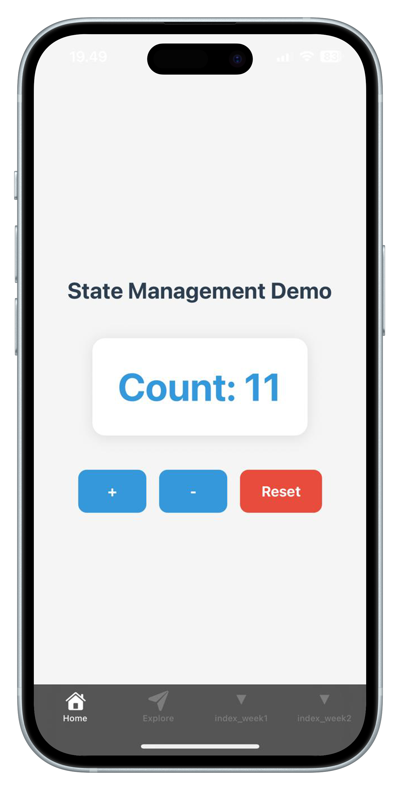
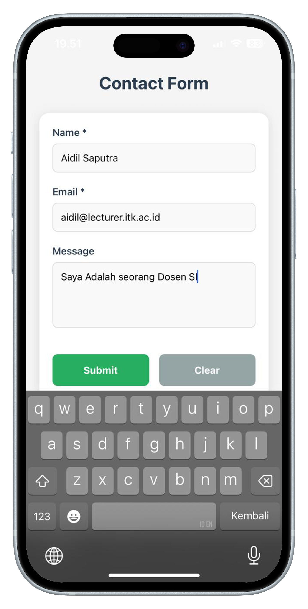
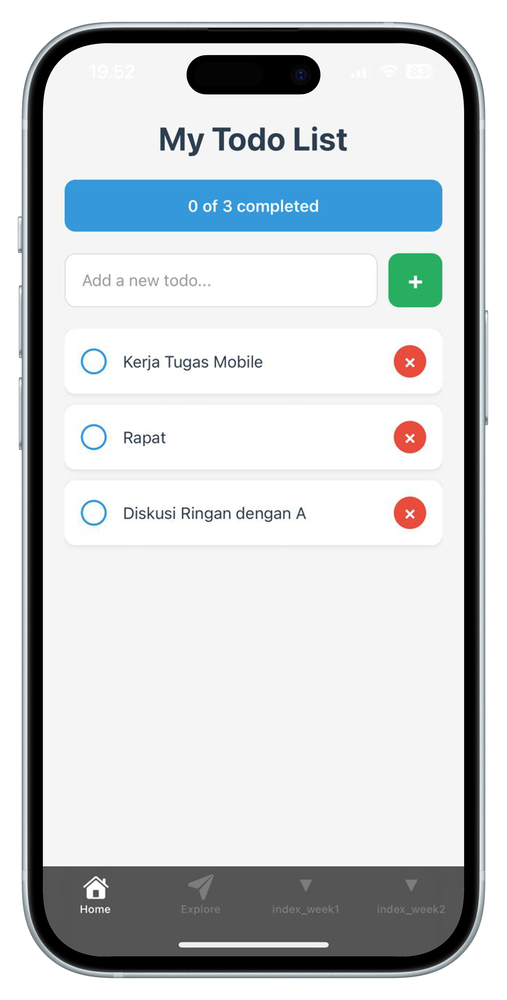
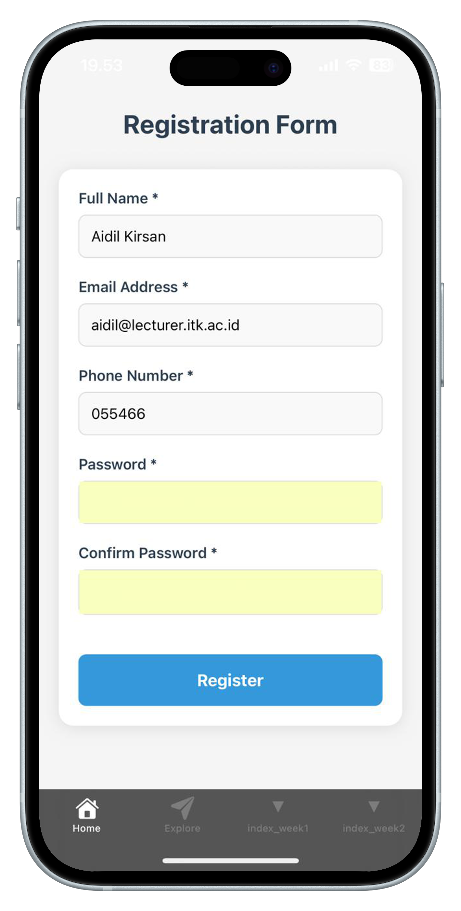

# Modul Praktikum Week 3
## State Management & User Input - Interactive Mobile Apps

**Mata Kuliah:** Pemrograman Mobile  
**Durasi:** 3 jam (1 sesi praktikum)  
**Tools:** VS Code, Node.js, Expo CLI, Expo Go

---

## 🎯 Learning Objectives

Setelah menyelesaikan praktikum ini, mahasiswa diharapkan mampu:

1. Memahami dan mengimplementasikan state management dengan useState
2. Menangani user input dengan TextInput component
3. Membuat interactive buttons dengan TouchableOpacity
4. Mengimplementasikan form handling dan validation
5. Membangun Todo List app yang functional
6. Memahami event handling di React Native
7. Mengelola component lifecycle dan re-rendering

---

## 📋 Prerequisites

- **Hasil Week 1-2:** Core components dan styling sudah dikuasai
- **Hardware:** Laptop/PC dengan RAM minimal 4GB
- **Software:** 
  - VS Code dengan project HelloWorld dari week sebelumnya
  - Node.js, Expo CLI, Expo Go
  - Koneksi internet stabil
- **Knowledge:** 
  - React Native fundamentals (View, Text, StyleSheet)
  - JavaScript ES6+ (arrow functions, destructuring)
  - Basic React concepts

---

## 📖 Teori Singkat

### State Management di React Native

**State** adalah data yang dapat berubah dalam komponen dan mempengaruhi tampilan UI. Ketika state berubah, komponen akan re-render.

```javascript
const [state, setState] = useState(initialValue);
```

### Hooks yang Digunakan

| Hook | Fungsi | Example |
|------|--------|---------|
| **useState** | Mengelola state lokal | `const [count, setCount] = useState(0)` |
| **useEffect** | Side effects & lifecycle | `useEffect(() => {}, [])` |

### Interactive Components

| Component | Fungsi | Use Case |
|-----------|--------|----------|
| **TextInput** | Input field | Forms, search, chat |
| **TouchableOpacity** | Touchable button | Custom buttons, actions |
| **Button** | Standard button | Submit, cancel actions |
| **Switch** | Toggle switch | Settings, on/off |

### Event Handling Patterns

```javascript
// Function handler
const handlePress = () => {
  console.log('Button pressed');
};

// Inline handler
onPress={() => console.log('Pressed')}

// Handler with parameters
onPress={() => handleDelete(item.id)}
```

---

## 🛠️ Bagian 1: Setup untuk Week 3

### Step 1: Gunakan Project HelloWorld

```bash
# Masuk ke project HelloWorld
cd ReactNativeProjects/HelloWorld

# Backup hasil Week 2
cp "app/(tabs)/index.tsx" "app/(tabs)/index_week2.tsx"
```

### Step 2: Start Development Server

```bash
npx expo start --tunnel
```

### Step 3: Verifikasi Project

Pastikan aplikasi berjalan dengan hasil Week 2, lalu kita akan mulai Week 3.

---

## 🔄 Bagian 2: State Management Basics

### Exercise 1: Counter App dengan useState

Edit `app/(tabs)/index.tsx` untuk memahami state dasar:

```typescript
import { StyleSheet, Text, View, TouchableOpacity } from 'react-native';
import { useState } from 'react';

export default function HomeScreen() {
  const [count, setCount] = useState(0);

  const increment = () => {
    setCount(count + 1);
  };

  const decrement = () => {
    setCount(count - 1);
  };

  const reset = () => {
    setCount(0);
  };

  return (
    <View style={styles.container}>
      <Text style={styles.title}>State Management Demo</Text>
      
      <View style={styles.counterContainer}>
        <Text style={styles.counterText}>Count: {count}</Text>
      </View>
      
      <View style={styles.buttonContainer}>
        <TouchableOpacity style={styles.button} onPress={increment}>
          <Text style={styles.buttonText}>+</Text>
        </TouchableOpacity>
        
        <TouchableOpacity style={styles.button} onPress={decrement}>
          <Text style={styles.buttonText}>-</Text>
        </TouchableOpacity>
        
        <TouchableOpacity style={[styles.button, styles.resetButton]} onPress={reset}>
          <Text style={styles.buttonText}>Reset</Text>
        </TouchableOpacity>
      </View>
    </View>
  );
}

const styles = StyleSheet.create({
  container: {
    flex: 1,
    backgroundColor: '#f5f5f5',
    justifyContent: 'center',
    alignItems: 'center',
    padding: 20,
  },
  title: {
    fontSize: 28,
    fontWeight: 'bold',
    color: '#2c3e50',
    marginBottom: 40,
  },
  counterContainer: {
    backgroundColor: 'white',
    padding: 30,
    borderRadius: 15,
    marginBottom: 40,
    shadowColor: '#000',
    shadowOffset: {
      width: 0,
      height: 2,
    },
    shadowOpacity: 0.1,
    shadowRadius: 8,
    elevation: 5,
  },
  counterText: {
    fontSize: 48,
    fontWeight: 'bold',
    color: '#3498db',
    textAlign: 'center',
  },
  buttonContainer: {
    flexDirection: 'row',
    gap: 15,
  },
  button: {
    backgroundColor: '#3498db',
    paddingVertical: 15,
    paddingHorizontal: 25,
    borderRadius: 10,
    minWidth: 80,
    alignItems: 'center',
  },
  resetButton: {
    backgroundColor: '#e74c3c',
  },
  buttonText: {
    color: 'white',
    fontSize: 18,
    fontWeight: 'bold',
  },
});
```

Save dan test di mobile. Coba tekan tombol +, -, dan Reset untuk melihat state berubah.

**Hasil Counter App:**

<div align="center" style="max-width: 320px; margin: 15px auto;">
  
</div>

### Exercise 2: TextInput dan Form Handling

Tambahkan input field untuk user interaction:

```typescript
import { StyleSheet, Text, View, TouchableOpacity, TextInput, Alert } from 'react-native';
import { useState } from 'react';

export default function HomeScreen() {
  const [name, setName] = useState('');
  const [email, setEmail] = useState('');
  const [message, setMessage] = useState('');

  const handleSubmit = () => {
    if (name.trim() === '' || email.trim() === '') {
      Alert.alert('Error', 'Please fill in all required fields');
      return;
    }
    
    Alert.alert(
      'Form Submitted',
      `Name: ${name}\nEmail: ${email}\nMessage: ${message}`,
      [{ text: 'OK', onPress: clearForm }]
    );
  };

  const clearForm = () => {
    setName('');
    setEmail('');
    setMessage('');
  };

  return (
    <View style={styles.container}>
      <Text style={styles.title}>Contact Form</Text>
      
      <View style={styles.formContainer}>
        <View style={styles.inputGroup}>
          <Text style={styles.label}>Name *</Text>
          <TextInput
            style={styles.input}
            value={name}
            onChangeText={setName}
            placeholder="Enter your name"
            placeholderTextColor="#999"
          />
        </View>
        
        <View style={styles.inputGroup}>
          <Text style={styles.label}>Email *</Text>
          <TextInput
            style={styles.input}
            value={email}
            onChangeText={setEmail}
            placeholder="Enter your email"
            placeholderTextColor="#999"
            keyboardType="email-address"
            autoCapitalize="none"
          />
        </View>
        
        <View style={styles.inputGroup}>
          <Text style={styles.label}>Message</Text>
          <TextInput
            style={[styles.input, styles.textArea]}
            value={message}
            onChangeText={setMessage}
            placeholder="Enter your message"
            placeholderTextColor="#999"
            multiline
            numberOfLines={4}
            textAlignVertical="top"
          />
        </View>
        
        <View style={styles.buttonContainer}>
          <TouchableOpacity style={styles.submitButton} onPress={handleSubmit}>
            <Text style={styles.buttonText}>Submit</Text>
          </TouchableOpacity>
          
          <TouchableOpacity style={styles.clearButton} onPress={clearForm}>
            <Text style={styles.buttonText}>Clear</Text>
          </TouchableOpacity>
        </View>
      </View>
    </View>
  );
}

const styles = StyleSheet.create({
  container: {
    flex: 1,
    backgroundColor: '#f5f5f5',
    padding: 20,
  },
  title: {
    fontSize: 28,
    fontWeight: 'bold',
    color: '#2c3e50',
    textAlign: 'center',
    marginTop: 50,
    marginBottom: 30,
  },
  formContainer: {
    backgroundColor: 'white',
    borderRadius: 15,
    padding: 20,
    shadowColor: '#000',
    shadowOffset: {
      width: 0,
      height: 2,
    },
    shadowOpacity: 0.1,
    shadowRadius: 8,
    elevation: 5,
  },
  inputGroup: {
    marginBottom: 20,
  },
  label: {
    fontSize: 16,
    fontWeight: '600',
    color: '#2c3e50',
    marginBottom: 8,
  },
  input: {
    borderWidth: 1,
    borderColor: '#ddd',
    borderRadius: 8,
    padding: 12,
    fontSize: 16,
    backgroundColor: '#f9f9f9',
  },
  textArea: {
    height: 100,
  },
  buttonContainer: {
    flexDirection: 'row',
    gap: 15,
    marginTop: 20,
  },
  submitButton: {
    flex: 1,
    backgroundColor: '#27ae60',
    padding: 15,
    borderRadius: 8,
    alignItems: 'center',
  },
  clearButton: {
    flex: 1,
    backgroundColor: '#95a5a6',
    padding: 15,
    borderRadius: 8,
    alignItems: 'center',
  },
  buttonText: {
    color: 'white',
    fontSize: 16,
    fontWeight: 'bold',
  },
});
```

**Hasil Form Input:**

<div align="center" style="max-width: 320px; margin: 15px auto;">
  
</div>

---

## 📝 Bagian 3: Todo List Application

### Exercise 3: Complete Todo List App

Sekarang kita buat aplikasi Todo List yang lengkap:

```typescript
import { StyleSheet, Text, View, TouchableOpacity, TextInput, ScrollView, Alert } from 'react-native';
import { useState } from 'react';

interface Todo {
  id: number;
  text: string;
  completed: boolean;
}

export default function HomeScreen() {
  const [todos, setTodos] = useState<Todo[]>([]);
  const [inputText, setInputText] = useState('');

  const addTodo = () => {
    if (inputText.trim() === '') {
      Alert.alert('Error', 'Please enter a todo item');
      return;
    }

    const newTodo: Todo = {
      id: Date.now(),
      text: inputText.trim(),
      completed: false,
    };

    setTodos([...todos, newTodo]);
    setInputText('');
  };

  const toggleTodo = (id: number) => {
    setTodos(todos.map(todo =>
      todo.id === id ? { ...todo, completed: !todo.completed } : todo
    ));
  };

  const deleteTodo = (id: number) => {
    Alert.alert(
      'Delete Todo',
      'Are you sure you want to delete this item?',
      [
        { text: 'Cancel', style: 'cancel' },
        { text: 'Delete', style: 'destructive', onPress: () => {
          setTodos(todos.filter(todo => todo.id !== id));
        }}
      ]
    );
  };

  const clearCompleted = () => {
    setTodos(todos.filter(todo => !todo.completed));
  };

  const completedCount = todos.filter(todo => todo.completed).length;
  const totalCount = todos.length;

  return (
    <View style={styles.container}>
      <Text style={styles.title}>My Todo List</Text>
      
      <View style={styles.statsContainer}>
        <Text style={styles.statsText}>
          {completedCount} of {totalCount} completed
        </Text>
      </View>
      
      <View style={styles.inputContainer}>
        <TextInput
          style={styles.input}
          value={inputText}
          onChangeText={setInputText}
          placeholder="Add a new todo..."
          placeholderTextColor="#999"
          onSubmitEditing={addTodo}
          returnKeyType="done"
        />
        <TouchableOpacity style={styles.addButton} onPress={addTodo}>
          <Text style={styles.addButtonText}>+</Text>
        </TouchableOpacity>
      </View>
      
      <ScrollView style={styles.todoList} showsVerticalScrollIndicator={false}>
        {todos.length === 0 ? (
          <View style={styles.emptyContainer}>
            <Text style={styles.emptyText}>No todos yet. Add one above!</Text>
          </View>
        ) : (
          todos.map((todo) => (
            <View key={todo.id} style={styles.todoItem}>
              <TouchableOpacity
                style={styles.todoContent}
                onPress={() => toggleTodo(todo.id)}
              >
                <View style={[
                  styles.checkbox,
                  todo.completed && styles.checkboxCompleted
                ]}>
                  {todo.completed && <Text style={styles.checkmark}>✓</Text>}
                </View>
                <Text style={[
                  styles.todoText,
                  todo.completed && styles.todoTextCompleted
                ]}>
                  {todo.text}
                </Text>
              </TouchableOpacity>
              
              <TouchableOpacity
                style={styles.deleteButton}
                onPress={() => deleteTodo(todo.id)}
              >
                <Text style={styles.deleteButtonText}>×</Text>
              </TouchableOpacity>
            </View>
          ))
        )}
      </ScrollView>
      
      {completedCount > 0 && (
        <TouchableOpacity style={styles.clearButton} onPress={clearCompleted}>
          <Text style={styles.clearButtonText}>Clear Completed ({completedCount})</Text>
        </TouchableOpacity>
      )}
    </View>
  );
}

const styles = StyleSheet.create({
  container: {
    flex: 1,
    backgroundColor: '#f5f5f5',
    padding: 20,
  },
  title: {
    fontSize: 32,
    fontWeight: 'bold',
    color: '#2c3e50',
    textAlign: 'center',
    marginTop: 50,
    marginBottom: 20,
  },
  statsContainer: {
    backgroundColor: '#3498db',
    padding: 15,
    borderRadius: 10,
    marginBottom: 20,
  },
  statsText: {
    color: 'white',
    fontSize: 16,
    fontWeight: '600',
    textAlign: 'center',
  },
  inputContainer: {
    flexDirection: 'row',
    marginBottom: 20,
    gap: 10,
  },
  input: {
    flex: 1,
    borderWidth: 1,
    borderColor: '#ddd',
    borderRadius: 10,
    padding: 15,
    fontSize: 16,
    backgroundColor: 'white',
  },
  addButton: {
    backgroundColor: '#27ae60',
    borderRadius: 10,
    width: 50,
    height: 50,
    justifyContent: 'center',
    alignItems: 'center',
  },
  addButtonText: {
    color: 'white',
    fontSize: 24,
    fontWeight: 'bold',
  },
  todoList: {
    flex: 1,
  },
  emptyContainer: {
    alignItems: 'center',
    justifyContent: 'center',
    paddingVertical: 50,
  },
  emptyText: {
    fontSize: 18,
    color: '#95a5a6',
    fontStyle: 'italic',
  },
  todoItem: {
    flexDirection: 'row',
    alignItems: 'center',
    backgroundColor: 'white',
    padding: 15,
    borderRadius: 10,
    marginBottom: 10,
    shadowColor: '#000',
    shadowOffset: {
      width: 0,
      height: 1,
    },
    shadowOpacity: 0.1,
    shadowRadius: 2,
    elevation: 2,
  },
  todoContent: {
    flex: 1,
    flexDirection: 'row',
    alignItems: 'center',
  },
  checkbox: {
    width: 24,
    height: 24,
    borderRadius: 12,
    borderWidth: 2,
    borderColor: '#3498db',
    marginRight: 15,
    justifyContent: 'center',
    alignItems: 'center',
  },
  checkboxCompleted: {
    backgroundColor: '#3498db',
  },
  checkmark: {
    color: 'white',
    fontSize: 16,
    fontWeight: 'bold',
  },
  todoText: {
    fontSize: 16,
    color: '#2c3e50',
    flex: 1,
  },
  todoTextCompleted: {
    textDecorationLine: 'line-through',
    color: '#95a5a6',
  },
  deleteButton: {
    backgroundColor: '#e74c3c',
    borderRadius: 15,
    width: 30,
    height: 30,
    justifyContent: 'center',
    alignItems: 'center',
  },
  deleteButtonText: {
    color: 'white',
    fontSize: 18,
    fontWeight: 'bold',
  },
  clearButton: {
    backgroundColor: '#f39c12',
    padding: 15,
    borderRadius: 10,
    alignItems: 'center',
    marginTop: 10,
  },
  clearButtonText: {
    color: 'white',
    fontSize: 16,
    fontWeight: 'bold',
  },
});
```

**Hasil Todo List App:**

<div align="center" style="max-width: 320px; margin: 15px auto;">
  
</div>

---

## ✅ Bagian 4: Form Validation Advanced

### Exercise 4: Enhanced Form dengan Validation

Buat form dengan validation yang lebih advanced:

```typescript
import { StyleSheet, Text, View, TouchableOpacity, TextInput, ScrollView, Alert } from 'react-native';
import { useState } from 'react';

interface FormData {
  name: string;
  email: string;
  phone: string;
  password: string;
  confirmPassword: string;
}

interface FormErrors {
  name?: string;
  email?: string;
  phone?: string;
  password?: string;
  confirmPassword?: string;
}

export default function HomeScreen() {
  const [formData, setFormData] = useState<FormData>({
    name: '',
    email: '',
    phone: '',
    password: '',
    confirmPassword: '',
  });

  const [errors, setErrors] = useState<FormErrors>({});
  const [isSubmitting, setIsSubmitting] = useState(false);

  const validateEmail = (email: string): boolean => {
    const emailRegex = /^[^\s@]+@[^\s@]+\.[^\s@]+$/;
    return emailRegex.test(email);
  };

  const validatePhone = (phone: string): boolean => {
    const phoneRegex = /^[0-9]{10,13}$/;
    return phoneRegex.test(phone.replace(/[\s-]/g, ''));
  };

  const validateForm = (): boolean => {
    const newErrors: FormErrors = {};

    // Name validation
    if (!formData.name.trim()) {
      newErrors.name = 'Name is required';
    } else if (formData.name.trim().length < 2) {
      newErrors.name = 'Name must be at least 2 characters';
    }

    // Email validation
    if (!formData.email.trim()) {
      newErrors.email = 'Email is required';
    } else if (!validateEmail(formData.email)) {
      newErrors.email = 'Please enter a valid email';
    }

    // Phone validation
    if (!formData.phone.trim()) {
      newErrors.phone = 'Phone number is required';
    } else if (!validatePhone(formData.phone)) {
      newErrors.phone = 'Please enter a valid phone number';
    }

    // Password validation
    if (!formData.password) {
      newErrors.password = 'Password is required';
    } else if (formData.password.length < 6) {
      newErrors.password = 'Password must be at least 6 characters';
    }

    // Confirm password validation
    if (!formData.confirmPassword) {
      newErrors.confirmPassword = 'Please confirm your password';
    } else if (formData.password !== formData.confirmPassword) {
      newErrors.confirmPassword = 'Passwords do not match';
    }

    setErrors(newErrors);
    return Object.keys(newErrors).length === 0;
  };

  const handleInputChange = (field: keyof FormData, value: string) => {
    setFormData(prev => ({
      ...prev,
      [field]: value
    }));

    // Clear error when user starts typing
    if (errors[field]) {
      setErrors(prev => ({
        ...prev,
        [field]: undefined
      }));
    }
  };

  const handleSubmit = async () => {
    if (!validateForm()) {
      return;
    }

    setIsSubmitting(true);

    // Simulate API call
    setTimeout(() => {
      setIsSubmitting(false);
      Alert.alert(
        'Success!',
        'Registration completed successfully',
        [
          {
            text: 'OK',
            onPress: () => {
              setFormData({
                name: '',
                email: '',
                phone: '',
                password: '',
                confirmPassword: '',
              });
            }
          }
        ]
      );
    }, 2000);
  };

  return (
    <ScrollView style={styles.container} showsVerticalScrollIndicator={false}>
      <Text style={styles.title}>Registration Form</Text>
      
      <View style={styles.formContainer}>
        {/* Name Field */}
        <View style={styles.inputGroup}>
          <Text style={styles.label}>Full Name *</Text>
          <TextInput
            style={[styles.input, errors.name && styles.inputError]}
            value={formData.name}
            onChangeText={(value) => handleInputChange('name', value)}
            placeholder="Enter your full name"
            placeholderTextColor="#999"
          />
          {errors.name && <Text style={styles.errorText}>{errors.name}</Text>}
        </View>

        {/* Email Field */}
        <View style={styles.inputGroup}>
          <Text style={styles.label}>Email Address *</Text>
          <TextInput
            style={[styles.input, errors.email && styles.inputError]}
            value={formData.email}
            onChangeText={(value) => handleInputChange('email', value)}
            placeholder="Enter your email"
            placeholderTextColor="#999"
            keyboardType="email-address"
            autoCapitalize="none"
          />
          {errors.email && <Text style={styles.errorText}>{errors.email}</Text>}
        </View>

        {/* Phone Field */}
        <View style={styles.inputGroup}>
          <Text style={styles.label}>Phone Number *</Text>
          <TextInput
            style={[styles.input, errors.phone && styles.inputError]}
            value={formData.phone}
            onChangeText={(value) => handleInputChange('phone', value)}
            placeholder="Enter your phone number"
            placeholderTextColor="#999"
            keyboardType="phone-pad"
          />
          {errors.phone && <Text style={styles.errorText}>{errors.phone}</Text>}
        </View>

        {/* Password Field */}
        <View style={styles.inputGroup}>
          <Text style={styles.label}>Password *</Text>
          <TextInput
            style={[styles.input, errors.password && styles.inputError]}
            value={formData.password}
            onChangeText={(value) => handleInputChange('password', value)}
            placeholder="Enter your password"
            placeholderTextColor="#999"
            secureTextEntry
          />
          {errors.password && <Text style={styles.errorText}>{errors.password}</Text>}
        </View>

        {/* Confirm Password Field */}
        <View style={styles.inputGroup}>
          <Text style={styles.label}>Confirm Password *</Text>
          <TextInput
            style={[styles.input, errors.confirmPassword && styles.inputError]}
            value={formData.confirmPassword}
            onChangeText={(value) => handleInputChange('confirmPassword', value)}
            placeholder="Confirm your password"
            placeholderTextColor="#999"
            secureTextEntry
          />
          {errors.confirmPassword && <Text style={styles.errorText}>{errors.confirmPassword}</Text>}
        </View>

        <TouchableOpacity
          style={[styles.submitButton, isSubmitting && styles.submitButtonDisabled]}
          onPress={handleSubmit}
          disabled={isSubmitting}
        >
          <Text style={styles.submitButtonText}>
            {isSubmitting ? 'Registering...' : 'Register'}
          </Text>
        </TouchableOpacity>
      </View>
    </ScrollView>
  );
}

const styles = StyleSheet.create({
  container: {
    flex: 1,
    backgroundColor: '#f5f5f5',
    padding: 20,
  },
  title: {
    fontSize: 28,
    fontWeight: 'bold',
    color: '#2c3e50',
    textAlign: 'center',
    marginTop: 50,
    marginBottom: 30,
  },
  formContainer: {
    backgroundColor: 'white',
    borderRadius: 15,
    padding: 20,
    shadowColor: '#000',
    shadowOffset: {
      width: 0,
      height: 2,
    },
    shadowOpacity: 0.1,
    shadowRadius: 8,
    elevation: 5,
    marginBottom: 30,
  },
  inputGroup: {
    marginBottom: 20,
  },
  label: {
    fontSize: 16,
    fontWeight: '600',
    color: '#2c3e50',
    marginBottom: 8,
  },
  input: {
    borderWidth: 1,
    borderColor: '#ddd',
    borderRadius: 8,
    padding: 12,
    fontSize: 16,
    backgroundColor: '#f9f9f9',
  },
  inputError: {
    borderColor: '#e74c3c',
    backgroundColor: '#fdf2f2',
  },
  errorText: {
    color: '#e74c3c',
    fontSize: 14,
    marginTop: 5,
  },
  submitButton: {
    backgroundColor: '#3498db',
    padding: 16,
    borderRadius: 8,
    alignItems: 'center',
    marginTop: 20,
  },
  submitButtonDisabled: {
    backgroundColor: '#bdc3c7',
  },
  submitButtonText: {
    color: 'white',
    fontSize: 18,
    fontWeight: 'bold',
  },
});
```

**Hasil Form dengan Validation:**
<div align="center" style="max-width: 320px; margin: 15px auto;">
  
</div>

---

## 🔧 Troubleshooting

### Problem 1: State tidak update setelah setState

**Cause:** setState adalah asynchronous

**Solutions:**
```typescript
// ❌ Wrong - langsung akses state setelah setState
setCount(count + 1);
console.log(count); // Masih nilai lama

// ✅ Correct - gunakan functional update
setCount(prevCount => {
  const newCount = prevCount + 1;
  console.log(newCount); // Nilai baru
  return newCount;
});
```

### Problem 2: TextInput tidak merespon

**Solutions:**
```typescript
// ✅ Pastikan ada value dan onChangeText
<TextInput
  value={inputValue}          // Wajib
  onChangeText={setInputValue} // Wajib
  placeholder="Enter text"
/>
```

### Problem 3: Keyboard tidak auto-dismiss

**Solutions:**
```typescript
import { Keyboard } from 'react-native';

// Dismiss keyboard
const handleSubmit = () => {
  Keyboard.dismiss();
  // Submit logic
};

// Atau wrap dengan TouchableWithoutFeedback
<TouchableWithoutFeedback onPress={Keyboard.dismiss}>
  <View>
    {/* Form content */}
  </View>
</TouchableWithoutFeedback>
```

### Problem 4: Form validation terlalu strict

**Solutions:**
```typescript
// Real-time validation (saat user mengetik)
const handleInputChange = (value: string) => {
  setValue(value);
  // Clear error when user types
  if (error) setError('');
};

// Validation saat blur atau submit saja
<TextInput
  onBlur={validateInput}  // Validate when focus lost
  onSubmitEditing={handleSubmit}
/>
```

---

## 📝 Tugas Praktikum

### Tugas 1: Enhanced Todo List (Wajib)

Perbaiki Todo List dengan fitur tambahan:

1. **Kategori Todo:**
   - Dropdown/Picker untuk memilih kategori (Work, Personal, Shopping)
   - Filter todo berdasarkan kategori
   - Color coding untuk setiap kategori

2. **Priority System:**
   - High, Medium, Low priority
   - Sort todo berdasarkan priority
   - Visual indicator untuk priority

3. **Due Date:**
   - DatePicker untuk set due date
   - Show overdue items dengan warning color
   - Sort by due date

4. **Search Function:**
   - Search bar untuk filter todo
   - Search by text content
   - Clear search functionality

### Tugas 2: Multi-Step Registration Form (Bonus)

Buat registration form dengan multiple steps:

1. **Step 1: Personal Info**
   - Name, Email, Phone
   - Next button hanya aktif jika valid

2. **Step 2: Account Details**
   - Username, Password, Confirm Password
   - Password strength indicator

3. **Step 3: Preferences**
   - Notification settings (Switch components)
   - Theme preference (Radio buttons)
   - Terms & conditions (Checkbox)

4. **Step Navigation:**
   - Progress indicator
   - Back/Next buttons
   - Skip optional steps

### Tugas 3: Interactive Calculator (Bonus)

Transform layout calculator Week 2 menjadi functional:

1. **Basic Operations:**
   - Add, Subtract, Multiply, Divide
   - Clear dan Clear Entry functions

2. **Advanced Features:**
   - Memory functions (M+, M-, MR, MC)
   - Percentage calculations
   - History of calculations

3. **UI Enhancements:**
   - Proper number formatting
   - Error handling (division by zero)
   - Button press animations

---

## 📤 Submission

**Deadline:** [Sesuaikan dengan jadwal]

**Yang dikumpulkan:**

1. **Source Code:**
   - Zip folder project `HelloWorld`
   - Nama file: `NIM_Nama_Week3_StateManagement.zip`

2. **Screenshots:**
   - Todo List app hasil akhir
   - Form validation demo
   - Nama file: `NIM_Week3_TodoList.jpg`, `NIM_Week3_FormValidation.jpg`

3. **Dokumentasi:**
   - `WEEK3_REPORT.md` berisi:
     - State management approach yang digunakan
     - Challenges dalam form validation
     - User experience improvements yang diterapkan

4. **Struktur Project:**
   ```
   HelloWorld/
   ├── app/(tabs)/
   │   ├── index.tsx          # Week 3 result
   │   ├── index_week1.tsx    # Week 1 backup
   │   ├── index_week2.tsx    # Week 2 backup
   │   └── explore.tsx
   ├── screenshots/
   │   ├── Week3_TodoList.jpg
   │   └── Week3_FormValidation.jpg
   └── ...
   ```

---

## 📚 Resources

### Documentation
- [React Native TextInput](https://reactnative.dev/docs/textinput)
- [React Native TouchableOpacity](https://reactnative.dev/docs/touchableopacity)
- [React Hooks Documentation](https://reactjs.org/docs/hooks-intro.html)
- [React Native Alert](https://reactnative.dev/docs/alert)

### State Management
- [useState Hook](https://reactjs.org/docs/hooks-state.html)
- [React Native Form Handling](https://reactnative.dev/docs/handling-text-input)
- [Form Validation Patterns](https://react-hook-form.com/get-started)

### UI Libraries untuk Forms
- [React Native Elements](https://reactnativeelements.com/docs/input)
- [Native Base FormControl](https://docs.nativebase.io/form-control)
- [React Hook Form](https://react-hook-form.com/) - Advanced form handling

### Development Tools
- [React Native Debugger](https://github.com/jhen0409/react-native-debugger)
- [Flipper](https://fbflipper.com/) - Debug React Native apps
- [React Developer Tools](https://chrome.google.com/webstore/detail/react-developer-tools/)

---

## 🎉 Summary

Hari ini Anda telah berhasil:

- Memahami state management dengan useState hook
- Mengimplementasikan user input dengan TextInput
- Membuat interactive buttons dengan TouchableOpacity
- Menangani form validation dan error handling
- Membangun Todo List app yang fully functional
- Memahami event handling patterns di React Native
- Mengelola component re-rendering dan lifecycle

**Key Concepts:**
- State adalah data yang dapat berubah dan mempengaruhi UI
- Event handlers menghubungkan user interaction dengan state changes
- Form validation penting untuk user experience dan data integrity
- Real-time feedback meningkatkan usability aplikasi

**Next Week:** Kita akan belajar Navigation & Multiple Screens - membuat aplikasi dengan beberapa halaman menggunakan React Navigation!

---

*Good luck dan jangan ragu untuk bertanya jika ada kesulitan! 🚀*