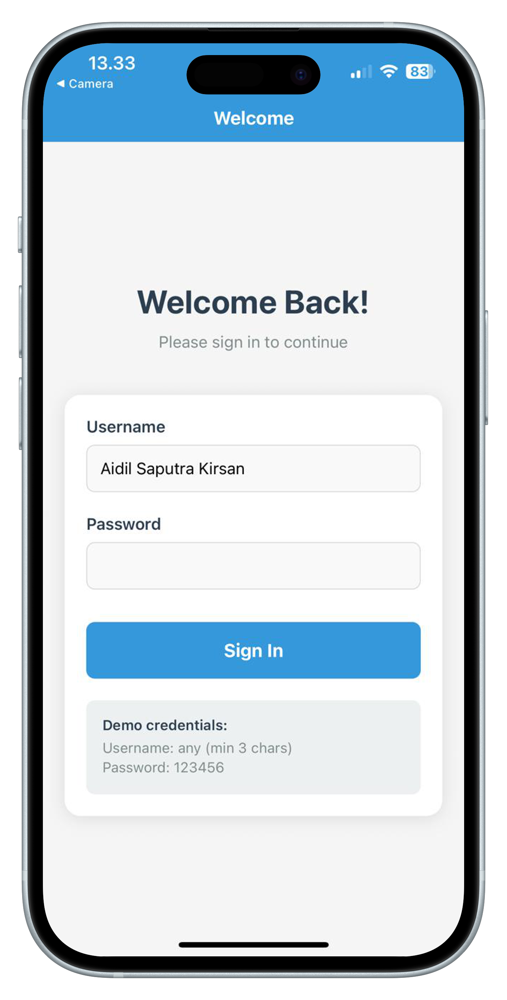
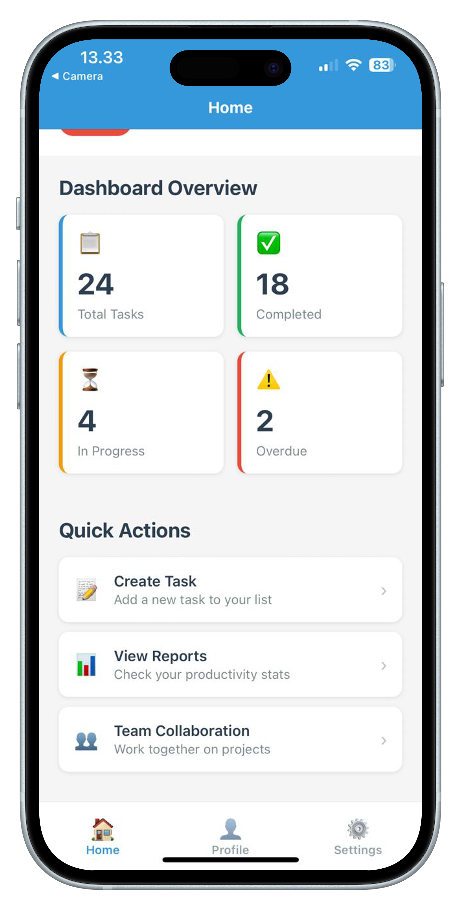
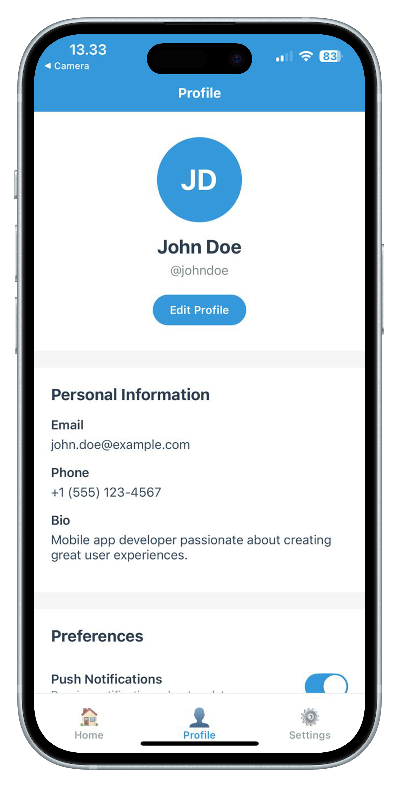
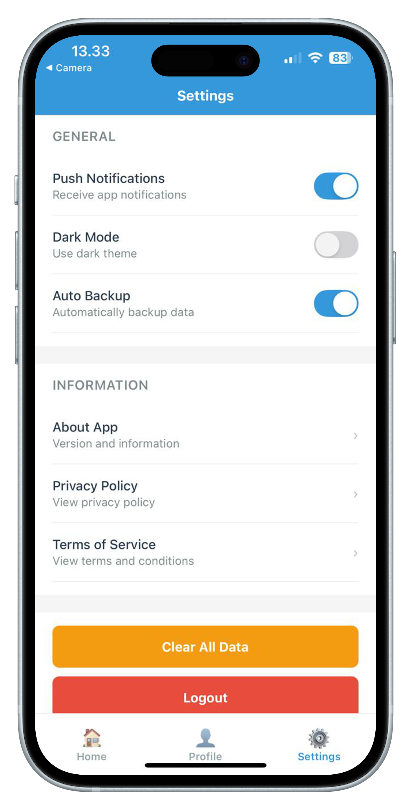

# Modul Praktikum Week 4
## Navigation & Multiple Screens - Hybrid Approach (Expo Router + Screens Folder)

**Mata Kuliah:** Pemrograman Mobile  
**Durasi:** 3 jam (1 sesi praktikum)  
**Tools:** VS Code, Node.js, Expo CLI, Expo Go

---

## 🎯 Learning Objectives
Setelah menyelesaikan praktikum ini, mahasiswa diharapkan mampu:
1. Memahami konsep navigation dalam mobile app development
2. Menggunakan Expo Router untuk file-based routing
3. Menerapkan separation of concerns dengan screens folder
4. Mengimplementasikan Stack Navigation untuk authentication flow
5. Membuat Tab Navigation untuk main app sections
6. Membangun multi-screen app dengan clean architecture
7. Mengelola navigation state dan parameter passing

---

## 📋 Prerequisites
- **Hasil Week 1-3:** State management dan user input sudah dikuasai
- **Hardware:** Laptop/PC dengan RAM minimal 4GB
- **Software:**
  - VS Code dengan project HelloWorld dari week sebelumnya
  - Node.js, Expo CLI, Expo Go
  - Koneksi internet stabil
- **Knowledge:**
  - React Native fundamentals dan state management
  - JavaScript ES6+ dan TypeScript basics
  - Component composition patterns

---

## 📖 Teori Singkat

### Hybrid Approach: Expo Router + Screens Folder
**Hybrid approach** menggabungkan kemudahan file-based routing Expo Router dengan separation of concerns menggunakan screens folder, memberikan struktur yang familiar bagi developer React Navigation.

### Architecture Pattern
```
app/                    # Routing layer (URLs & Navigation)
├── _layout.tsx         # Navigation configuration
├── login.tsx           # Route wrapper
└── (tabs)/
    ├── _layout.tsx     # Tab configuration
    ├── index.tsx       # Route wrapper
    └── profile.tsx     # Route wrapper

screens/                # UI layer (Components & Logic)
├── LoginScreen.tsx     # Actual screen component
├── HomeScreen.tsx      # Actual screen component
└── ProfileScreen.tsx   # Actual screen component

components/             # Shared UI components
└── forms/              # Reusable form components
```

### Benefits of Hybrid Approach
| Benefit | Description |
|---------|-------------|
| **Clear Separation** | Routing logic terpisah dari UI logic |
| **Easy Testing** | Screen components bisa di-test secara terpisah |
| **Reusability** | Screen components bisa digunakan di multiple routes |
| **Familiar Pattern** | Mirip dengan React Navigation pattern |
| **Team Friendly** | Mudah dipahami untuk developer baru |

---

## 🛠️ Bagian 1: Setup Project Structure

### Step 1: Backup dan Clean Up
```bash
# Masuk ke project HelloWorld
cd ReactNativeProjects/HelloWorld

# Backup hasil Week 3
mkdir -p backup/week3
cp -r "app/"* "backup/week3/" 2>/dev/null || true

# Clean up files lama di (tabs)
cd "app/(tabs)/"
ls -la  # Lihat files yang ada
# Backup files lama
for file in *.tsx; do
    if [[ "$file" != "_layout.tsx" && "$file" != "index.tsx" ]]; then
        mv "$file" "${file}.backup" 2>/dev/null || true
    fi
done
cd ../../
```

### Step 2: Create Project Structure
```bash
# Buat folder structure untuk hybrid approach
mkdir -p screens
mkdir -p screens/auth
mkdir -p screens/main
mkdir -p components
mkdir -p components/ui
mkdir -p components/forms
mkdir -p utils
```

### Step 3: Final Project Structure
```
HelloWorld/
├── app/
│   ├── _layout.tsx           # Root Stack Navigator
│   ├── login.tsx             # Login route wrapper
│   └── (tabs)/               # Tab navigation group
│       ├── _layout.tsx       # Tab Navigator configuration
│       ├── index.tsx         # Home route wrapper
│       ├── profile.tsx       # Profile route wrapper
│       └── settings.tsx      # Settings route wrapper
├── screens/
│   ├── auth/
│   │   └── LoginScreen.tsx   # Login screen component
│   └── main/
│       ├── HomeScreen.tsx    # Home screen component
│       ├── ProfileScreen.tsx # Profile screen component
│       └── SettingsScreen.tsx# Settings screen component
├── components/
│   ├── ui/                   # Reusable UI components
│   └── forms/                # Form components
├── utils/                    # Helper functions
└── backup/                   # Backup files
```

---

## 🏗️ Bagian 2: Root Navigation Setup

### Step 1: Root Layout (Stack Navigator)
Buat file `app/_layout.tsx`:

```typescript
import { Stack } from 'expo-router';

export default function RootLayout() {
  return (
    <Stack>
      {/* Login Route - akan menjadi initial route karena alfabetically first */}
      <Stack.Screen 
        name="login" 
        options={{ 
          title: 'Welcome',
          headerStyle: {
            backgroundColor: '#3498db',
          },
          headerTintColor: '#fff',
          headerTitleStyle: {
            fontWeight: 'bold',
          },
        }} 
      />
      
      {/* Tab Navigation Route */}
      <Stack.Screen 
        name="(tabs)" 
        options={{ 
          headerShown: false, // Tabs handle their own headers
        }} 
      />
    </Stack>
  );
}
```

### Step 2: Login Route Wrapper
Buat file `app/login.tsx`:

```typescript
// Route wrapper - hanya import dan export screen component
import LoginScreen from '../screens/auth/LoginScreen';

// Re-export the screen component as default
export default LoginScreen;
```

### Step 3: Tab Layout Configuration
Edit `app/(tabs)/_layout.tsx`:

```typescript
import { Tabs } from 'expo-router';
import { Text, View } from 'react-native';

// Simple Tab Icon Component
const TabIcon = ({ emoji, color, focused }: { 
  emoji: string; 
  color: string; 
  focused: boolean;
}) => (
  <View style={{ 
    alignItems: 'center', 
    justifyContent: 'center',
    opacity: focused ? 1 : 0.7 
  }}>
    <Text style={{ fontSize: focused ? 26 : 22, color }}>{emoji}</Text>
  </View>
);

export default function TabLayout() {
  return (
    <Tabs
      screenOptions={{
        tabBarActiveTintColor: '#3498db',
        tabBarInactiveTintColor: '#95a5a6',
        tabBarStyle: {
          backgroundColor: 'white',
          borderTopWidth: 1,
          borderTopColor: '#ecf0f1',
          paddingBottom: 8,
          paddingTop: 8,
          height: 70,
        },
        headerStyle: {
          backgroundColor: '#3498db',
        },
        headerTintColor: '#fff',
        headerTitleStyle: {
          fontWeight: 'bold',
        },
        tabBarLabelStyle: {
          fontSize: 12,
          fontWeight: '600',
        },
      }}
    >
      <Tabs.Screen
        name="index"
        options={{
          title: 'Home',
          tabBarIcon: ({ color, focused }) => (
            <TabIcon emoji="🏠" color={color} focused={focused} />
          ),
        }}
      />
      <Tabs.Screen
        name="profile"
        options={{
          title: 'Profile',
          tabBarIcon: ({ color, focused }) => (
            <TabIcon emoji="👤" color={color} focused={focused} />
          ),
        }}
      />
      <Tabs.Screen
        name="settings"
        options={{
          title: 'Settings',
          tabBarIcon: ({ color, focused }) => (
            <TabIcon emoji="⚙️" color={color} focused={focused} />
          ),
        }}
      />
    </Tabs>
  );
}
```

### Step 4: Tab Route Wrappers
Edit `app/(tabs)/index.tsx`:
```typescript
// Home route wrapper
import HomeScreen from '../../screens/main/HomeScreen';
export default HomeScreen;
```

Buat file `app/(tabs)/profile.tsx`:
```typescript
// Profile route wrapper
import ProfileScreen from '../../screens/main/ProfileScreen';
export default ProfileScreen;
```

Buat file `app/(tabs)/settings.tsx`:
```typescript
// Settings route wrapper
import SettingsScreen from '../../screens/main/SettingsScreen';
export default SettingsScreen;
```

---

## 🔐 Bagian 3: Screen Components

### Step 1: Login Screen Component
Buat file `screens/auth/LoginScreen.tsx`:

```typescript
import React, { useState } from 'react';
import {
  StyleSheet,
  Text,
  View,
  TextInput,
  TouchableOpacity,
  Alert,
  KeyboardAvoidingView,
  Platform,
} from 'react-native';
import { useRouter } from 'expo-router';

export default function LoginScreen() {
  // State untuk form inputs
  const [username, setUsername] = useState('');
  const [password, setPassword] = useState('');
  const [isLoading, setIsLoading] = useState(false);
  
  // Hook untuk navigation
  const router = useRouter();

  const handleLogin = async () => {
    // Validasi input kosong
    if (!username.trim() || !password.trim()) {
      Alert.alert('Error', 'Please fill in all fields');
      return;
    }

    // Validasi panjang username
    if (username.length < 3) {
      Alert.alert('Error', 'Username must be at least 3 characters');
      return;
    }

    setIsLoading(true);
    
    // Simulate API call dengan setTimeout
    setTimeout(() => {
      setIsLoading(false);
      
      // Simple validation - dalam real app, ini akan jadi API call
      if (password === '123456') {
        // Navigate ke tab navigation setelah login berhasil
        router.replace('/(tabs)');
      } else {
        Alert.alert('Error', 'Invalid credentials. Use password: 123456');
      }
    }, 1500);
  };

  return (
    <KeyboardAvoidingView
      style={styles.container}
      behavior={Platform.OS === 'ios' ? 'padding' : 'height'}
    >
      <View style={styles.loginContainer}>
        <Text style={styles.title}>Welcome Back!</Text>
        <Text style={styles.subtitle}>Please sign in to continue</Text>

        <View style={styles.formContainer}>
          {/* Username Input */}
          <View style={styles.inputGroup}>
            <Text style={styles.label}>Username</Text>
            <TextInput
              style={styles.input}
              value={username}
              onChangeText={setUsername}
              placeholder="Enter your username"
              placeholderTextColor="#999"
              autoCapitalize="none"
            />
          </View>

          {/* Password Input */}
          <View style={styles.inputGroup}>
            <Text style={styles.label}>Password</Text>
            <TextInput
              style={styles.input}
              value={password}
              onChangeText={setPassword}
              placeholder="Enter your password"
              placeholderTextColor="#999"
              secureTextEntry
            />
          </View>

          {/* Login Button */}
          <TouchableOpacity
            style={[styles.loginButton, isLoading && styles.loginButtonDisabled]}
            onPress={handleLogin}
            disabled={isLoading}
          >
            <Text style={styles.loginButtonText}>
              {isLoading ? 'Signing In...' : 'Sign In'}
            </Text>
          </TouchableOpacity>

          {/* Demo Credentials Helper */}
          <View style={styles.helpContainer}>
            <Text style={styles.helpText}>Demo credentials:</Text>
            <Text style={styles.credentialsText}>Username: any (min 3 chars)</Text>
            <Text style={styles.credentialsText}>Password: 123456</Text>
          </View>
        </View>
      </View>
    </KeyboardAvoidingView>
  );
}

const styles = StyleSheet.create({
  container: {
    flex: 1,
    backgroundColor: '#f5f5f5',
  },
  loginContainer: {
    flex: 1,
    justifyContent: 'center',
    padding: 20,
  },
  title: {
    fontSize: 32,
    fontWeight: 'bold',
    color: '#2c3e50',
    textAlign: 'center',
    marginBottom: 10,
  },
  subtitle: {
    fontSize: 16,
    color: '#7f8c8d',
    textAlign: 'center',
    marginBottom: 40,
  },
  formContainer: {
    backgroundColor: 'white',
    borderRadius: 15,
    padding: 20,
    shadowColor: '#000',
    shadowOffset: {
      width: 0,
      height: 2,
    },
    shadowOpacity: 0.1,
    shadowRadius: 8,
    elevation: 5,
  },
  inputGroup: {
    marginBottom: 20,
  },
  label: {
    fontSize: 16,
    fontWeight: '600',
    color: '#2c3e50',
    marginBottom: 8,
  },
  input: {
    borderWidth: 1,
    borderColor: '#ddd',
    borderRadius: 8,
    padding: 12,
    fontSize: 16,
    backgroundColor: '#f9f9f9',
  },
  loginButton: {
    backgroundColor: '#3498db',
    padding: 16,
    borderRadius: 8,
    alignItems: 'center',
    marginTop: 10,
  },
  loginButtonDisabled: {
    backgroundColor: '#bdc3c7',
  },
  loginButtonText: {
    color: 'white',
    fontSize: 18,
    fontWeight: 'bold',
  },
  helpContainer: {
    marginTop: 20,
    padding: 15,
    backgroundColor: '#ecf0f1',
    borderRadius: 8,
  },
  helpText: {
    fontSize: 14,
    fontWeight: '600',
    color: '#2c3e50',
    marginBottom: 5,
  },
  credentialsText: {
    fontSize: 14,
    color: '#7f8c8d',
    marginBottom: 2,
  },
});
```

Save dan test di mobile. Coba masukkan username dan password untuk melihat login flow.

**Hasil Login Screen:**
<div align="center" style="max-width: 320px; margin: 15px auto;">
  
</div>


### Step 2: Home Screen Component
Buat file `screens/main/HomeScreen.tsx`:

```typescript
import React from 'react';
import { StyleSheet, Text, View, ScrollView, TouchableOpacity, Alert } from 'react-native';
import { useRouter } from 'expo-router';

export default function HomeScreen() {
  const router = useRouter();

  // Data untuk dashboard cards
  const dashboardData = [
    { id: '1', title: 'Total Tasks', value: '24', color: '#3498db', icon: '📋' },
    { id: '2', title: 'Completed', value: '18', color: '#27ae60', icon: '✅' },
    { id: '3', title: 'In Progress', value: '4', color: '#f39c12', icon: '⏳' },
    { id: '4', title: 'Overdue', value: '2', color: '#e74c3c', icon: '⚠️' },
  ];

  // Handler untuk quick actions
  const handleActionPress = (action: string) => {
    Alert.alert('Info', `${action} feature coming soon!`);
  };

  // Handler untuk logout
  const handleLogout = () => {
    Alert.alert(
      'Logout',
      'Are you sure you want to logout?',
      [
        { text: 'Cancel', style: 'cancel' },
        { 
          text: 'Logout', 
          style: 'destructive', 
          // Navigate kembali ke login screen
          onPress: () => router.replace('/login')
        }
      ]
    );
  };

  return (
    <ScrollView style={styles.container} showsVerticalScrollIndicator={false}>
      {/* Header dengan welcome message dan logout button */}
      <View style={styles.header}>
        <Text style={styles.welcomeText}>Welcome back,</Text>
        <Text style={styles.usernameText}>User!</Text>
        
        <TouchableOpacity style={styles.logoutButton} onPress={handleLogout}>
          <Text style={styles.logoutButtonText}>Logout</Text>
        </TouchableOpacity>
      </View>

      {/* Dashboard Overview dengan cards */}
      <View style={styles.dashboardContainer}>
        <Text style={styles.sectionTitle}>Dashboard Overview</Text>
        
        <View style={styles.cardsContainer}>
          {dashboardData.map((card) => (
            <View key={card.id} style={[styles.card, { borderLeftColor: card.color }]}>
              <Text style={styles.cardIcon}>{card.icon}</Text>
              <View style={styles.cardContent}>
                <Text style={styles.cardValue}>{card.value}</Text>
                <Text style={styles.cardTitle}>{card.title}</Text>
              </View>
            </View>
          ))}
        </View>
      </View>

      {/* Quick Actions Section */}
      <View style={styles.quickActionsContainer}>
        <Text style={styles.sectionTitle}>Quick Actions</Text>
        
        <TouchableOpacity
          style={styles.actionButton}
          onPress={() => handleActionPress('Create Task')}
        >
          <Text style={styles.actionIcon}>📝</Text>
          <View style={styles.actionContent}>
            <Text style={styles.actionTitle}>Create Task</Text>
            <Text style={styles.actionSubtitle}>Add a new task to your list</Text>
          </View>
          <Text style={styles.actionArrow}>›</Text>
        </TouchableOpacity>

        <TouchableOpacity
          style={styles.actionButton}
          onPress={() => handleActionPress('View Reports')}
        >
          <Text style={styles.actionIcon}>📊</Text>
          <View style={styles.actionContent}>
            <Text style={styles.actionTitle}>View Reports</Text>
            <Text style={styles.actionSubtitle}>Check your productivity stats</Text>
          </View>
          <Text style={styles.actionArrow}>›</Text>
        </TouchableOpacity>

        <TouchableOpacity
          style={styles.actionButton}
          onPress={() => handleActionPress('Team Collaboration')}
        >
          <Text style={styles.actionIcon}>👥</Text>
          <View style={styles.actionContent}>
            <Text style={styles.actionTitle}>Team Collaboration</Text>
            <Text style={styles.actionSubtitle}>Work together on projects</Text>
          </View>
          <Text style={styles.actionArrow}>›</Text>
        </TouchableOpacity>
      </View>
    </ScrollView>
  );
}

const styles = StyleSheet.create({
  container: {
    flex: 1,
    backgroundColor: '#f5f5f5',
  },
  header: {
    padding: 20,
    backgroundColor: 'white',
    marginBottom: 20,
  },
  welcomeText: {
    fontSize: 18,
    color: '#7f8c8d',
  },
  usernameText: {
    fontSize: 28,
    fontWeight: 'bold',
    color: '#2c3e50',
    marginBottom: 15,
  },
  logoutButton: {
    backgroundColor: '#e74c3c',
    paddingHorizontal: 15,
    paddingVertical: 8,
    borderRadius: 15,
    alignSelf: 'flex-start',
  },
  logoutButtonText: {
    color: 'white',
    fontSize: 14,
    fontWeight: '600',
  },
  dashboardContainer: {
    paddingHorizontal: 20,
    marginBottom: 30,
  },
  sectionTitle: {
    fontSize: 22,
    fontWeight: 'bold',
    color: '#2c3e50',
    marginBottom: 15,
  },
  cardsContainer: {
    flexDirection: 'row',
    flexWrap: 'wrap',
    justifyContent: 'space-between',
  },
  card: {
    backgroundColor: 'white',
    borderRadius: 10,
    padding: 15,
    width: '48%',
    marginBottom: 15,
    borderLeftWidth: 4,
    shadowColor: '#000',
    shadowOffset: {
      width: 0,
      height: 1,
    },
    shadowOpacity: 0.1,
    shadowRadius: 2,
    elevation: 3,
  },
  cardIcon: {
    fontSize: 24,
    marginBottom: 10,
  },
  cardContent: {
    alignItems: 'flex-start',
  },
  cardValue: {
    fontSize: 32,
    fontWeight: 'bold',
    color: '#2c3e50',
  },
  cardTitle: {
    fontSize: 14,
    color: '#7f8c8d',
    marginTop: 5,
  },
  quickActionsContainer: {
    paddingHorizontal: 20,
    marginBottom: 20,
  },
  actionButton: {
    backgroundColor: 'white',
    borderRadius: 10,
    padding: 15,
    marginBottom: 10,
    flexDirection: 'row',
    alignItems: 'center',
    shadowColor: '#000',
    shadowOffset: {
      width: 0,
      height: 1,
    },
    shadowOpacity: 0.1,
    shadowRadius: 2,
    elevation: 3,
  },
  actionIcon: {
    fontSize: 24,
    marginRight: 15,
  },
  actionContent: {
    flex: 1,
  },
  actionTitle: {
    fontSize: 16,
    fontWeight: '600',
    color: '#2c3e50',
  },
  actionSubtitle: {
    fontSize: 14,
    color: '#7f8c8d',
    marginTop: 2,
  },
  actionArrow: {
    fontSize: 20,
    color: '#bdc3c7',
  },
});
```

**Hasil Home Screen dengan Dashboard:**
<div align="center" style="max-width: 320px; margin: 15px auto;">
  
</div>


### Step 3: Profile Screen Component
Buat file `screens/main/ProfileScreen.tsx`:

```typescript
import React, { useState } from 'react';
import { StyleSheet, Text, View, ScrollView, TouchableOpacity, Switch, Alert } from 'react-native';
import { useRouter } from 'expo-router';

export default function ProfileScreen() {
  // State untuk settings switches
  const [notifications, setNotifications] = useState(true);
  const [darkMode, setDarkMode] = useState(false);
  const [autoBackup, setAutoBackup] = useState(true);
  
  const router = useRouter();

  // Mock user profile data
  const profile = {
    username: 'johndoe',
    fullName: 'John Doe',
    email: 'john.doe@example.com',
    phone: '+1 (555) 123-4567',
    bio: 'Mobile app developer passionate about creating great user experiences.',
  };

  // Handler untuk logout
  const handleLogout = () => {
    Alert.alert(
      'Logout',
      'Are you sure you want to logout?',
      [
        { text: 'Cancel', style: 'cancel' },
        { 
          text: 'Logout', 
          style: 'destructive', 
          onPress: () => router.replace('/login')
        }
      ]
    );
  };

  // Handler untuk edit profile
  const handleEditProfile = () => {
    Alert.alert('Info', 'Edit profile feature coming soon!');
  };

  return (
    <ScrollView style={styles.container} showsVerticalScrollIndicator={false}>
      {/* Profile Header dengan avatar dan basic info */}
      <View style={styles.profileHeader}>
        <View style={styles.avatarContainer}>
          <View style={styles.avatar}>
            <Text style={styles.avatarText}>
              {/* Generate initials dari nama */}
              {profile.fullName.split(' ').map(n => n[0]).join('')}
            </Text>
          </View>
        </View>
        <Text style={styles.fullName}>{profile.fullName}</Text>
        <Text style={styles.username}>@{profile.username}</Text>
        
        <TouchableOpacity style={styles.editButton} onPress={handleEditProfile}>
          <Text style={styles.editButtonText}>Edit Profile</Text>
        </TouchableOpacity>
      </View>

      {/* Personal Information Section */}
      <View style={styles.section}>
        <Text style={styles.sectionTitle}>Personal Information</Text>
        
        <View style={styles.infoItem}>
          <Text style={styles.label}>Email</Text>
          <Text style={styles.value}>{profile.email}</Text>
        </View>
        <View style={styles.infoItem}>
          <Text style={styles.label}>Phone</Text>
          <Text style={styles.value}>{profile.phone}</Text>
        </View>
        <View style={styles.infoItem}>
          <Text style={styles.label}>Bio</Text>
          <Text style={styles.value}>{profile.bio}</Text>
        </View>
      </View>

      {/* Preferences Section dengan switches */}
      <View style={styles.section}>
        <Text style={styles.sectionTitle}>Preferences</Text>
        
        <View style={styles.settingItem}>
          <View style={styles.settingContent}>
            <Text style={styles.settingTitle}>Push Notifications</Text>
            <Text style={styles.settingSubtitle}>Receive notifications about updates</Text>
          </View>
          <Switch
            value={notifications}
            onValueChange={setNotifications}
            trackColor={{ false: '#767577', true: '#3498db' }}
            thumbColor={notifications ? '#ffffff' : '#f4f3f4'}
          />
        </View>

        <View style={styles.settingItem}>
          <View style={styles.settingContent}>
            <Text style={styles.settingTitle}>Dark Mode</Text>
            <Text style={styles.settingSubtitle}>Use dark theme for the app</Text>
          </View>
          <Switch
            value={darkMode}
            onValueChange={setDarkMode}
            trackColor={{ false: '#767577', true: '#3498db' }}
            thumbColor={darkMode ? '#ffffff' : '#f4f3f4'}
          />
        </View>

        <View style={styles.settingItem}>
          <View style={styles.settingContent}>
            <Text style={styles.settingTitle}>Auto Backup</Text>
            <Text style={styles.settingSubtitle}>Automatically backup your data</Text>
          </View>
          <Switch
            value={autoBackup}
            onValueChange={setAutoBackup}
            trackColor={{ false: '#767577', true: '#3498db' }}
            thumbColor={autoBackup ? '#ffffff' : '#f4f3f4'}
          />
        </View>
      </View>

      {/* Actions Section */}
      <View style={styles.section}>
        <TouchableOpacity
          style={[styles.actionButton, styles.logoutButton]}
          onPress={handleLogout}
        >
          <Text style={[styles.actionButtonText, styles.logoutButtonText]}>
            Logout
          </Text>
        </TouchableOpacity>
      </View>
    </ScrollView>
  );
}

const styles = StyleSheet.create({
  container: {
    flex: 1,
    backgroundColor: '#f5f5f5',
  },
  profileHeader: {
    backgroundColor: 'white',
    alignItems: 'center',
    paddingVertical: 30,
    marginBottom: 20,
  },
  avatarContainer: {
    marginBottom: 15,
  },
  avatar: {
    width: 100,
    height: 100,
    borderRadius: 50,
    backgroundColor: '#3498db',
    justifyContent: 'center',
    alignItems: 'center',
  },
  avatarText: {
    fontSize: 36,
    fontWeight: 'bold',
    color: 'white',
  },
  fullName: {
    fontSize: 24,
    fontWeight: 'bold',
    color: '#2c3e50',
    marginBottom: 5,
  },
  username: {
    fontSize: 16,
    color: '#7f8c8d',
    marginBottom: 20,
  },
  editButton: {
    backgroundColor: '#3498db',
    paddingHorizontal: 20,
    paddingVertical: 10,
    borderRadius: 20,
  },
  editButtonText: {
    color: 'white',
    fontSize: 14,
    fontWeight: '600',
  },
  section: {
    backgroundColor: 'white',
    marginBottom: 20,
    padding: 20,
  },
  sectionTitle: {
    fontSize: 20,
    fontWeight: 'bold',
    color: '#2c3e50',
    marginBottom: 15,
  },
  infoItem: {
    marginBottom: 15,
  },
  label: {
    fontSize: 16,
    fontWeight: '600',
    color: '#2c3e50',
    marginBottom: 5,
  },
  value: {
    fontSize: 16,
    color: '#34495e',
  },
  settingItem: {
    flexDirection: 'row',
    alignItems: 'center',
    paddingVertical: 15,
    borderBottomWidth: 1,
    borderBottomColor: '#ecf0f1',
  },
  settingContent: {
    flex: 1,
  },
  settingTitle: {
    fontSize: 16,
    fontWeight: '600',
    color: '#2c3e50',
  },
  settingSubtitle: {
    fontSize: 14,
    color: '#7f8c8d',
    marginTop: 2,
  },
  actionButton: {
    backgroundColor: '#3498db',
    padding: 15,
    borderRadius: 8,
    alignItems: 'center',
    marginBottom: 10,
  },
  actionButtonText: {
    color: 'white',
    fontSize: 16,
    fontWeight: 'bold',
  },
  logoutButton: {
    backgroundColor: '#e74c3c',
  },
  logoutButtonText: {
    color: 'white',
  },
});
```

**Hasil Profile Screen dengan User Information:**
<div align="center" style="max-width: 320px; margin: 15px auto;">
  
</div>

### Step 4: Settings Screen Component
Buat file `screens/main/SettingsScreen.tsx`:

```typescript
import React, { useState } from 'react';
import {
  StyleSheet,
  Text,
  View,
  ScrollView,
  TouchableOpacity,
  Switch,
  Alert,
} from 'react-native';
import { useRouter } from 'expo-router';

// Interface untuk setting items
interface Setting {
  id: string;
  title: string;
  subtitle: string;
  type: 'switch' | 'action';
  value?: boolean;
  onPress?: () => void;
}

export default function SettingsScreen() {
  const router = useRouter();
  
  // State untuk semua settings
  const [settings, setSettings] = useState<Setting[]>([
    {
      id: 'notifications',
      title: 'Push Notifications',
      subtitle: 'Receive app notifications',
      type: 'switch',
      value: true,
    },
    {
      id: 'darkMode',
      title: 'Dark Mode',
      subtitle: 'Use dark theme',
      type: 'switch',
      value: false,
    },
    {
      id: 'autoBackup',
      title: 'Auto Backup',
      subtitle: 'Automatically backup data',
      type: 'switch',
      value: true,
    },
    {
      id: 'about',
      title: 'About App',
      subtitle: 'Version and information',
      type: 'action',
      onPress: () => Alert.alert('About', 'React Native Navigation Demo v1.0\nBuilt with Expo Router + Screens'),
    },
    {
      id: 'privacy',
      title: 'Privacy Policy',
      subtitle: 'View privacy policy',
      type: 'action',
      onPress: () => Alert.alert('Privacy', 'Privacy policy content here'),
    },
    {
      id: 'terms',
      title: 'Terms of Service',
      subtitle: 'View terms and conditions',
      type: 'action',
      onPress: () => Alert.alert('Terms', 'Terms of service content here'),
    },
  ]);

  // Handler untuk toggle switch settings
  const toggleSetting = (id: string) => {
    setSettings(prev =>
      prev.map(setting =>
        setting.id === id && setting.type === 'switch'
          ? { ...setting, value: !setting.value }
          : setting
      )
    );
  };

  // Handler untuk logout
  const handleLogout = () => {
    Alert.alert(
      'Logout',
      'Are you sure you want to logout?',
      [
        { text: 'Cancel', style: 'cancel' },
        { 
          text: 'Logout', 
          style: 'destructive', 
          onPress: () => router.replace('/login')
        }
      ]
    );
  };

  // Render individual setting item
  const renderSettingItem = (setting: Setting) => {
    return (
      <TouchableOpacity
        key={setting.id}
        style={styles.settingItem}
        onPress={setting.type === 'action' ? setting.onPress : undefined}
        disabled={setting.type === 'switch'}
      >
        <View style={styles.settingContent}>
          <Text style={styles.settingTitle}>{setting.title}</Text>
          <Text style={styles.settingSubtitle}>{setting.subtitle}</Text>
        </View>
        
        {setting.type === 'switch' ? (
          <Switch
            value={setting.value}
            onValueChange={() => toggleSetting(setting.id)}
            trackColor={{ false: '#767577', true: '#3498db' }}
            thumbColor={setting.value ? '#ffffff' : '#f4f3f4'}
          />
        ) : (
          <Text style={styles.arrow}>›</Text>
        )}
      </TouchableOpacity>
    );
  };

  return (
    <ScrollView style={styles.container} showsVerticalScrollIndicator={false}>
      {/* General Settings Section */}
      <View style={styles.section}>
        <Text style={styles.sectionTitle}>General</Text>
        {settings.filter(s => ['notifications', 'darkMode', 'autoBackup'].includes(s.id)).map(renderSettingItem)}
      </View>

      {/* Information Settings Section */}
      <View style={styles.section}>
        <Text style={styles.sectionTitle}>Information</Text>
        {settings.filter(s => ['about', 'privacy', 'terms'].includes(s.id)).map(renderSettingItem)}
      </View>

      {/* Danger Zone Section */}
      <View style={styles.section}>
        <TouchableOpacity
          style={styles.dangerButton}
          onPress={() => Alert.alert('Clear Data', 'This will clear all app data')}
        >
          <Text style={styles.dangerButtonText}>Clear All Data</Text>
        </TouchableOpacity>
        
        <TouchableOpacity
          style={[styles.dangerButton, { backgroundColor: '#e74c3c', marginTop: 10 }]}
          onPress={handleLogout}
        >
          <Text style={styles.dangerButtonText}>Logout</Text>
        </TouchableOpacity>
      </View>
    </ScrollView>
  );
}

const styles = StyleSheet.create({
  container: {
    flex: 1,
    backgroundColor: '#f5f5f5',
  },
  section: {
    backgroundColor: 'white',
    marginBottom: 20,
    paddingHorizontal: 20,
    paddingVertical: 15,
  },
  sectionTitle: {
    fontSize: 16,
    fontWeight: '600',
    color: '#7f8c8d',
    marginBottom: 15,
    textTransform: 'uppercase',
    letterSpacing: 0.5,
  },
  settingItem: {
    flexDirection: 'row',
    alignItems: 'center',
    paddingVertical: 15,
    borderBottomWidth: 1,
    borderBottomColor: '#ecf0f1',
  },
  settingContent: {
    flex: 1,
  },
  settingTitle: {
    fontSize: 16,
    fontWeight: '500',
    color: '#2c3e50',
  },
  settingSubtitle: {
    fontSize: 14,
    color: '#7f8c8d',
    marginTop: 2,
  },
  arrow: {
    fontSize: 18,
    color: '#bdc3c7',
  },
  dangerButton: {
    backgroundColor: '#f39c12',
    padding: 15,
    borderRadius: 8,
    alignItems: 'center',
  },
  dangerButtonText: {
    color: 'white',
    fontSize: 16,
    fontWeight: 'bold',
  },
});
```

**Hasil Settings Screen dengan Preferences:**
<div align="center" style="max-width: 320px; margin: 15px auto;">
  
</div>

---

## 📱 Bagian 4: Tab Navigation Implementation

Setelah semua screen components dibuat, mari kita test tab navigation secara keseluruhan:

### Testing Flow yang Lengkap:
1. **Login Screen** → Input credentials dan navigate ke tabs
2. **Home Tab** → Dashboard dengan cards dan quick actions
3. **Profile Tab** → User profile dengan personal information dan preferences
4. **Settings Tab** → App settings dengan switches dan action items
5. **Logout Flow** → Dari tab manapun kembali ke login screen

---

## 🛠️ Bagian 1: Setup Project Structure

### Step 1: Backup dan Clean Up
```bash
# Masuk ke project HelloWorld
cd ReactNativeProjects/HelloWorld

# Backup hasil Week 3
mkdir -p backup/week3
cp -r "app/"* "backup/week3/" 2>/dev/null || true

# Clean up files lama di (tabs)
cd "app/(tabs)/"
ls -la  # Lihat files yang ada
# Backup files lama
for file in *.tsx; do
    if [[ "$file" != "_layout.tsx" && "$file" != "index.tsx" ]]; then
        mv "$file" "${file}.backup" 2>/dev/null || true
    fi
done
cd ../../
```

### Step 2: Create Project Structure
```bash
# Buat folder structure untuk hybrid approach
mkdir -p screens
mkdir -p screens/auth
mkdir -p screens/main
mkdir -p components
mkdir -p components/ui
mkdir -p components/forms
mkdir -p utils
```

### Step 3: Final Project Structure
```
HelloWorld/
├── app/
│   ├── _layout.tsx           # Root Stack Navigator
│   ├── login.tsx             # Login route wrapper
│   └── (tabs)/               # Tab navigation group
│       ├── _layout.tsx       # Tab Navigator configuration
│       ├── index.tsx         # Home route wrapper
│       ├── profile.tsx       # Profile route wrapper
│       └── settings.tsx      # Settings route wrapper
├── screens/
│   ├── auth/
│   │   └── LoginScreen.tsx   # Login screen component
│   └── main/
│       ├── HomeScreen.tsx    # Home screen component
│       ├── ProfileScreen.tsx # Profile screen component
│       └── SettingsScreen.tsx# Settings screen component
├── components/
│   ├── ui/                   # Reusable UI components
│   └── forms/                # Form components
├── utils/                    # Helper functions
└── backup/                   # Backup files
```

---

## 🏗️ Bagian 2: Root Navigation Setup

### Step 1: Root Layout (Stack Navigator)
Buat file `app/_layout.tsx`:

```typescript
import { Stack } from 'expo-router';

export default function RootLayout() {
  return (
    <Stack>
      {/* Login Route - akan menjadi initial route karena alfabetically first */}
      <Stack.Screen 
        name="login" 
        options={{ 
          title: 'Welcome',
          headerStyle: {
            backgroundColor: '#3498db',
          },
          headerTintColor: '#fff',
          headerTitleStyle: {
            fontWeight: 'bold',
          },
        }} 
      />
      
      {/* Tab Navigation Route */}
      <Stack.Screen 
        name="(tabs)" 
        options={{ 
          headerShown: false, // Tabs handle their own headers
        }} 
      />
    </Stack>
  );
}
```

### Step 2: Login Route Wrapper
Buat file `app/login.tsx`:

```typescript
// Route wrapper - hanya import dan export screen component
import LoginScreen from '../screens/auth/LoginScreen';

// Re-export the screen component as default
export default LoginScreen;
```

### Step 3: Tab Layout Configuration
Edit `app/(tabs)/_layout.tsx`:

```typescript
import { Tabs } from 'expo-router';
import { Text, View } from 'react-native';

// Simple Tab Icon Component
const TabIcon = ({ emoji, color, focused }: { 
  emoji: string; 
  color: string; 
  focused: boolean;
}) => (
  <View style={{ 
    alignItems: 'center', 
    justifyContent: 'center',
    opacity: focused ? 1 : 0.7 
  }}>
    <Text style={{ fontSize: focused ? 26 : 22, color }}>{emoji}</Text>
  </View>
);

export default function TabLayout() {
  return (
    <Tabs
      screenOptions={{
        tabBarActiveTintColor: '#3498db',
        tabBarInactiveTintColor: '#95a5a6',
        tabBarStyle: {
          backgroundColor: 'white',
          borderTopWidth: 1,
          borderTopColor: '#ecf0f1',
          paddingBottom: 8,
          paddingTop: 8,
          height: 70,
        },
        headerStyle: {
          backgroundColor: '#3498db',
        },
        headerTintColor: '#fff',
        headerTitleStyle: {
          fontWeight: 'bold',
        },
        tabBarLabelStyle: {
          fontSize: 12,
          fontWeight: '600',
        },
      }}
    >
      <Tabs.Screen
        name="index"
        options={{
          title: 'Home',
          tabBarIcon: ({ color, focused }) => (
            <TabIcon emoji="🏠" color={color} focused={focused} />
          ),
        }}
      />
      <Tabs.Screen
        name="profile"
        options={{
          title: 'Profile',
          tabBarIcon: ({ color, focused }) => (
            <TabIcon emoji="👤" color={color} focused={focused} />
          ),
        }}
      />
      <Tabs.Screen
        name="settings"
        options={{
          title: 'Settings',
          tabBarIcon: ({ color, focused }) => (
            <TabIcon emoji="⚙️" color={color} focused={focused} />
          ),
        }}
      />
    </Tabs>
  );
}
```

### Step 4: Tab Route Wrappers
Edit `app/(tabs)/index.tsx`:
```typescript
// Home route wrapper
import HomeScreen from '../../screens/main/HomeScreen';
export default HomeScreen;
```

Buat file `app/(tabs)/profile.tsx`:
```typescript
// Profile route wrapper
import ProfileScreen from '../../screens/main/ProfileScreen';
export default ProfileScreen;
```

Buat file `app/(tabs)/settings.tsx`:
```typescript
// Settings route wrapper
import SettingsScreen from '../../screens/main/SettingsScreen';
export default SettingsScreen;
```

---

## 🔐 Bagian 3: Screen Components

### Step 1: Login Screen Component
Buat file `screens/auth/LoginScreen.tsx`:

```typescript
import React, { useState } from 'react';
import {
  StyleSheet,
  Text,
  View,
  TextInput,
  TouchableOpacity,
  Alert,
  KeyboardAvoidingView,
  Platform,
} from 'react-native';
import { useRouter } from 'expo-router';

export default function LoginScreen() {
  // State untuk form inputs
  const [username, setUsername] = useState('');
  const [password, setPassword] = useState('');
  const [isLoading, setIsLoading] = useState(false);
  
  // Hook untuk navigation
  const router = useRouter();

  const handleLogin = async () => {
    // Validasi input kosong
    if (!username.trim() || !password.trim()) {
      Alert.alert('Error', 'Please fill in all fields');
      return;
    }

    // Validasi panjang username
    if (username.length < 3) {
      Alert.alert('Error', 'Username must be at least 3 characters');
      return;
    }

    setIsLoading(true);
    
    // Simulate API call dengan setTimeout
    setTimeout(() => {
      setIsLoading(false);
      
      // Simple validation - dalam real app, ini akan jadi API call
      if (password === '123456') {
        // Navigate ke tab navigation setelah login berhasil
        router.replace('/(tabs)');
      } else {
        Alert.alert('Error', 'Invalid credentials. Use password: 123456');
      }
    }, 1500);
  };

  return (
    <KeyboardAvoidingView
      style={styles.container}
      behavior={Platform.OS === 'ios' ? 'padding' : 'height'}
    >
      <View style={styles.loginContainer}>
        <Text style={styles.title}>Welcome Back!</Text>
        <Text style={styles.subtitle}>Please sign in to continue</Text>

        <View style={styles.formContainer}>
          {/* Username Input */}
          <View style={styles.inputGroup}>
            <Text style={styles.label}>Username</Text>
            <TextInput
              style={styles.input}
              value={username}
              onChangeText={setUsername}
              placeholder="Enter your username"
              placeholderTextColor="#999"
              autoCapitalize="none"
            />
          </View>

          {/* Password Input */}
          <View style={styles.inputGroup}>
            <Text style={styles.label}>Password</Text>
            <TextInput
              style={styles.input}
              value={password}
              onChangeText={setPassword}
              placeholder="Enter your password"
              placeholderTextColor="#999"
              secureTextEntry
            />
          </View>

          {/* Login Button */}
          <TouchableOpacity
            style={[styles.loginButton, isLoading && styles.loginButtonDisabled]}
            onPress={handleLogin}
            disabled={isLoading}
          >
            <Text style={styles.loginButtonText}>
              {isLoading ? 'Signing In...' : 'Sign In'}
            </Text>
          </TouchableOpacity>

          {/* Demo Credentials Helper */}
          <View style={styles.helpContainer}>
            <Text style={styles.helpText}>Demo credentials:</Text>
            <Text style={styles.credentialsText}>Username: any (min 3 chars)</Text>
            <Text style={styles.credentialsText}>Password: 123456</Text>
          </View>
        </View>
      </View>
    </KeyboardAvoidingView>
  );
}

const styles = StyleSheet.create({
  container: {
    flex: 1,
    backgroundColor: '#f5f5f5',
  },
  loginContainer: {
    flex: 1,
    justifyContent: 'center',
    padding: 20,
  },
  title: {
    fontSize: 32,
    fontWeight: 'bold',
    color: '#2c3e50',
    textAlign: 'center',
    marginBottom: 10,
  },
  subtitle: {
    fontSize: 16,
    color: '#7f8c8d',
    textAlign: 'center',
    marginBottom: 40,
  },
  formContainer: {
    backgroundColor: 'white',
    borderRadius: 15,
    padding: 20,
    shadowColor: '#000',
    shadowOffset: {
      width: 0,
      height: 2,
    },
    shadowOpacity: 0.1,
    shadowRadius: 8,
    elevation: 5,
  },
  inputGroup: {
    marginBottom: 20,
  },
  label: {
    fontSize: 16,
    fontWeight: '600',
    color: '#2c3e50',
    marginBottom: 8,
  },
  input: {
    borderWidth: 1,
    borderColor: '#ddd',
    borderRadius: 8,
    padding: 12,
    fontSize: 16,
    backgroundColor: '#f9f9f9',
  },
  loginButton: {
    backgroundColor: '#3498db',
    padding: 16,
    borderRadius: 8,
    alignItems: 'center',
    marginTop: 10,
  },
  loginButtonDisabled: {
    backgroundColor: '#bdc3c7',
  },
  loginButtonText: {
    color: 'white',
    fontSize: 18,
    fontWeight: 'bold',
  },
  helpContainer: {
    marginTop: 20,
    padding: 15,
    backgroundColor: '#ecf0f1',
    borderRadius: 8,
  },
  helpText: {
    fontSize: 14,
    fontWeight: '600',
    color: '#2c3e50',
    marginBottom: 5,
  },
  credentialsText: {
    fontSize: 14,
    color: '#7f8c8d',
    marginBottom: 2,
  },
});
```

### Step 2: Home Screen Component
Buat file `screens/main/HomeScreen.tsx`:

```typescript
import React from 'react';
import { StyleSheet, Text, View, ScrollView, TouchableOpacity, Alert } from 'react-native';
import { useRouter } from 'expo-router';

export default function HomeScreen() {
  const router = useRouter();

  // Data untuk dashboard cards
  const dashboardData = [
    { id: '1', title: 'Total Tasks', value: '24', color: '#3498db', icon: '📋' },
    { id: '2', title: 'Completed', value: '18', color: '#27ae60', icon: '✅' },
    { id: '3', title: 'In Progress', value: '4', color: '#f39c12', icon: '⏳' },
    { id: '4', title: 'Overdue', value: '2', color: '#e74c3c', icon: '⚠️' },
  ];

  // Handler untuk quick actions
  const handleActionPress = (action: string) => {
    Alert.alert('Info', `${action} feature coming soon!`);
  };

  // Handler untuk logout
  const handleLogout = () => {
    Alert.alert(
      'Logout',
      'Are you sure you want to logout?',
      [
        { text: 'Cancel', style: 'cancel' },
        { 
          text: 'Logout', 
          style: 'destructive', 
          // Navigate kembali ke login screen
          onPress: () => router.replace('/login')
        }
      ]
    );
  };

  return (
    <ScrollView style={styles.container} showsVerticalScrollIndicator={false}>
      {/* Header dengan welcome message dan logout button */}
      <View style={styles.header}>
        <Text style={styles.welcomeText}>Welcome back,</Text>
        <Text style={styles.usernameText}>User!</Text>
        
        <TouchableOpacity style={styles.logoutButton} onPress={handleLogout}>
          <Text style={styles.logoutButtonText}>Logout</Text>
        </TouchableOpacity>
      </View>

      {/* Dashboard Overview dengan cards */}
      <View style={styles.dashboardContainer}>
        <Text style={styles.sectionTitle}>Dashboard Overview</Text>
        
        <View style={styles.cardsContainer}>
          {dashboardData.map((card) => (
            <View key={card.id} style={[styles.card, { borderLeftColor: card.color }]}>
              <Text style={styles.cardIcon}>{card.icon}</Text>
              <View style={styles.cardContent}>
                <Text style={styles.cardValue}>{card.value}</Text>
                <Text style={styles.cardTitle}>{card.title}</Text>
              </View>
            </View>
          ))}
        </View>
      </View>

      {/* Quick Actions Section */}
      <View style={styles.quickActionsContainer}>
        <Text style={styles.sectionTitle}>Quick Actions</Text>
        
        <TouchableOpacity
          style={styles.actionButton}
          onPress={() => handleActionPress('Create Task')}
        >
          <Text style={styles.actionIcon}>📝</Text>
          <View style={styles.actionContent}>
            <Text style={styles.actionTitle}>Create Task</Text>
            <Text style={styles.actionSubtitle}>Add a new task to your list</Text>
          </View>
          <Text style={styles.actionArrow}>›</Text>
        </TouchableOpacity>

        <TouchableOpacity
          style={styles.actionButton}
          onPress={() => handleActionPress('View Reports')}
        >
          <Text style={styles.actionIcon}>📊</Text>
          <View style={styles.actionContent}>
            <Text style={styles.actionTitle}>View Reports</Text>
            <Text style={styles.actionSubtitle}>Check your productivity stats</Text>
          </View>
          <Text style={styles.actionArrow}>›</Text>
        </TouchableOpacity>

        <TouchableOpacity
          style={styles.actionButton}
          onPress={() => handleActionPress('Team Collaboration')}
        >
          <Text style={styles.actionIcon}>👥</Text>
          <View style={styles.actionContent}>
            <Text style={styles.actionTitle}>Team Collaboration</Text>
            <Text style={styles.actionSubtitle}>Work together on projects</Text>
          </View>
          <Text style={styles.actionArrow}>›</Text>
        </TouchableOpacity>
      </View>
    </ScrollView>
  );
}

const styles = StyleSheet.create({
  container: {
    flex: 1,
    backgroundColor: '#f5f5f5',
  },
  header: {
    padding: 20,
    backgroundColor: 'white',
    marginBottom: 20,
  },
  welcomeText: {
    fontSize: 18,
    color: '#7f8c8d',
  },
  usernameText: {
    fontSize: 28,
    fontWeight: 'bold',
    color: '#2c3e50',
    marginBottom: 15,
  },
  logoutButton: {
    backgroundColor: '#e74c3c',
    paddingHorizontal: 15,
    paddingVertical: 8,
    borderRadius: 15,
    alignSelf: 'flex-start',
  },
  logoutButtonText: {
    color: 'white',
    fontSize: 14,
    fontWeight: '600',
  },
  dashboardContainer: {
    paddingHorizontal: 20,
    marginBottom: 30,
  },
  sectionTitle: {
    fontSize: 22,
    fontWeight: 'bold',
    color: '#2c3e50',
    marginBottom: 15,
  },
  cardsContainer: {
    flexDirection: 'row',
    flexWrap: 'wrap',
    justifyContent: 'space-between',
  },
  card: {
    backgroundColor: 'white',
    borderRadius: 10,
    padding: 15,
    width: '48%',
    marginBottom: 15,
    borderLeftWidth: 4,
    shadowColor: '#000',
    shadowOffset: {
      width: 0,
      height: 1,
    },
    shadowOpacity: 0.1,
    shadowRadius: 2,
    elevation: 3,
  },
  cardIcon: {
    fontSize: 24,
    marginBottom: 10,
  },
  cardContent: {
    alignItems: 'flex-start',
  },
  cardValue: {
    fontSize: 32,
    fontWeight: 'bold',
    color: '#2c3e50',
  },
  cardTitle: {
    fontSize: 14,
    color: '#7f8c8d',
    marginTop: 5,
  },
  quickActionsContainer: {
    paddingHorizontal: 20,
    marginBottom: 20,
  },
  actionButton: {
    backgroundColor: 'white',
    borderRadius: 10,
    padding: 15,
    marginBottom: 10,
    flexDirection: 'row',
    alignItems: 'center',
    shadowColor: '#000',
    shadowOffset: {
      width: 0,
      height: 1,
    },
    shadowOpacity: 0.1,
    shadowRadius: 2,
    elevation: 3,
  },
  actionIcon: {
    fontSize: 24,
    marginRight: 15,
  },
  actionContent: {
    flex: 1,
  },
  actionTitle: {
    fontSize: 16,
    fontWeight: '600',
    color: '#2c3e50',
  },
  actionSubtitle: {
    fontSize: 14,
    color: '#7f8c8d',
    marginTop: 2,
  },
  actionArrow: {
    fontSize: 20,
    color: '#bdc3c7',
  },
});
```

### Step 3: Profile Screen Component
Buat file `screens/main/ProfileScreen.tsx`:

```typescript
import React, { useState } from 'react';
import { StyleSheet, Text, View, ScrollView, TouchableOpacity, Switch, Alert } from 'react-native';
import { useRouter } from 'expo-router';

export default function ProfileScreen() {
  // State untuk settings switches
  const [notifications, setNotifications] = useState(true);
  const [darkMode, setDarkMode] = useState(false);
  const [autoBackup, setAutoBackup] = useState(true);
  
  const router = useRouter();

  // Mock user profile data
  const profile = {
    username: 'johndoe',
    fullName: 'John Doe',
    email: 'john.doe@example.com',
    phone: '+1 (555) 123-4567',
    bio: 'Mobile app developer passionate about creating great user experiences.',
  };

  // Handler untuk logout
  const handleLogout = () => {
    Alert.alert(
      'Logout',
      'Are you sure you want to logout?',
      [
        { text: 'Cancel', style: 'cancel' },
        { 
          text: 'Logout', 
          style: 'destructive', 
          onPress: () => router.replace('/login')
        }
      ]
    );
  };

  // Handler untuk edit profile
  const handleEditProfile = () => {
    Alert.alert('Info', 'Edit profile feature coming soon!');
  };

  return (
    <ScrollView style={styles.container} showsVerticalScrollIndicator={false}>
      {/* Profile Header dengan avatar dan basic info */}
      <View style={styles.profileHeader}>
        <View style={styles.avatarContainer}>
          <View style={styles.avatar}>
            <Text style={styles.avatarText}>
              {/* Generate initials dari nama */}
              {profile.fullName.split(' ').map(n => n[0]).join('')}
            </Text>
          </View>
        </View>
        <Text style={styles.fullName}>{profile.fullName}</Text>
        <Text style={styles.username}>@{profile.username}</Text>
        
        <TouchableOpacity style={styles.editButton} onPress={handleEditProfile}>
          <Text style={styles.editButtonText}>Edit Profile</Text>
        </TouchableOpacity>
      </View>

      {/* Personal Information Section */}
      <View style={styles.section}>
        <Text style={styles.sectionTitle}>Personal Information</Text>
        
        <View style={styles.infoItem}>
          <Text style={styles.label}>Email</Text>
          <Text style={styles.value}>{profile.email}</Text>
        </View>
        <View style={styles.infoItem}>
          <Text style={styles.label}>Phone</Text>
          <Text style={styles.value}>{profile.phone}</Text>
        </View>
        <View style={styles.infoItem}>
          <Text style={styles.label}>Bio</Text>
          <Text style={styles.value}>{profile.bio}</Text>
        </View>
      </View>

      {/* Preferences Section dengan switches */}
      <View style={styles.section}>
        <Text style={styles.sectionTitle}>Preferences</Text>
        
        <View style={styles.settingItem}>
          <View style={styles.settingContent}>
            <Text style={styles.settingTitle}>Push Notifications</Text>
            <Text style={styles.settingSubtitle}>Receive notifications about updates</Text>
          </View>
          <Switch
            value={notifications}
            onValueChange={setNotifications}
            trackColor={{ false: '#767577', true: '#3498db' }}
            thumbColor={notifications ? '#ffffff' : '#f4f3f4'}
          />
        </View>

        <View style={styles.settingItem}>
          <View style={styles.settingContent}>
            <Text style={styles.settingTitle}>Dark Mode</Text>
            <Text style={styles.settingSubtitle}>Use dark theme for the app</Text>
          </View>
          <Switch
            value={darkMode}
            onValueChange={setDarkMode}
            trackColor={{ false: '#767577', true: '#3498db' }}
            thumbColor={darkMode ? '#ffffff' : '#f4f3f4'}
          />
        </View>

        <View style={styles.settingItem}>
          <View style={styles.settingContent}>
            <Text style={styles.settingTitle}>Auto Backup</Text>
            <Text style={styles.settingSubtitle}>Automatically backup your data</Text>
          </View>
          <Switch
            value={autoBackup}
            onValueChange={setAutoBackup}
            trackColor={{ false: '#767577', true: '#3498db' }}
            thumbColor={autoBackup ? '#ffffff' : '#f4f3f4'}
          />
        </View>
      </View>

      {/* Actions Section */}
      <View style={styles.section}>
        <TouchableOpacity
          style={[styles.actionButton, styles.logoutButton]}
          onPress={handleLogout}
        >
          <Text style={[styles.actionButtonText, styles.logoutButtonText]}>
            Logout
          </Text>
        </TouchableOpacity>
      </View>
    </ScrollView>
  );
}

const styles = StyleSheet.create({
  container: {
    flex: 1,
    backgroundColor: '#f5f5f5',
  },
  profileHeader: {
    backgroundColor: 'white',
    alignItems: 'center',
    paddingVertical: 30,
    marginBottom: 20,
  },
  avatarContainer: {
    marginBottom: 15,
  },
  avatar: {
    width: 100,
    height: 100,
    borderRadius: 50,
    backgroundColor: '#3498db',
    justifyContent: 'center',
    alignItems: 'center',
  },
  avatarText: {
    fontSize: 36,
    fontWeight: 'bold',
    color: 'white',
  },
  fullName: {
    fontSize: 24,
    fontWeight: 'bold',
    color: '#2c3e50',
    marginBottom: 5,
  },
  username: {
    fontSize: 16,
    color: '#7f8c8d',
    marginBottom: 20,
  },
  editButton: {
    backgroundColor: '#3498db',
    paddingHorizontal: 20,
    paddingVertical: 10,
    borderRadius: 20,
  },
  editButtonText: {
    color: 'white',
    fontSize: 14,
    fontWeight: '600',
  },
  section: {
    backgroundColor: 'white',
    marginBottom: 20,
    padding: 20,
  },
  sectionTitle: {
    fontSize: 20,
    fontWeight: 'bold',
    color: '#2c3e50',
    marginBottom: 15,
  },
  infoItem: {
    marginBottom: 15,
  },
  label: {
    fontSize: 16,
    fontWeight: '600',
    color: '#2c3e50',
    marginBottom: 5,
  },
  value: {
    fontSize: 16,
    color: '#34495e',
  },
  settingItem: {
    flexDirection: 'row',
    alignItems: 'center',
    paddingVertical: 15,
    borderBottomWidth: 1,
    borderBottomColor: '#ecf0f1',
  },
  settingContent: {
    flex: 1,
  },
  settingTitle: {
    fontSize: 16,
    fontWeight: '600',
    color: '#2c3e50',
  },
  settingSubtitle: {
    fontSize: 14,
    color: '#7f8c8d',
    marginTop: 2,
  },
  actionButton: {
    backgroundColor: '#3498db',
    padding: 15,
    borderRadius: 8,
    alignItems: 'center',
    marginBottom: 10,
  },
  actionButtonText: {
    color: 'white',
    fontSize: 16,
    fontWeight: 'bold',
  },
  logoutButton: {
    backgroundColor: '#e74c3c',
  },
  logoutButtonText: {
    color: 'white',
  },
});
```

### Step 4: Settings Screen Component
Buat file `screens/main/SettingsScreen.tsx`:

```typescript
import React, { useState } from 'react';
import {
  StyleSheet,
  Text,
  View,
  ScrollView,
  TouchableOpacity,
  Switch,
  Alert,
} from 'react-native';
import { useRouter } from 'expo-router';

// Interface untuk setting items
interface Setting {
  id: string;
  title: string;
  subtitle: string;
  type: 'switch' | 'action';
  value?: boolean;
  onPress?: () => void;
}

export default function SettingsScreen() {
  const router = useRouter();
  
  // State untuk semua settings
  const [settings, setSettings] = useState<Setting[]>([
    {
      id: 'notifications',
      title: 'Push Notifications',
      subtitle: 'Receive app notifications',
      type: 'switch',
      value: true,
    },
    {
      id: 'darkMode',
      title: 'Dark Mode',
      subtitle: 'Use dark theme',
      type: 'switch',
      value: false,
    },
    {
      id: 'autoBackup',
      title: 'Auto Backup',
      subtitle: 'Automatically backup data',
      type: 'switch',
      value: true,
    },
    {
      id: 'about',
      title: 'About App',
      subtitle: 'Version and information',
      type: 'action',
      onPress: () => Alert.alert('About', 'React Native Navigation Demo v1.0\nBuilt with Expo Router + Screens'),
    },
    {
      id: 'privacy',
      title: 'Privacy Policy',
      subtitle: 'View privacy policy',
      type: 'action',
      onPress: () => Alert.alert('Privacy', 'Privacy policy content here'),
    },
    {
      id: 'terms',
      title: 'Terms of Service',
      subtitle: 'View terms and conditions',
      type: 'action',
      onPress: () => Alert.alert('Terms', 'Terms of service content here'),
    },
  ]);

  // Handler untuk toggle switch settings
  const toggleSetting = (id: string) => {
    setSettings(prev =>
      prev.map(setting =>
        setting.id === id && setting.type === 'switch'
          ? { ...setting, value: !setting.value }
          : setting
      )
    );
  };

  // Handler untuk logout
  const handleLogout = () => {
    Alert.alert(
      'Logout',
      'Are you sure you want to logout?',
      [
        { text: 'Cancel', style: 'cancel' },
        { 
          text: 'Logout', 
          style: 'destructive', 
          onPress: () => router.replace('/login')
        }
      ]
    );
  };

  // Render individual setting item
  const renderSettingItem = (setting: Setting) => {
    return (
      <TouchableOpacity
        key={setting.id}
        style={styles.settingItem}
        onPress={setting.type === 'action' ? setting.onPress : undefined}
        disabled={setting.type === 'switch'}
      >
        <View style={styles.settingContent}>
          <Text style={styles.settingTitle}>{setting.title}</Text>
          <Text style={styles.settingSubtitle}>{setting.subtitle}</Text>
        </View>
        
        {setting.type === 'switch' ? (
          <Switch
            value={setting.value}
            onValueChange={() => toggleSetting(setting.id)}
            trackColor={{ false: '#767577', true: '#3498db' }}
            thumbColor={setting.value ? '#ffffff' : '#f4f3f4'}
          />
        ) : (
          <Text style={styles.arrow}>›</Text>
        )}
      </TouchableOpacity>
    );
  };

  return (
    <ScrollView style={styles.container} showsVerticalScrollIndicator={false}>
      {/* General Settings Section */}
      <View style={styles.section}>
        <Text style={styles.sectionTitle}>General</Text>
        {settings.filter(s => ['notifications', 'darkMode', 'autoBackup'].includes(s.id)).map(renderSettingItem)}
      </View>

      {/* Information Settings Section */}
      <View style={styles.section}>
        <Text style={styles.sectionTitle}>Information</Text>
        {settings.filter(s => ['about', 'privacy', 'terms'].includes(s.id)).map(renderSettingItem)}
      </View>

      {/* Danger Zone Section */}
      <View style={styles.section}>
        <TouchableOpacity
          style={styles.dangerButton}
          onPress={() => Alert.alert('Clear Data', 'This will clear all app data')}
        >
          <Text style={styles.dangerButtonText}>Clear All Data</Text>
        </TouchableOpacity>
        
        <TouchableOpacity
          style={[styles.dangerButton, { backgroundColor: '#e74c3c', marginTop: 10 }]}
          onPress={handleLogout}
        >
          <Text style={styles.dangerButtonText}>Logout</Text>
        </TouchableOpacity>
      </View>
    </ScrollView>
  );
}

const styles = StyleSheet.create({
  container: {
    flex: 1,
    backgroundColor: '#f5f5f5',
  },
  section: {
    backgroundColor: 'white',
    marginBottom: 20,
    paddingHorizontal: 20,
    paddingVertical: 15,
  },
  sectionTitle: {
    fontSize: 16,
    fontWeight: '600',
    color: '#7f8c8d',
    marginBottom: 15,
    textTransform: 'uppercase',
    letterSpacing: 0.5,
  },
  settingItem: {
    flexDirection: 'row',
    alignItems: 'center',
    paddingVertical: 15,
    borderBottomWidth: 1,
    borderBottomColor: '#ecf0f1',
  },
  settingContent: {
    flex: 1,
  },
  settingTitle: {
    fontSize: 16,
    fontWeight: '500',
    color: '#2c3e50',
  },
  settingSubtitle: {
    fontSize: 14,
    color: '#7f8c8d',
    marginTop: 2,
  },
  arrow: {
    fontSize: 18,
    color: '#bdc3c7',
  },
  dangerButton: {
    backgroundColor: '#f39c12',
    padding: 15,
    borderRadius: 8,
    alignItems: 'center',
  },
  dangerButtonText: {
    color: 'white',
    fontSize: 16,
    fontWeight: 'bold',
  },
});
```

---

## 🔧 Bagian 4: Testing dan Troubleshooting

### Testing Navigation Flow
1. **Start aplikasi** → Tampil Login Screen
2. **Input credentials** → Username: admin, Password: 123456
3. **Login berhasil** → Navigate ke Tab Navigation
4. **Tab Navigation** → Switch antar Home, Profile, Settings
5. **Logout** → Kembali ke Login Screen

### Troubleshooting Guide

**Problem 1: Route wrapper not found**
```bash
# Pastikan import path benar
# app/(tabs)/index.tsx
import HomeScreen from '../../screens/main/HomeScreen';
# Bukan '../screens/main/HomeScreen'
```

**Problem 2: Screen component not rendering**
```typescript
// Pastikan export default di screen component
export default function HomeScreen() {
  // component logic
}
```

**Problem 3: Navigation tidak bekerja**
```typescript
// Pastikan menggunakan useRouter hook
import { useRouter } from 'expo-router';
const router = useRouter();

// Gunakan router.push() atau router.replace()
router.replace('/(tabs)');
```

**Problem 4: Tabs tidak muncul**
```bash
# Restart development server
npx expo start --clear
# Pastikan tab files ada dan proper exports
```

---

## 📝 Tugas Praktikum

### Tugas 1: Enhanced Authentication (Wajib)
1. **Registration Screen:**
   - Buat `screens/auth/RegisterScreen.tsx`
   - Buat route wrapper `app/register.tsx`
   - Form validation untuk register
   - Link dari login ke register

2. **Forgot Password Screen:**
   - Buat `screens/auth/ForgotPasswordScreen.tsx`
   - Buat route wrapper `app/forgot-password.tsx`
   - Email validation dan mock reset
   - Link dari login screen

3. **User Data Passing:**
   - Pass username dari login ke tabs
   - Display real username di HomeScreen
   - Update ProfileScreen dengan user data

### Tugas 2: Reusable Components (Bonus)
1. **Form Components:**
   - Buat `components/forms/LoginForm.tsx`
   - Buat `components/forms/RegisterForm.tsx`
   - Extract form logic dari screens
   - Reusable input components

2. **UI Components:**
   - Buat `components/ui/Button.tsx`
   - Buat `components/ui/Card.tsx`
   - Buat `components/ui/Avatar.tsx`
   - Replace inline components dengan reusable ones

3. **Utility Functions:**
   - Buat `utils/validation.ts`
   - Buat `utils/navigation.ts`
   - Extract common logic

### Tugas 3: Advanced Features (Bonus)
1. **Persistent Login:**
   - Gunakan AsyncStorage untuk save login state
   - Auto-redirect ke tabs jika sudah login
   - Remember me checkbox

2. **Dynamic Navigation:**
   - Conditional tab based on user role
   - Protected routes dengan middleware
   - Deep linking support

---

## 📤 Submission

**Deadline:** [Sesuaikan dengan jadwal]

**Yang dikumpulkan:**
1. **Source Code:** `NIM_Nama_Week4_HybridNavigation.zip`
2. **Screenshots:** Login, Home Tab, Profile Tab, Settings Tab
3. **Demo Video:** Navigation flow demo (30-60 detik)
4. **Documentation:** `WEEK4_REPORT.md`

**Report Content:**
- Architecture decision (mengapa pilih hybrid approach)
- Separation of concerns implementation
- Navigation flow diagram
- Challenges encountered dan solutions

**Struktur Submission:**
```
HelloWorld/
├── app/
│   ├── _layout.tsx
│   ├── login.tsx
│   └── (tabs)/
│       ├── _layout.tsx
│       ├── index.tsx
│       ├── profile.tsx
│       └── settings.tsx
├── screens/
│   ├── auth/
│   │   └── LoginScreen.tsx
│   └── main/
│       ├── HomeScreen.tsx
│       ├── ProfileScreen.tsx
│       └── SettingsScreen.tsx
├── components/
├── utils/
├── screenshots/
├── WEEK4_REPORT.md
└── backup/
```

---

## 📚 Resources

### Expo Router Documentation
- [Expo Router Official Docs](https://docs.expo.dev/router/introduction/)
- [File-based Routing](https://docs.expo.dev/router/create-pages/)
- [Layouts and Navigation](https://docs.expo.dev/router/advanced/tabs/)

### Architecture Patterns
- [Separation of Concerns](https://en.wikipedia.org/wiki/Separation_of_concerns)
- [React Component Patterns](https://reactpatterns.com/)
- [Clean Architecture](https://blog.cleancoder.com/uncle-bob/2012/08/13/the-clean-architecture.html)

### Testing Resources
- [React Native Testing Library](https://callstack.github.io/react-native-testing-library/)
- [Jest Testing Framework](https://jestjs.io/docs/tutorial-react-native)

---

## 🎉 Summary

Hari ini Anda telah berhasil:
- Memahami hybrid approach untuk navigation (Expo Router + Screens folder)
- Mengimplementasikan separation of concerns yang proper
- Membuat clean architecture dengan route wrappers dan screen components
- Membangun multi-screen app dengan professional structure
- Mengelola navigation state dan parameter passing
- Memahami best practices untuk maintainable code

**Key Concepts:**
- **Hybrid approach** menggabungkan kemudahan Expo Router dengan familiar patterns
- **Route wrappers** memisahkan routing logic dari UI logic
- **Screen components** fokus pada UI dan business logic
- **Clear separation** memudahkan testing dan maintenance
- **Scalable architecture** untuk team development

**Next Week:** Working with APIs & Async Data - fetch data dari external API dan handle loading states!

---

*Good luck dan jangan ragu untuk bertanya jika ada kesulitan! 🚀*