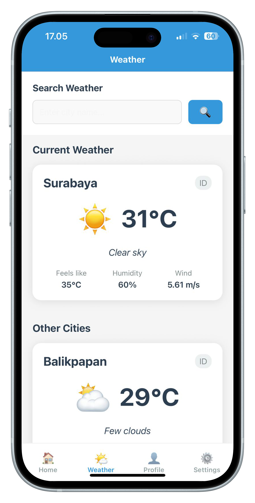

# Modul Praktikum Week 5
## Working with APIs & Async Data - Weather App Development

**Mata Kuliah:** Pemrograman Mobile  
**Durasi:** 3 jam (1 sesi praktikum)  
**Tools:** VS Code, Node.js, Expo CLI, Expo Go

---

## 🎯 Learning Objectives
Setelah menyelesaikan praktikum ini, mahasiswa diharapkan mampu:
1. Memahami konsep asynchronous programming dalam React Native
2. Menggunakan fetch API dan axios untuk request data
3. Menangani loading states dan error handling
4. Mengimplementasikan data fetching patterns
5. Membangun Weather App dengan real-time API data
6. Mengelola state management untuk async data
7. Memahami best practices untuk API integration

---

## 📋 Prerequisites
- **Hasil Week 1-4:** Navigation dan UI components sudah dikuasai
- **Hardware:** Laptop/PC dengan RAM minimal 4GB
- **Software:**
  - VS Code dengan project HelloWorld dari week sebelumnya
  - Node.js, Expo CLI, Expo Go
  - Koneksi internet stabil untuk API calls
- **Knowledge:**
  - React Native fundamentals dan state management
  - Navigation dengan Expo Router (Week 4)
  - JavaScript ES6+ (Promises, async/await)
  - JSON data handling

---

## 📖 Teori Singkat

### Asynchronous Programming di React Native
**Asynchronous programming** memungkinkan aplikasi untuk menjalankan operasi yang memakan waktu (seperti API calls) tanpa memblokir UI thread.

### API Integration Patterns
```javascript
// 1. Fetch API (Native)
fetch('https://api.example.com/data')
  .then(response => response.json())
  .then(data => setData(data));

// 2. Async/Await Pattern
const fetchData = async () => {
  try {
    const response = await fetch('https://api.example.com/data');
    const data = await response.json();
    setData(data);
  } catch (error) {
    setError(error.message);
  }
};

// 3. Axios Library
import axios from 'axios';
const response = await axios.get('https://api.example.com/data');
setData(response.data);
```

### State Management untuk Async Data
| State | Purpose | Example |
|-------|---------|---------|
| **Loading** | Menunjukkan proses loading | `isLoading: true` |
| **Data** | Menyimpan hasil API | `weatherData: {}` |
| **Error** | Menangani error state | `error: "Network error"` |
| **Refresh** | Handle pull-to-refresh | `isRefreshing: false` |

### Weather API yang Akan Digunakan
Dalam praktikum ini, kita akan menggunakan **OpenWeatherMap API** yang gratis dan mudah digunakan:
- **Base URL:** `https://api.openweathermap.org/data/2.5/weather`
- **Free Tier:** 1000 calls/day
- **Data:** Current weather, temperature, humidity, wind speed

---

## 🛠️ Bagian 1: Setup API Integration

### Step 1: Install Dependencies
```bash
# Masuk ke project HelloWorld
cd ReactNativeProjects/HelloWorld

# Install axios untuk HTTP requests
npm install axios

# Install additional dependencies untuk loading states
npm install react-native-super-grid
```

### Step 2: Get OpenWeatherMap API Key
1. **Daftar di OpenWeatherMap:**
   - Kunjungi: https://openweathermap.org/api
   - Sign up untuk free account
   - Verify email dan login

2. **Generate API Key:**
   - Go to "My API Keys"
   - Copy API key (akan digunakan dalam code)
   - **Note:** API key butuh ~10 menit untuk active

3. **Test API Key:**
```bash
# Test di browser atau postman
https://api.openweathermap.org/data/2.5/weather?q=Balikpapan&appid=YOUR_API_KEY&units=metric
```

### Step 3: Project Structure untuk Weather App
```
HelloWorld/
├── app/
│   ├── _layout.tsx           # Root Stack Navigator
│   ├── login.tsx             # Login route wrapper
│   └── (tabs)/               # Tab navigation group
│       ├── _layout.tsx       # Tab Navigator configuration
│       ├── index.tsx         # Home route wrapper
│       ├── weather.tsx       # Weather route wrapper (NEW)
│       ├── profile.tsx       # Profile route wrapper
│       └── settings.tsx      # Settings route wrapper
├── screens/
│   ├── auth/
│   │   └── LoginScreen.tsx   # Login screen component
│   ├── main/
│   │   ├── HomeScreen.tsx    # Home screen component
│   │   ├── WeatherScreen.tsx # Weather screen component (NEW)
│   │   ├── ProfileScreen.tsx # Profile screen component
│   │   └── SettingsScreen.tsx# Settings screen component
│   └── components/           # Reusable components (NEW)
│       ├── WeatherCard.tsx   # Weather display component
│       ├── LoadingSpinner.tsx# Loading component
│       └── ErrorMessage.tsx  # Error display component
├── services/                 # API services (NEW)
│   └── weatherService.ts     # Weather API calls
├── utils/                    # Helper functions
│   └── constants.ts          # API keys and constants
└── types/                    # TypeScript types (NEW)
    └── weather.ts            # Weather data types
```

---

## 🌤️ Bagian 2: Weather API Service

### Step 1: Define TypeScript Types
Buat file `types/weather.ts`:

```typescript
// Interface untuk weather data dari OpenWeatherMap API
export interface WeatherData {
  coord: {
    lon: number;
    lat: number;
  };
  weather: Array<{
    id: number;
    main: string;
    description: string;
    icon: string;
  }>;
  base: string;
  main: {
    temp: number;
    feels_like: number;
    temp_min: number;
    temp_max: number;
    pressure: number;
    humidity: number;
  };
  visibility: number;
  wind: {
    speed: number;
    deg: number;
  };
  clouds: {
    all: number;
  };
  dt: number;
  sys: {
    type: number;
    id: number;
    country: string;
    sunrise: number;
    sunset: number;
  };
  timezone: number;
  id: number;
  name: string;
  cod: number;
}

// Interface untuk error handling
export interface WeatherError {
  message: string;
  code?: number;
}

// Interface untuk weather state management
export interface WeatherState {
  data: WeatherData | null;
  loading: boolean;
  error: string | null;
  refreshing: boolean;
}
```

### Step 2: Constants dan Configuration
Buat file `utils/constants.ts`:

```typescript
// API Configuration
export const WEATHER_API = {
  BASE_URL: 'https://api.openweathermap.org/data/2.5',
  API_KEY: 'YOUR_API_KEY_HERE', // Replace dengan API key Anda
  UNITS: 'metric', // metric untuk Celsius, imperial untuk Fahrenheit
};

// Default cities untuk quick access
export const DEFAULT_CITIES = [
  { name: 'Balikpapan', country: 'ID' },
  { name: 'Surabaya', country: 'ID' },
  { name: 'Bandung', country: 'ID' },
  { name: 'Medan', country: 'ID' },
  { name: 'Singapore', country: 'SG' },
  { name: 'Kuala Lumpur', country: 'MY' },
];

// Weather icons mapping
export const WEATHER_ICONS = {
  '01d': '☀️', // clear sky day
  '01n': '🌙', // clear sky night
  '02d': '⛅', // few clouds day
  '02n': '☁️', // few clouds night
  '03d': '☁️', // scattered clouds
  '03n': '☁️', // scattered clouds
  '04d': '☁️', // broken clouds
  '04n': '☁️', // broken clouds
  '09d': '🌧️', // shower rain
  '09n': '🌧️', // shower rain
  '10d': '🌦️', // rain day
  '10n': '🌧️', // rain night
  '11d': '⛈️', // thunderstorm
  '11n': '⛈️', // thunderstorm
  '13d': '🌨️', // snow
  '13n': '🌨️', // snow
  '50d': '🌫️', // mist
  '50n': '🌫️', // mist
};
```

### Step 3: Weather Service
Buat file `services/weatherService.ts`:

```typescript
import axios from 'axios';
import { WEATHER_API } from '../utils/constants';
import { WeatherData, WeatherError } from '../types/weather';

// Weather API Service Class
class WeatherService {
  private baseURL: string;
  private apiKey: string;

  constructor() {
    this.baseURL = WEATHER_API.BASE_URL;
    this.apiKey = WEATHER_API.API_KEY;
  }

  // Get weather by city name
  async getWeatherByCity(cityName: string): Promise<WeatherData> {
    try {
      const response = await axios.get(`${this.baseURL}/weather`, {
        params: {
          q: cityName,
          appid: this.apiKey,
          units: WEATHER_API.UNITS,
        },
        timeout: 10000, // 10 second timeout
      });

      return response.data;
    } catch (error) {
      if (axios.isAxiosError(error)) {
        if (error.response?.status === 404) {
          throw new Error('City not found. Please check the city name.');
        } else if (error.response?.status === 401) {
          throw new Error('Invalid API key. Please check your configuration.');
        } else if (error.code === 'ECONNABORTED') {
          throw new Error('Request timeout. Please check your internet connection.');
        } else {
          throw new Error(`Weather service error: ${error.response?.data?.message || error.message}`);
        }
      }
      throw new Error('Network error. Please try again later.');
    }
  }

  // Get weather by coordinates
  async getWeatherByCoordinates(lat: number, lon: number): Promise<WeatherData> {
    try {
      const response = await axios.get(`${this.baseURL}/weather`, {
        params: {
          lat: lat,
          lon: lon,
          appid: this.apiKey,
          units: WEATHER_API.UNITS,
        },
        timeout: 10000,
      });

      return response.data;
    } catch (error) {
      if (axios.isAxiosError(error)) {
        throw new Error(`Weather service error: ${error.response?.data?.message || error.message}`);
      }
      throw new Error('Network error. Please try again later.');
    }
  }

  // Get weather for multiple cities
  async getWeatherForCities(cities: string[]): Promise<WeatherData[]> {
    try {
      const promises = cities.map(city => this.getWeatherByCity(city));
      const results = await Promise.allSettled(promises);
      
      return results
        .filter((result): result is PromiseFulfilledResult<WeatherData> => 
          result.status === 'fulfilled'
        )
        .map(result => result.value);
    } catch (error) {
      throw new Error('Failed to fetch weather for multiple cities');
    }
  }
}

// Export singleton instance
export const weatherService = new WeatherService();
```

---

## 🎨 Bagian 3: Reusable Components

### Step 1: Loading Spinner Component
Buat file `screens/components/LoadingSpinner.tsx`:

```typescript
import React from 'react';
import { View, ActivityIndicator, Text, StyleSheet } from 'react-native';

interface LoadingSpinnerProps {
  message?: string;
  size?: 'small' | 'large';
  color?: string;
}

export default function LoadingSpinner({ 
  message = 'Loading...', 
  size = 'large',
  color = '#3498db' 
}: LoadingSpinnerProps) {
  return (
    <View style={styles.container}>
      <ActivityIndicator size={size} color={color} />
      <Text style={styles.message}>{message}</Text>
    </View>
  );
}

const styles = StyleSheet.create({
  container: {
    flex: 1,
    justifyContent: 'center',
    alignItems: 'center',
    padding: 20,
  },
  message: {
    marginTop: 16,
    fontSize: 16,
    color: '#7f8c8d',
    textAlign: 'center',
  },
});
```

### Step 2: Error Message Component
Buat file `screens/components/ErrorMessage.tsx`:

```typescript
import React from 'react';
import { View, Text, TouchableOpacity, StyleSheet } from 'react-native';

interface ErrorMessageProps {
  message: string;
  onRetry?: () => void;
  showRetry?: boolean;
}

export default function ErrorMessage({ 
  message, 
  onRetry, 
  showRetry = true 
}: ErrorMessageProps) {
  return (
    <View style={styles.container}>
      <Text style={styles.errorIcon}>⚠️</Text>
      <Text style={styles.errorMessage}>{message}</Text>
      {showRetry && onRetry && (
        <TouchableOpacity style={styles.retryButton} onPress={onRetry}>
          <Text style={styles.retryButtonText}>Try Again</Text>
        </TouchableOpacity>
      )}
    </View>
  );
}

const styles = StyleSheet.create({
  container: {
    flex: 1,
    justifyContent: 'center',
    alignItems: 'center',
    padding: 20,
  },
  errorIcon: {
    fontSize: 48,
    marginBottom: 16,
  },
  errorMessage: {
    fontSize: 16,
    color: '#e74c3c',
    textAlign: 'center',
    marginBottom: 20,
    lineHeight: 24,
  },
  retryButton: {
    backgroundColor: '#3498db',
    paddingHorizontal: 24,
    paddingVertical: 12,
    borderRadius: 8,
  },
  retryButtonText: {
    color: 'white',
    fontSize: 16,
    fontWeight: '600',
  },
});
```

### Step 3: Weather Card Component
Buat file `screens/components/WeatherCard.tsx`:

```typescript
import React from 'react';
import { View, Text, StyleSheet, TouchableOpacity } from 'react-native';
import { WeatherData } from '../../types/weather';
import { WEATHER_ICONS } from '../../utils/constants';

interface WeatherCardProps {
  weather: WeatherData;
  onPress?: () => void;
  style?: any;
}

export default function WeatherCard({ weather, onPress, style }: WeatherCardProps) {
  // Get weather icon
  const getWeatherIcon = (iconCode: string): string => {
    return WEATHER_ICONS[iconCode as keyof typeof WEATHER_ICONS] || '❓';
  };

  // Format temperature
  const formatTemp = (temp: number): string => {
    return `${Math.round(temp)}°C`;
  };

  // Capitalize first letter
  const capitalize = (str: string): string => {
    return str.charAt(0).toUpperCase() + str.slice(1);
  };

  const CardContent = () => (
    <View style={[styles.card, style]}>
      <View style={styles.header}>
        <Text style={styles.cityName}>{weather.name}</Text>
        <Text style={styles.country}>{weather.sys.country}</Text>
      </View>

      <View style={styles.mainInfo}>
        <Text style={styles.weatherIcon}>
          {getWeatherIcon(weather.weather[0].icon)}
        </Text>
        <Text style={styles.temperature}>
          {formatTemp(weather.main.temp)}
        </Text>
      </View>

      <Text style={styles.description}>
        {capitalize(weather.weather[0].description)}
      </Text>

      <View style={styles.details}>
        <View style={styles.detailItem}>
          <Text style={styles.detailLabel}>Feels like</Text>
          <Text style={styles.detailValue}>
            {formatTemp(weather.main.feels_like)}
          </Text>
        </View>
        <View style={styles.detailItem}>
          <Text style={styles.detailLabel}>Humidity</Text>
          <Text style={styles.detailValue}>{weather.main.humidity}%</Text>
        </View>
        <View style={styles.detailItem}>
          <Text style={styles.detailLabel}>Wind</Text>
          <Text style={styles.detailValue}>{weather.wind.speed} m/s</Text>
        </View>
      </View>
    </View>
  );

  // Return touchable or non-touchable based on onPress prop
  if (onPress) {
    return (
      <TouchableOpacity onPress={onPress} activeOpacity={0.8}>
        <CardContent />
      </TouchableOpacity>
    );
  }

  return <CardContent />;
}

const styles = StyleSheet.create({
  card: {
    backgroundColor: 'white',
    borderRadius: 16,
    padding: 20,
    marginBottom: 16,
    shadowColor: '#000',
    shadowOffset: {
      width: 0,
      height: 2,
    },
    shadowOpacity: 0.1,
    shadowRadius: 8,
    elevation: 5,
  },
  header: {
    flexDirection: 'row',
    justifyContent: 'space-between',
    alignItems: 'center',
    marginBottom: 16,
  },
  cityName: {
    fontSize: 24,
    fontWeight: 'bold',
    color: '#2c3e50',
  },
  country: {
    fontSize: 16,
    color: '#7f8c8d',
    backgroundColor: '#ecf0f1',
    paddingHorizontal: 8,
    paddingVertical: 4,
    borderRadius: 12,
  },
  mainInfo: {
    flexDirection: 'row',
    alignItems: 'center',
    justifyContent: 'center',
    marginBottom: 16,
  },
  weatherIcon: {
    fontSize: 64,
    marginRight: 16,
  },
  temperature: {
    fontSize: 48,
    fontWeight: 'bold',
    color: '#2c3e50',
  },
  description: {
    fontSize: 18,
    color: '#34495e',
    textAlign: 'center',
    marginBottom: 20,
    fontStyle: 'italic',
  },
  details: {
    flexDirection: 'row',
    justifyContent: 'space-between',
  },
  detailItem: {
    alignItems: 'center',
    flex: 1,
  },
  detailLabel: {
    fontSize: 14,
    color: '#7f8c8d',
    marginBottom: 4,
  },
  detailValue: {
    fontSize: 16,
    fontWeight: '600',
    color: '#2c3e50',
  },
});
```

---

## 🌍 Bagian 4: Weather Screen Implementation

### Step 1: Weather Screen Component
Buat file `screens/main/WeatherScreen.tsx`:

```typescript
import React, { useState, useEffect } from 'react';
import {
  StyleSheet,
  Text,
  View,
  ScrollView,
  TextInput,
  TouchableOpacity,
  RefreshControl,
  Alert,
} from 'react-native';
import { weatherService } from '../../services/weatherService';
import { WeatherData, WeatherState } from '../../types/weather';
import { DEFAULT_CITIES } from '../../utils/constants';
import WeatherCard from '../components/WeatherCard';
import LoadingSpinner from '../components/LoadingSpinner';
import ErrorMessage from '../components/ErrorMessage';

export default function WeatherScreen() {
  // State management untuk weather data
  const [weatherState, setWeatherState] = useState<WeatherState>({
    data: null,
    loading: false,
    error: null,
    refreshing: false,
  });

  // State untuk search functionality
  const [searchQuery, setSearchQuery] = useState('');
  const [searchLoading, setSearchLoading] = useState(false);

  // State untuk multiple cities weather
  const [citiesWeather, setCitiesWeather] = useState<WeatherData[]>([]);

  // Load initial weather data (Balikpapan as default)
  useEffect(() => {
    loadDefaultWeather();
    loadCitiesWeather();
  }, []);

  // Load default city weather (Balikpapan)
  const loadDefaultWeather = async () => {
    setWeatherState(prev => ({ ...prev, loading: true, error: null }));
    
    try {
      const data = await weatherService.getWeatherByCity('Balikpapan');
      setWeatherState({
        data,
        loading: false,
        error: null,
        refreshing: false,
      });
    } catch (error) {
      setWeatherState({
        data: null,
        loading: false,
        error: error instanceof Error ? error.message : 'Failed to load weather data',
        refreshing: false,
      });
    }
  };

  // Load weather for multiple cities
  const loadCitiesWeather = async () => {
    try {
      const cityNames = DEFAULT_CITIES.map(city => city.name);
      const data = await weatherService.getWeatherForCities(cityNames);
      setCitiesWeather(data);
    } catch (error) {
      console.error('Failed to load cities weather:', error);
    }
  };

  // Handle search functionality
  const handleSearch = async () => {
    if (!searchQuery.trim()) {
      Alert.alert('Error', 'Please enter a city name');
      return;
    }

    setSearchLoading(true);
    
    try {
      const data = await weatherService.getWeatherByCity(searchQuery.trim());
      setWeatherState({
        data,
        loading: false,
        error: null,
        refreshing: false,
      });
      setSearchQuery(''); // Clear search input
    } catch (error) {
      Alert.alert(
        'Search Error',
        error instanceof Error ? error.message : 'Failed to search weather data'
      );
    } finally {
      setSearchLoading(false);
    }
  };

  // Handle refresh functionality
  const handleRefresh = async () => {
    setWeatherState(prev => ({ ...prev, refreshing: true }));
    
    if (weatherState.data) {
      // Refresh current city weather
      try {
        const data = await weatherService.getWeatherByCity(weatherState.data.name);
        setWeatherState({
          data,
          loading: false,
          error: null,
          refreshing: false,
        });
      } catch (error) {
        setWeatherState(prev => ({
          ...prev,
          refreshing: false,
          error: error instanceof Error ? error.message : 'Failed to refresh weather data',
        }));
      }
    } else {
      // Load default weather if no current data
      await loadDefaultWeather();
    }
    
    // Also refresh cities weather
    await loadCitiesWeather();
  };

  // Handle city card press
  const handleCityPress = async (cityName: string) => {
    setWeatherState(prev => ({ ...prev, loading: true, error: null }));
    
    try {
      const data = await weatherService.getWeatherByCity(cityName);
      setWeatherState({
        data,
        loading: false,
        error: null,
        refreshing: false,
      });
    } catch (error) {
      setWeatherState(prev => ({
        ...prev,
        loading: false,
        error: error instanceof Error ? error.message : 'Failed to load weather data',
      }));
    }
  };

  // Render loading state
  if (weatherState.loading && !weatherState.refreshing) {
    return <LoadingSpinner message="Loading weather data..." />;
  }

  // Render error state
  if (weatherState.error && !weatherState.data) {
    return (
      <ErrorMessage 
        message={weatherState.error} 
        onRetry={loadDefaultWeather}
      />
    );
  }

  return (
    <ScrollView 
      style={styles.container}
      refreshControl={
        <RefreshControl
          refreshing={weatherState.refreshing}
          onRefresh={handleRefresh}
          colors={['#3498db']}
          tintColor="#3498db"
        />
      }
      showsVerticalScrollIndicator={false}
    >
      {/* Search Section */}
      <View style={styles.searchContainer}>
        <Text style={styles.searchTitle}>Search Weather</Text>
        <View style={styles.searchInputContainer}>
          <TextInput
            style={styles.searchInput}
            placeholder="Enter city name..."
            value={searchQuery}
            onChangeText={setSearchQuery}
            onSubmitEditing={handleSearch}
            returnKeyType="search"
          />
          <TouchableOpacity 
            style={[styles.searchButton, searchLoading && styles.searchButtonDisabled]}
            onPress={handleSearch}
            disabled={searchLoading}
          >
            <Text style={styles.searchButtonText}>
              {searchLoading ? '...' : '🔍'}
            </Text>
          </TouchableOpacity>
        </View>
      </View>

      {/* Current Weather Section */}
      {weatherState.data && (
        <View style={styles.currentWeatherContainer}>
          <Text style={styles.sectionTitle}>Current Weather</Text>
          <WeatherCard weather={weatherState.data} />
        </View>
      )}

      {/* Cities Weather Section */}
      <View style={styles.citiesContainer}>
        <Text style={styles.sectionTitle}>Other Cities</Text>
        {citiesWeather.map((weather) => (
          <WeatherCard
            key={weather.id}
            weather={weather}
            onPress={() => handleCityPress(weather.name)}
            style={styles.cityCard}
          />
        ))}
      </View>

      {/* Pull to Refresh Hint */}
      <View style={styles.refreshHint}>
        <Text style={styles.refreshHintText}>
          Pull down to refresh weather data
        </Text>
      </View>
    </ScrollView>
  );
}

const styles = StyleSheet.create({
  container: {
    flex: 1,
    backgroundColor: '#f5f5f5',
  },
  searchContainer: {
    backgroundColor: 'white',
    padding: 20,
    marginBottom: 16,
  },
  searchTitle: {
    fontSize: 18,
    fontWeight: 'bold',
    color: '#2c3e50',
    marginBottom: 12,
  },
  searchInputContainer: {
    flexDirection: 'row',
    gap: 12,
  },
  searchInput: {
    flex: 1,
    borderWidth: 1,
    borderColor: '#ddd',
    borderRadius: 8,
    padding: 12,
    fontSize: 16,
    backgroundColor: '#f9f9f9',
  },
  searchButton: {
    backgroundColor: '#3498db',
    paddingHorizontal: 20,
    paddingVertical: 12,
    borderRadius: 8,
    justifyContent: 'center',
    alignItems: 'center',
  },
  searchButtonDisabled: {
    backgroundColor: '#bdc3c7',
  },
  searchButtonText: {
    fontSize: 18,
    color: 'white',
  },
  currentWeatherContainer: {
    paddingHorizontal: 20,
    marginBottom: 24,
  },
  sectionTitle: {
    fontSize: 20,
    fontWeight: 'bold',
    color: '#2c3e50',
    marginBottom: 16,
  },
  citiesContainer: {
    paddingHorizontal: 20,
    marginBottom: 24,
  },
  cityCard: {
    marginBottom: 12,
  },
  refreshHint: {
    padding: 20,
    alignItems: 'center',
  },
  refreshHintText: {
    fontSize: 14,
    color: '#7f8c8d',
    fontStyle: 'italic',
  },
});
```

### Step 2: Add Weather Tab to Navigation
Edit `app/(tabs)/_layout.tsx` untuk menambah weather tab:

```typescript
import { Tabs } from 'expo-router';
import { Text, View } from 'react-native';

// Simple Tab Icon Component
const TabIcon = ({ emoji, color, focused }: { 
  emoji: string; 
  color: string; 
  focused: boolean;
}) => (
  <View style={{ 
    alignItems: 'center', 
    justifyContent: 'center',
    opacity: focused ? 1 : 0.7 
  }}>
    <Text style={{ fontSize: focused ? 26 : 22, color }}>{emoji}</Text>
  </View>
);

export default function TabLayout() {
  return (
    <Tabs
      screenOptions={{
        tabBarActiveTintColor: '#3498db',
        tabBarInactiveTintColor: '#95a5a6',
        tabBarStyle: {
          backgroundColor: 'white',
          borderTopWidth: 1,
          borderTopColor: '#ecf0f1',
          paddingBottom: 8,
          paddingTop: 8,
          height: 70,
        },
        headerStyle: {
          backgroundColor: '#3498db',
        },
        headerTintColor: '#fff',
        headerTitleStyle: {
          fontWeight: 'bold',
        },
        tabBarLabelStyle: {
          fontSize: 12,
          fontWeight: '600',
        },
      }}
    >
      <Tabs.Screen
        name="index"
        options={{
          title: 'Home',
          tabBarIcon: ({ color, focused }) => (
            <TabIcon emoji="🏠" color={color} focused={focused} />
          ),
        }}
      />
      {/* NEW: Weather Tab */}
      <Tabs.Screen
        name="weather"
        options={{
          title: 'Weather',
          tabBarIcon: ({ color, focused }) => (
            <TabIcon emoji="🌤️" color={color} focused={focused} />
          ),
        }}
      />
      <Tabs.Screen
        name="profile"
        options={{
          title: 'Profile',
          tabBarIcon: ({ color, focused }) => (
            <TabIcon emoji="👤" color={color} focused={focused} />
          ),
        }}
      />
      <Tabs.Screen
        name="settings"
        options={{
          title: 'Settings',
          tabBarIcon: ({ color, focused }) => (
            <TabIcon emoji="⚙️" color={color} focused={focused} />
          ),
        }}
      />
    </Tabs>
  );
}
```

### Step 3: Weather Route Wrapper
Buat file `app/(tabs)/weather.tsx`:

```typescript
// Weather route wrapper
import WeatherScreen from '../../screens/main/WeatherScreen';
export default WeatherScreen;
```

Save dan test aplikasi. Seharusnya sekarang ada tab Weather dengan functionality lengkap.

**Hasil Weather Screen dengan API Integration:**
<div align="center" style="max-width: 320px; margin: 15px auto;">
  
</div>
---

## 🔧 Bagian 5: Testing dan Troubleshooting

### Testing API Integration
1. **Test dengan berbagai cities** → Balikpapan, Surabaya, Singapore
2. **Test search functionality** → Input city name dan search
3. **Test error handling** → Input invalid city name
4. **Test pull-to-refresh** → Pull down untuk refresh data
5. **Test loading states** → Verify loading spinners work
6. **Test offline behavior** → Disable internet dan test error messages

### Troubleshooting Guide

**Problem 1: API Key not working**
```bash
# Solution: Pastikan API key sudah active
# Wait 10-15 minutes setelah generate API key
# Test di browser: https://api.openweathermap.org/data/2.5/weather?q=Balikpapan&appid=YOUR_API_KEY
```

**Problem 2: Network timeout errors**
```typescript
// Solution: Increase timeout dan add retry mechanism
const response = await axios.get(url, {
  timeout: 15000, // Increase dari 10 detik ke 15 detik
});
```

**Problem 3: Type errors dengan weather data**
```typescript
// Solution: Add proper null checks
if (weather?.main?.temp) {
  const temperature = weather.main.temp;
}
```

**Problem 4: Tab navigation not working dengan weather**
```bash
# Solution: Pastikan route wrapper sudah dibuat
# app/(tabs)/weather.tsx harus ada dan export WeatherScreen
```

---

## 📝 Tugas Praktikum

### Tugas 1: Enhanced Weather Features (Wajib)
1. **Location-based Weather:**
   - Gunakan Expo Location untuk get current position
   - Display weather berdasarkan user location
   - Add "Use Current Location" button

2. **Weather History:**
   - Save searched cities ke AsyncStorage
   - Display recent searches
   - Clear history functionality

3. **Extended Weather Info:**
   - Add 5-day forecast functionality
   - Display sunrise/sunset times
   - Add UV index dan air quality data

### Tugas 2: News Reader App (Bonus)
Buat aplikasi news reader dengan:
1. **News API Integration:**
   - Gunakan NewsAPI.org (free tier)
   - Fetch latest news articles
   - Categories: Technology, Business, Sports

2. **Article Features:**
   - List view dengan thumbnail images
   - Detail view untuk full article
   - Share functionality

3. **Search dan Filters:**
   - Search articles by keyword
   - Filter by category dan date
   - Bookmark favorite articles

### Tugas 3: Advanced API Features (Bonus)
1. **Multiple API Integration:**
   - Combine weather dan news APIs
   - Create unified dashboard
   - Cross-reference weather dan local news

2. **Real-time Updates:**
   - Auto-refresh every 5 minutes
   - Background fetch when app is inactive
   - Push notifications untuk weather alerts

3. **Data Visualization:**
   - Charts untuk temperature trends
   - Weather maps integration
   - Graphical weather predictions

---

## 📤 Submission

**Deadline:** [Sesuaikan dengan jadwal]

**Yang dikumpulkan:**
1. **Source Code:** `NIM_Nama_Week5_WeatherApp.zip`
2. **Screenshots:** Weather screen, search functionality, error handling, loading states
3. **Demo Video:** Weather app functionality demo (60-90 detik)
4. **Documentation:** `WEEK5_REPORT.md`

**Report Content:**
- API integration strategy dan architecture
- Error handling implementation
- State management untuk async data
- Challenges encountered dalam API integration
- Performance considerations

**Struktur Submission:**
```
HelloWorld/
├── app/
│   ├── _layout.tsx
│   ├── login.tsx
│   └── (tabs)/
│       ├── _layout.tsx
│       ├── index.tsx
│       ├── weather.tsx          # NEW
│       ├── profile.tsx
│       └── settings.tsx
├── screens/
│   ├── auth/
│   │   └── LoginScreen.tsx
│   ├── main/
│   │   ├── HomeScreen.tsx
│   │   ├── WeatherScreen.tsx    # NEW
│   │   ├── ProfileScreen.tsx
│   │   └── SettingsScreen.tsx
│   └── components/              # NEW
│       ├── WeatherCard.tsx
│       ├── LoadingSpinner.tsx
│       └── ErrorMessage.tsx
├── services/                    # NEW
│   └── weatherService.ts
├── types/                       # NEW
│   └── weather.ts
├── utils/
│   └── constants.ts
├── screenshots/
├── WEEK5_REPORT.md
└── backup/
```

---

## 📚 Resources

### API Documentation
- [OpenWeatherMap API](https://openweathermap.org/api)
- [NewsAPI Documentation](https://newsapi.org/docs)
- [JSONPlaceholder](https://jsonplaceholder.typicode.com/) - Free fake API for testing

### React Native Async
- [React Native Network](https://reactnative.dev/docs/network)
- [Axios Documentation](https://axios-http.com/docs/intro)
- [React Native AsyncStorage](https://react-native-async-storage.github.io/async-storage/)

### State Management
- [React Hooks](https://reactjs.org/docs/hooks-intro.html)
- [Error Boundaries](https://reactjs.org/docs/error-boundaries.html)
- [Loading States Best Practices](https://uxdesign.cc/best-practices-for-loading-states-f4c7de49e0a8)

### API Best Practices
- [REST API Design](https://restfulapi.net/)
- [HTTP Status Codes](https://httpstatuses.com/)
- [API Rate Limiting](https://blog.bearer.sh/api-rate-limiting/)

---

## 🎉 Summary

Hari ini Anda telah berhasil:
- Memahami asynchronous programming dalam React Native
- Mengimplementasikan API integration dengan fetch dan axios
- Membuat weather app dengan real-time data
- Menangani loading states dan error handling yang proper
- Membangun reusable components untuk API-driven UI
- Mengelola state management untuk async data
- Memahami best practices untuk API integration

**Key Concepts:**
- **Async/Await Pattern** untuk handling API calls
- **Error Handling** yang comprehensive untuk network requests
- **Loading States** untuk better user experience
- **State Management** untuk complex async data
- **Component Composition** untuk reusable API-driven UI
- **API Service Architecture** untuk maintainable code

**Next Week:** Local Storage & State Persistence - menyimpan data di device untuk offline capability!

---

*Good luck dan jangan ragu untuk bertanya jika ada kesulitan! 🚀*