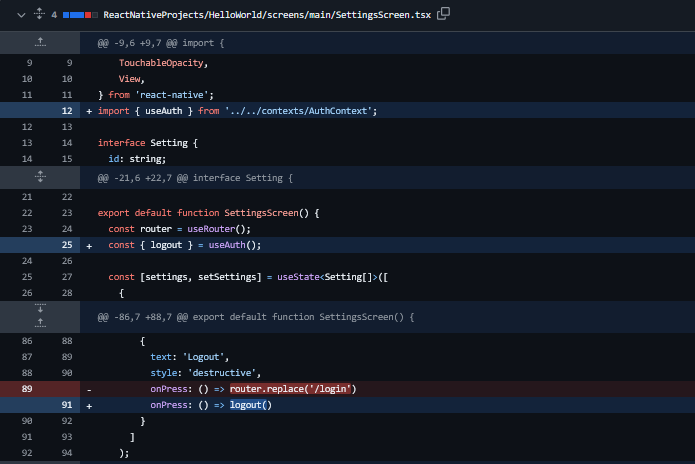

# Modul Praktikum Week 6
## Local Storage & State Persistence - Note-Taking App Development

**Mata Kuliah:** Pemrograman Mobile  
**Durasi:** 3 jam (1 sesi praktikum)  
**Tools:** VS Code, Node.js, Expo CLI, Expo Go

---

## 🔄 Step 0: Prerequisites - Enhanced Authentication Flow

**PENTING:** Sebelum memulai Week 6, pastikan project Anda sudah memiliki **Enhanced Authentication Flow** dari hasil perbaikan sebelumnya yang mencakup authentication context dan user data consistency improvements.

### 📋 Verifikasi Enhanced Authentication

Enhanced Authentication menambahkan authentication context dan memperbaiki user data flow. Berikut adalah file-file yang harus sudah ada/terupdate:

#### 1. **File Baru: `contexts/AuthContext.tsx`**

Buat file `contexts/AuthContext.tsx` dengan kode berikut:

```typescript
import React, { createContext, useContext, useState, ReactNode, useEffect } from 'react';

interface User {
  username: string;
  fullName: string;
  email: string;
  phone: string;
  bio: string;
}

interface AuthContextType {
  isAuthenticated: boolean;
  user: User | null;
  login: (username: string) => void;
  logout: () => void;
  isLoading: boolean;
}

const AuthContext = createContext<AuthContextType | undefined>(undefined);

export const useAuth = () => {
  const context = useContext(AuthContext);
  if (context === undefined) {
    throw new Error('useAuth must be used within an AuthProvider');
  }
  return context;
};

interface AuthProviderProps {
  children: ReactNode;
}

export const AuthProvider: React.FC<AuthProviderProps> = ({ children }) => {
  const [isAuthenticated, setIsAuthenticated] = useState(false);
  const [user, setUser] = useState<User | null>(null);
  const [isLoading, setIsLoading] = useState(true);

  // Initialize auth state from localStorage on web
  useEffect(() => {
    try {
      const storedUser = localStorage.getItem('user');
      const storedAuth = localStorage.getItem('isAuthenticated');
      
      if (storedUser && storedAuth === 'true') {
        setUser(JSON.parse(storedUser));
        setIsAuthenticated(true);
      }
    } catch (error) {
      console.log('No stored auth data found');
    }
    setIsLoading(false);
  }, []);

  const login = (username: string) => {
    // Create user data based on the provided username
    const userData: User = {
      username: username.toLowerCase(),
      fullName: username.charAt(0).toUpperCase() + username.slice(1),
      email: `${username.toLowerCase()}@example.com`,
      phone: '+1 (555) 123-4567',
      bio: 'Mobile app developer passionate about creating great user experiences.',
    };

    setUser(userData);
    setIsAuthenticated(true);

    // Store in localStorage for web persistence
    try {
      localStorage.setItem('user', JSON.stringify(userData));
      localStorage.setItem('isAuthenticated', 'true');
    } catch (error) {
      console.log('Failed to store auth data');
    }
  };

  const logout = () => {
    setUser(null);
    setIsAuthenticated(false);

    // Clear localStorage
    try {
      localStorage.removeItem('user');
      localStorage.removeItem('isAuthenticated');
    } catch (error) {
      console.log('Failed to clear auth data');
    }
  };

  return (
    <AuthContext.Provider value={{ isAuthenticated, user, login, logout, isLoading }}>
      {children}
    </AuthContext.Provider>
  );
};
```

#### 2. **File Updates: Authentication Integration**

Pastikan file-file berikut sudah terupdate dengan authentication context:

**🔄 app/_layout.tsx Updates (Core Authentication Routing):**


**🔄 LoginScreen.tsx Updates:**


**🔄 HomeScreen.tsx Updates:**


**🔄 ProfileScreen.tsx Updates:**


**🔄 SettingsScreen.tsx Updates:**


#### 3. **Root Layout Updates**

Pastikan `app/_layout.tsx` sudah menggunakan `AuthProvider` dan `useAuth()` untuk authentication routing logic.

### ✅ Checklist Enhanced Authentication

Sebelum lanjut ke Week 6, pastikan:

- [ ] ✅ File `contexts/AuthContext.tsx` sudah dibuat
- [ ] ✅ `LoginScreen.tsx` menggunakan `useAuth()` dan `login()` function
- [ ] ✅ `HomeScreen.tsx` menampilkan `user.fullName` dari context
- [ ] ✅ `ProfileScreen.tsx` menggunakan user data dari auth context
- [ ] ✅ `SettingsScreen.tsx` menggunakan `logout()` function dari context
- [ ] ✅ `app/_layout.tsx` sudah implement `AuthProvider` wrapper
- [ ] ✅ Authentication flow bekerja dengan baik (login/logout)

**🎯 Jika semua checklist sudah ✅, Anda siap melanjutkan ke Week 6!**

---

## 🎯 Learning Objectives
Setelah menyelesaikan praktikum ini, mahasiswa diharapkan mampu:
1. Memahami konsep local storage dalam mobile applications
2. Menggunakan AsyncStorage untuk data persistence
3. Mengimplementasikan CRUD operations dengan local storage
4. Membangun offline-capable applications
5. Membuat Note-Taking App dengan save/load functionality
6. Mengelola data synchronization dan state management
7. Memahami best practices untuk data persistence

---

## 📋 Prerequisites
- **Hasil Week 1-5:** Navigation, state management, dan API integration sudah dikuasai
- **Enhanced Authentication:** Authentication context dan user flow sudah terimplementasi ✅
- **Hardware:** Laptop/PC dengan RAM minimal 4GB
- **Software:**
  - VS Code dengan project HelloWorld dari week sebelumnya
  - Node.js, Expo CLI, Expo Go
  - Weather App dari Week 5 sudah berfungsi
  - Authentication enhancement sudah terimplementasi ✅
- **Knowledge:**
  - React Native fundamentals dan navigation
  - State management dengan useState dan useEffect
  - Async/await patterns dari Week 5
  - JSON data handling
  - Authentication context usage ✅

---

## 📖 Teori Singkat

### Local Storage dalam Mobile Apps
**Local Storage** memungkinkan aplikasi menyimpan data secara persistent di device user, bahkan ketika aplikasi ditutup atau device direstart.

### AsyncStorage vs Other Storage Options
| Storage Type | Use Case | Persistence | Size Limit |
|--------------|----------|-------------|------------|
| **AsyncStorage** | Key-value data, settings, cache | ✅ Persistent | ~6MB |
| **State (useState)** | Temporary UI state | ❌ Temporary | RAM limited |
| **SecureStore** | Sensitive data (passwords, tokens) | ✅ Persistent | Small data |
| **FileSystem** | Large files, documents, images | ✅ Persistent | Storage space |

### Data Persistence Patterns
```javascript
// 1. Save Data Pattern
const saveData = async (key, data) => {
  try {
    const jsonData = JSON.stringify(data);
    await AsyncStorage.setItem(key, jsonData);
  } catch (error) {
    console.error('Save failed:', error);
  }
};

// 2. Load Data Pattern
const loadData = async (key) => {
  try {
    const jsonData = await AsyncStorage.getItem(key);
    return jsonData ? JSON.parse(jsonData) : null;
  } catch (error) {
    console.error('Load failed:', error);
    return null;
  }
};

// 3. Data Sync Pattern
useEffect(() => {
  loadDataFromStorage();
}, []);

useEffect(() => {
  saveDataToStorage();
}, [dataState]);
```

### Note-Taking App Architecture
```
Notes App Features:
├── Create Notes      # Add new notes with title & content
├── Read Notes        # Display all notes in list format
├── Update Notes      # Edit existing notes
├── Delete Notes      # Remove notes with confirmation
├── Search Notes      # Filter notes by title/content
├── Categories        # Organize notes by categories
└── Export/Import     # Backup and restore notes
```

---

## 🛠️ Bagian 1: Setup AsyncStorage

### Step 1: Install AsyncStorage
```bash
# Masuk ke project HelloWorld
cd ReactNativeProjects/HelloWorld

# Install AsyncStorage untuk data persistence
npx expo install @react-native-async-storage/async-storage

# Install additional dependencies untuk enhanced UI
npm install react-native-super-grid
npm install @expo/vector-icons
```

### Step 2: Project Structure untuk Notes App
```
HelloWorld/
├── app/
│   ├── _layout.tsx           # Root Stack Navigator (Enhanced ✅)
│   ├── login.tsx             # Login route wrapper
│   └── (tabs)/               # Tab navigation group
│       ├── _layout.tsx       # Tab Navigator configuration
│       ├── index.tsx         # Home route wrapper
│       ├── weather.tsx       # Weather route wrapper
│       ├── notes.tsx         # Notes route wrapper (NEW)
│       ├── profile.tsx       # Profile route wrapper
│       └── settings.tsx      # Settings route wrapper
├── contexts/                 # Authentication context (Enhanced ✅)
│   └── AuthContext.tsx       # Auth provider & hooks (Enhanced ✅)
├── screens/
│   ├── auth/
│   │   └── LoginScreen.tsx   # Login screen component (Enhanced ✅)
│   ├── main/
│   │   ├── HomeScreen.tsx    # Home screen component (Enhanced ✅)
│   │   ├── WeatherScreen.tsx # Weather screen component
│   │   ├── NotesScreen.tsx   # Notes screen component (NEW)
│   │   ├── ProfileScreen.tsx # Profile screen component (Enhanced ✅)
│   │   └── SettingsScreen.tsx# Settings screen component (Enhanced ✅)
│   └── components/           # Reusable components
│       ├── WeatherCard.tsx   # Weather display component
│       ├── LoadingSpinner.tsx# Loading component
│       ├── ErrorMessage.tsx  # Error display component
│       ├── NoteCard.tsx      # Note display component (NEW)
│       ├── NoteEditor.tsx    # Note editing component (NEW)
│       └── SearchBar.tsx     # Search component (NEW)
├── services/                 # Data services
│   ├── weatherService.ts     # Weather API calls
│   └── notesService.ts       # Notes storage service (NEW)
├── utils/                    # Helper functions
│   ├── constants.ts          # API keys and constants
│   └── dateUtils.ts          # Date formatting utilities (NEW)
└── types/                    # TypeScript types
    ├── weather.ts            # Weather data types
    └── notes.ts              # Notes data types (NEW)
```

---

## 📝 Bagian 2: Notes Data Structure

### Step 1: Define TypeScript Types
Buat file `types/notes.ts`:

```typescript
// Interface untuk Note object
export interface Note {
  id: string;
  title: string;
  content: string;
  category: string;
  tags: string[];
  createdAt: number;
  updatedAt: number;
  isFavorite: boolean;
}

// Interface untuk Note categories
export interface NoteCategory {
  id: string;
  name: string;
  color: string;
  icon: string;
}

// Interface untuk Notes state management
export interface NotesState {
  notes: Note[];
  categories: NoteCategory[];
  loading: boolean;
  error: string | null;
  searchQuery: string;
  selectedCategory: string | null;
}

// Interface untuk Note creation/editing
export interface NoteInput {
  title: string;
  content: string;
  category: string;
  tags: string[];
}

// Interface untuk Notes statistics
export interface NotesStats {
  totalNotes: number;
  favoriteNotes: number;
  categoriesCount: number;
  totalWords: number;
}
```

### Step 2: Date Utilities
Buat file `utils/dateUtils.ts`:

```typescript
// Date formatting utilities untuk notes
export class DateUtils {
  // Format date untuk display
  static formatDate(timestamp: number): string {
    const date = new Date(timestamp);
    const now = new Date();
    const diff = now.getTime() - date.getTime();
    const days = Math.floor(diff / (1000 * 60 * 60 * 24));

    if (days === 0) {
      return 'Today';
    } else if (days === 1) {
      return 'Yesterday';
    } else if (days < 7) {
      return `${days} days ago`;
    } else {
      return date.toLocaleDateString('en-US', {
        year: 'numeric',
        month: 'short',
        day: 'numeric',
      });
    }
  }

  // Format full date untuk details
  static formatFullDate(timestamp: number): string {
    const date = new Date(timestamp);
    return date.toLocaleDateString('en-US', {
      year: 'numeric',
      month: 'long',
      day: 'numeric',
      hour: '2-digit',
      minute: '2-digit',
    });
  }

  // Generate readable time
  static formatTime(timestamp: number): string {
    const date = new Date(timestamp);
    return date.toLocaleTimeString('en-US', {
      hour: '2-digit',
      minute: '2-digit',
      hour12: true,
    });
  }

  // Check if date is today
  static isToday(timestamp: number): boolean {
    const date = new Date(timestamp);
    const today = new Date();
    return date.toDateString() === today.toDateString();
  }
}
```

### Step 3: Notes Service dengan AsyncStorage
Buat file `services/notesService.ts`:

```typescript
import AsyncStorage from '@react-native-async-storage/async-storage';
import { Note, NoteCategory, NoteInput, NotesStats } from '../types/notes';

// Storage keys
const STORAGE_KEYS = {
  NOTES: '@notes_app_notes',
  CATEGORIES: '@notes_app_categories',
  SETTINGS: '@notes_app_settings',
};

// Default categories
const DEFAULT_CATEGORIES: NoteCategory[] = [
  { id: '1', name: 'Personal', color: '#3498db', icon: '👤' },
  { id: '2', name: 'Work', color: '#e74c3c', icon: '💼' },
  { id: '3', name: 'Ideas', color: '#f39c12', icon: '💡' },
  { id: '4', name: 'Tasks', color: '#27ae60', icon: '✅' },
  { id: '5', name: 'Shopping', color: '#9b59b6', icon: '🛒' },
];

class NotesService {
  // Generate unique ID untuk notes
  private generateId(): string {
    return Date.now().toString() + Math.random().toString(36).substr(2, 9);
  }

  // Load semua notes dari AsyncStorage
  async getAllNotes(): Promise<Note[]> {
    try {
      const notesJson = await AsyncStorage.getItem(STORAGE_KEYS.NOTES);
      if (notesJson) {
        const notes = JSON.parse(notesJson);
        // Sort by updatedAt descending (newest first)
        return notes.sort((a: Note, b: Note) => b.updatedAt - a.updatedAt);
      }
      return [];
    } catch (error) {
      console.error('Failed to load notes:', error);
      throw new Error('Failed to load notes from storage');
    }
  }

  // Save semua notes ke AsyncStorage
  async saveAllNotes(notes: Note[]): Promise<void> {
    try {
      const notesJson = JSON.stringify(notes);
      await AsyncStorage.setItem(STORAGE_KEYS.NOTES, notesJson);
    } catch (error) {
      console.error('Failed to save notes:', error);
      throw new Error('Failed to save notes to storage');
    }
  }

  // Create note baru
  async createNote(noteInput: NoteInput): Promise<Note> {
    try {
      const notes = await this.getAllNotes();
      const newNote: Note = {
        id: this.generateId(),
        title: noteInput.title.trim(),
        content: noteInput.content.trim(),
        category: noteInput.category,
        tags: noteInput.tags.map(tag => tag.trim()).filter(tag => tag.length > 0),
        createdAt: Date.now(),
        updatedAt: Date.now(),
        isFavorite: false,
      };

      notes.unshift(newNote); // Add to beginning
      await this.saveAllNotes(notes);
      return newNote;
    } catch (error) {
      console.error('Failed to create note:', error);
      throw new Error('Failed to create note');
    }
  }

  // Update existing note
  async updateNote(noteId: string, noteInput: NoteInput): Promise<Note> {
    try {
      const notes = await this.getAllNotes();
      const noteIndex = notes.findIndex(note => note.id === noteId);
      
      if (noteIndex === -1) {
        throw new Error('Note not found');
      }

      const updatedNote: Note = {
        ...notes[noteIndex],
        title: noteInput.title.trim(),
        content: noteInput.content.trim(),
        category: noteInput.category,
        tags: noteInput.tags.map(tag => tag.trim()).filter(tag => tag.length > 0),
        updatedAt: Date.now(),
      };

      notes[noteIndex] = updatedNote;
      await this.saveAllNotes(notes);
      return updatedNote;
    } catch (error) {
      console.error('Failed to update note:', error);
      throw new Error('Failed to update note');
    }
  }

  // Delete note
  async deleteNote(noteId: string): Promise<void> {
    try {
      const notes = await this.getAllNotes();
      const filteredNotes = notes.filter(note => note.id !== noteId);
      await this.saveAllNotes(filteredNotes);
    } catch (error) {
      console.error('Failed to delete note:', error);
      throw new Error('Failed to delete note');
    }
  }

  // Toggle favorite status
  async toggleFavorite(noteId: string): Promise<Note> {
    try {
      const notes = await this.getAllNotes();
      const noteIndex = notes.findIndex(note => note.id === noteId);
      
      if (noteIndex === -1) {
        throw new Error('Note not found');
      }

      notes[noteIndex].isFavorite = !notes[noteIndex].isFavorite;
      notes[noteIndex].updatedAt = Date.now();
      
      await this.saveAllNotes(notes);
      return notes[noteIndex];
    } catch (error) {
      console.error('Failed to toggle favorite:', error);
      throw new Error('Failed to toggle favorite');
    }
  }

  // Search notes
  async searchNotes(query: string): Promise<Note[]> {
    try {
      const notes = await this.getAllNotes();
      if (!query.trim()) return notes;

      const searchQuery = query.toLowerCase();
      return notes.filter(note => 
        note.title.toLowerCase().includes(searchQuery) ||
        note.content.toLowerCase().includes(searchQuery) ||
        note.tags.some(tag => tag.toLowerCase().includes(searchQuery))
      );
    } catch (error) {
      console.error('Failed to search notes:', error);
      throw new Error('Failed to search notes');
    }
  }

  // Get notes by category
  async getNotesByCategory(categoryId: string): Promise<Note[]> {
    try {
      const notes = await this.getAllNotes();
      return notes.filter(note => note.category === categoryId);
    } catch (error) {
      console.error('Failed to get notes by category:', error);
      throw new Error('Failed to get notes by category');
    }
  }

  // Get favorite notes
  async getFavoriteNotes(): Promise<Note[]> {
    try {
      const notes = await this.getAllNotes();
      return notes.filter(note => note.isFavorite);
    } catch (error) {
      console.error('Failed to get favorite notes:', error);
      throw new Error('Failed to get favorite notes');
    }
  }

  // Get notes statistics
  async getNotesStats(): Promise<NotesStats> {
    try {
      const notes = await this.getAllNotes();
      const categories = await this.getCategories();
      
      const totalWords = notes.reduce((total, note) => {
        const words = note.content.split(/\s+/).filter(word => word.length > 0);
        return total + words.length;
      }, 0);

      return {
        totalNotes: notes.length,
        favoriteNotes: notes.filter(note => note.isFavorite).length,
        categoriesCount: categories.length,
        totalWords,
      };
    } catch (error) {
      console.error('Failed to get notes stats:', error);
      throw new Error('Failed to get notes statistics');
    }
  }

  // Load categories
  async getCategories(): Promise<NoteCategory[]> {
    try {
      const categoriesJson = await AsyncStorage.getItem(STORAGE_KEYS.CATEGORIES);
      if (categoriesJson) {
        return JSON.parse(categoriesJson);
      }
      
      // Initialize dengan default categories jika belum ada
      await this.saveCategories(DEFAULT_CATEGORIES);
      return DEFAULT_CATEGORIES;
    } catch (error) {
      console.error('Failed to load categories:', error);
      return DEFAULT_CATEGORIES;
    }
  }

  // Save categories
  async saveCategories(categories: NoteCategory[]): Promise<void> {
    try {
      const categoriesJson = JSON.stringify(categories);
      await AsyncStorage.setItem(STORAGE_KEYS.CATEGORIES, categoriesJson);
    } catch (error) {
      console.error('Failed to save categories:', error);
      throw new Error('Failed to save categories');
    }
  }

  // Export all data
  async exportData(): Promise<{ notes: Note[]; categories: NoteCategory[] }> {
    try {
      const notes = await this.getAllNotes();
      const categories = await this.getCategories();
      return { notes, categories };
    } catch (error) {
      console.error('Failed to export data:', error);
      throw new Error('Failed to export data');
    }
  }

  // Import data (overwrite existing)
  async importData(data: { notes: Note[]; categories: NoteCategory[] }): Promise<void> {
    try {
      if (data.notes) {
        await this.saveAllNotes(data.notes);
      }
      if (data.categories) {
        await this.saveCategories(data.categories);
      }
    } catch (error) {
      console.error('Failed to import data:', error);
      throw new Error('Failed to import data');
    }
  }

  // Clear all data
  async clearAllData(): Promise<void> {
    try {
      await AsyncStorage.multiRemove([
        STORAGE_KEYS.NOTES,
        STORAGE_KEYS.CATEGORIES,
        STORAGE_KEYS.SETTINGS,
      ]);
    } catch (error) {
      console.error('Failed to clear data:', error);
      throw new Error('Failed to clear all data');
    }
  }
}

// Export singleton instance
export const notesService = new NotesService();
```

---

## 🎨 Bagian 3: Notes UI Components

### Step 1: Search Bar Component
Buat file `screens/components/SearchBar.tsx`:

```typescript
import React from 'react';
import { View, TextInput, TouchableOpacity, StyleSheet } from 'react-native';
import { Ionicons } from '@expo/vector-icons';

interface SearchBarProps {
  value: string;
  onChangeText: (text: string) => void;
  placeholder?: string;
  onClear?: () => void;
}

export default function SearchBar({ 
  value, 
  onChangeText, 
  placeholder = 'Search notes...', 
  onClear 
}: SearchBarProps) {
  return (
    <View style={styles.container}>
      <View style={styles.searchContainer}>
        <Ionicons name="search" size={20} color="#7f8c8d" style={styles.searchIcon} />
        <TextInput
          style={styles.searchInput}
          value={value}
          onChangeText={onChangeText}
          placeholder={placeholder}
          placeholderTextColor="#95a5a6"
          returnKeyType="search"
        />
        {value.length > 0 && (
          <TouchableOpacity onPress={onClear} style={styles.clearButton}>
            <Ionicons name="close-circle" size={20} color="#7f8c8d" />
          </TouchableOpacity>
        )}
      </View>
    </View>
  );
}

const styles = StyleSheet.create({
  container: {
    paddingHorizontal: 20,
    paddingVertical: 10,
    backgroundColor: 'white',
  },
  searchContainer: {
    flexDirection: 'row',
    alignItems: 'center',
    backgroundColor: '#f8f9fa',
    borderRadius: 12,
    paddingHorizontal: 12,
    paddingVertical: 8,
  },
  searchIcon: {
    marginRight: 8,
  },
  searchInput: {
    flex: 1,
    fontSize: 16,
    color: '#2c3e50',
  },
  clearButton: {
    marginLeft: 8,
  },
});
```

### Step 2: Note Card Component
Buat file `screens/components/NoteCard.tsx`:

```typescript
import React from 'react';
import { View, Text, TouchableOpacity, StyleSheet, Alert } from 'react-native';
import { Ionicons } from '@expo/vector-icons';
import { Note, NoteCategory } from '../../types/notes';
import { DateUtils } from '../../utils/dateUtils';

interface NoteCardProps {
  note: Note;
  category?: NoteCategory;
  onPress: () => void;
  onToggleFavorite: () => void;
  onDelete: () => void;
}

export default function NoteCard({ 
  note, 
  category, 
  onPress, 
  onToggleFavorite, 
  onDelete 
}: NoteCardProps) {
  // Truncate content untuk preview
  const getPreviewContent = (content: string, maxLength: number = 100): string => {
    if (content.length <= maxLength) return content;
    return content.substring(0, maxLength) + '...';
  };

  // Handle delete dengan confirmation
  const handleDelete = () => {
    Alert.alert(
      'Delete Note',
      'Are you sure you want to delete this note? This action cannot be undone.',
      [
        { text: 'Cancel', style: 'cancel' },
        { text: 'Delete', style: 'destructive', onPress: onDelete },
      ]
    );
  };

  return (
    <TouchableOpacity style={styles.card} onPress={onPress} activeOpacity={0.8}>
      {/* Card Header */}
      <View style={styles.header}>
        <View style={styles.titleContainer}>
          <Text style={styles.title} numberOfLines={1}>
            {note.title || 'Untitled Note'}
          </Text>
          <View style={styles.categoryContainer}>
            {category && (
              <View style={[styles.categoryBadge, { backgroundColor: category.color }]}>
                <Text style={styles.categoryIcon}>{category.icon}</Text>
                <Text style={styles.categoryText}>{category.name}</Text>
              </View>
            )}
          </View>
        </View>
        
        <View style={styles.actions}>
          <TouchableOpacity onPress={onToggleFavorite} style={styles.actionButton}>
            <Ionicons 
              name={note.isFavorite ? "heart" : "heart-outline"} 
              size={20} 
              color={note.isFavorite ? "#e74c3c" : "#95a5a6"} 
            />
          </TouchableOpacity>
          <TouchableOpacity onPress={handleDelete} style={styles.actionButton}>
            <Ionicons name="trash-outline" size={20} color="#e74c3c" />
          </TouchableOpacity>
        </View>
      </View>

      {/* Content Preview */}
      {note.content.trim().length > 0 && (
        <Text style={styles.content} numberOfLines={3}>
          {getPreviewContent(note.content)}
        </Text>
      )}

      {/* Tags */}
      {note.tags.length > 0 && (
        <View style={styles.tagsContainer}>
          {note.tags.slice(0, 3).map((tag, index) => (
            <View key={index} style={styles.tag}>
              <Text style={styles.tagText}>#{tag}</Text>
            </View>
          ))}
          {note.tags.length > 3 && (
            <Text style={styles.moreTagsText}>+{note.tags.length - 3} more</Text>
          )}
        </View>
      )}

      {/* Footer */}
      <View style={styles.footer}>
        <Text style={styles.dateText}>
          {DateUtils.formatDate(note.updatedAt)}
        </Text>
        <Text style={styles.timeText}>
          {DateUtils.formatTime(note.updatedAt)}
        </Text>
      </View>
    </TouchableOpacity>
  );
}

const styles = StyleSheet.create({
  card: {
    backgroundColor: 'white',
    borderRadius: 12,
    padding: 16,
    marginBottom: 12,
    shadowColor: '#000',
    shadowOffset: {
      width: 0,
      height: 2,
    },
    shadowOpacity: 0.1,
    shadowRadius: 4,
    elevation: 3,
  },
  header: {
    flexDirection: 'row',
    justifyContent: 'space-between',
    alignItems: 'flex-start',
    marginBottom: 12,
  },
  titleContainer: {
    flex: 1,
    marginRight: 12,
  },
  title: {
    fontSize: 18,
    fontWeight: 'bold',
    color: '#2c3e50',
    marginBottom: 8,
  },
  categoryContainer: {
    flexDirection: 'row',
    alignItems: 'center',
  },
  categoryBadge: {
    flexDirection: 'row',
    alignItems: 'center',
    paddingHorizontal: 8,
    paddingVertical: 4,
    borderRadius: 12,
    opacity: 0.9,
  },
  categoryIcon: {
    fontSize: 12,
    marginRight: 4,
  },
  categoryText: {
    fontSize: 12,
    color: 'white',
    fontWeight: '600',
  },
  actions: {
    flexDirection: 'row',
    gap: 8,
  },
  actionButton: {
    padding: 4,
  },
  content: {
    fontSize: 14,
    color: '#34495e',
    lineHeight: 20,
    marginBottom: 12,
  },
  tagsContainer: {
    flexDirection: 'row',
    flexWrap: 'wrap',
    alignItems: 'center',
    marginBottom: 12,
    gap: 6,
  },
  tag: {
    backgroundColor: '#ecf0f1',
    paddingHorizontal: 8,
    paddingVertical: 4,
    borderRadius: 8,
  },
  tagText: {
    fontSize: 12,
    color: '#7f8c8d',
    fontWeight: '500',
  },
  moreTagsText: {
    fontSize: 12,
    color: '#95a5a6',
    fontStyle: 'italic',
  },
  footer: {
    flexDirection: 'row',
    justifyContent: 'space-between',
    alignItems: 'center',
    paddingTop: 8,
    borderTopWidth: 1,
    borderTopColor: '#ecf0f1',
  },
  dateText: {
    fontSize: 12,
    color: '#7f8c8d',
  },
  timeText: {
    fontSize: 12,
    color: '#95a5a6',
  },
});
```

### Step 3: Note Editor Component
Buat file `screens/components/NoteEditor.tsx`:

```typescript
import React, { useState, useEffect } from 'react';
import {
  View,
  Text,
  TextInput,
  TouchableOpacity,
  ScrollView,
  StyleSheet,
  Alert,
  Modal,
} from 'react-native';
import { Ionicons } from '@expo/vector-icons';
import { Note, NoteCategory, NoteInput } from '../../types/notes';

interface NoteEditorProps {
  visible: boolean;
  note?: Note; // undefined untuk create new note
  categories: NoteCategory[];
  onSave: (noteInput: NoteInput) => Promise<void>;
  onCancel: () => void;
}

export default function NoteEditor({
  visible,
  note,
  categories,
  onSave,
  onCancel,
}: NoteEditorProps) {
  // Form state
  const [title, setTitle] = useState('');
  const [content, setContent] = useState('');
  const [selectedCategory, setSelectedCategory] = useState('');
  const [tagsInput, setTagsInput] = useState('');
  const [isSaving, setIsSaving] = useState(false);

  // Initialize form dengan existing note data
  useEffect(() => {
    if (note) {
      setTitle(note.title);
      setContent(note.content);
      setSelectedCategory(note.category);
      setTagsInput(note.tags.join(', '));
    } else {
      // Clear form untuk new note
      setTitle('');
      setContent('');
      setSelectedCategory(categories[0]?.id || '');
      setTagsInput('');
    }
  }, [note, categories, visible]);

  // Handle save
  const handleSave = async () => {
    if (!title.trim()) {
      Alert.alert('Error', 'Please enter a note title');
      return;
    }

    if (!content.trim()) {
      Alert.alert('Error', 'Please enter note content');
      return;
    }

    setIsSaving(true);

    try {
      const tags = tagsInput
        .split(',')
        .map(tag => tag.trim())
        .filter(tag => tag.length > 0);

      const noteInput: NoteInput = {
        title: title.trim(),
        content: content.trim(),
        category: selectedCategory,
        tags,
      };

      await onSave(noteInput);
    } catch (error) {
      Alert.alert('Error', 'Failed to save note. Please try again.');
    } finally {
      setIsSaving(false);
    }
  };

  // Handle cancel dengan confirmation jika ada changes
  const handleCancel = () => {
    const hasChanges = note
      ? title !== note.title ||
        content !== note.content ||
        selectedCategory !== note.category ||
        tagsInput !== note.tags.join(', ')
      : title.trim() || content.trim() || tagsInput.trim();

    if (hasChanges) {
      Alert.alert(
        'Discard Changes',
        'Are you sure you want to discard your changes?',
        [
          { text: 'Keep Editing', style: 'cancel' },
          { text: 'Discard', style: 'destructive', onPress: onCancel },
        ]
      );
    } else {
      onCancel();
    }
  };

  return (
    <Modal
      visible={visible}
      animationType="slide"
      presentationStyle="pageSheet"
    >
      <View style={styles.container}>
        {/* Header */}
        <View style={styles.header}>
          <TouchableOpacity onPress={handleCancel} style={styles.headerButton}>
            <Ionicons name="close" size={24} color="#95a5a6" />
          </TouchableOpacity>
          
          <Text style={styles.headerTitle}>
            {note ? 'Edit Note' : 'New Note'}
          </Text>
          
          <TouchableOpacity 
            onPress={handleSave} 
            style={[styles.headerButton, styles.saveButton]}
            disabled={isSaving}
          >
            <Text style={styles.saveButtonText}>
              {isSaving ? 'Saving...' : 'Save'}
            </Text>
          </TouchableOpacity>
        </View>

        <ScrollView style={styles.form} showsVerticalScrollIndicator={false}>
          {/* Title Input */}
          <View style={styles.inputGroup}>
            <Text style={styles.label}>Title</Text>
            <TextInput
              style={styles.titleInput}
              value={title}
              onChangeText={setTitle}
              placeholder="Enter note title..."
              placeholderTextColor="#95a5a6"
              autoFocus={!note}
            />
          </View>

          {/* Category Selection */}
          <View style={styles.inputGroup}>
            <Text style={styles.label}>Category</Text>
            <ScrollView 
              horizontal 
              showsHorizontalScrollIndicator={false}
              style={styles.categoriesContainer}
            >
              {categories.map((category) => (
                <TouchableOpacity
                  key={category.id}
                  style={[
                    styles.categoryItem,
                    { backgroundColor: category.color },
                    selectedCategory === category.id && styles.selectedCategory,
                  ]}
                  onPress={() => setSelectedCategory(category.id)}
                >
                  <Text style={styles.categoryIcon}>{category.icon}</Text>
                  <Text style={styles.categoryName}>{category.name}</Text>
                </TouchableOpacity>
              ))}
            </ScrollView>
          </View>

          {/* Content Input */}
          <View style={styles.inputGroup}>
            <Text style={styles.label}>Content</Text>
            <TextInput
              style={styles.contentInput}
              value={content}
              onChangeText={setContent}
              placeholder="Write your note here..."
              placeholderTextColor="#95a5a6"
              multiline
              textAlignVertical="top"
            />
          </View>

          {/* Tags Input */}
          <View style={styles.inputGroup}>
            <Text style={styles.label}>Tags (separated by commas)</Text>
            <TextInput
              style={styles.input}
              value={tagsInput}
              onChangeText={setTagsInput}
              placeholder="work, important, meeting..."
              placeholderTextColor="#95a5a6"
            />
          </View>
        </ScrollView>
      </View>
    </Modal>
  );
}

const styles = StyleSheet.create({
  container: {
    flex: 1,
    backgroundColor: '#f8f9fa',
  },
  header: {
    flexDirection: 'row',
    justifyContent: 'space-between',
    alignItems: 'center',
    paddingHorizontal: 20,
    paddingVertical: 16,
    backgroundColor: 'white',
    borderBottomWidth: 1,
    borderBottomColor: '#ecf0f1',
    paddingTop: 50, // Account for status bar
  },
  headerButton: {
    padding: 8,
  },
  headerTitle: {
    fontSize: 18,
    fontWeight: 'bold',
    color: '#2c3e50',
  },
  saveButton: {
    backgroundColor: '#3498db',
    paddingHorizontal: 16,
    paddingVertical: 8,
    borderRadius: 8,
  },
  saveButtonText: {
    color: 'white',
    fontWeight: '600',
  },
  form: {
    flex: 1,
    padding: 20,
  },
  inputGroup: {
    marginBottom: 24,
  },
  label: {
    fontSize: 16,
    fontWeight: '600',
    color: '#2c3e50',
    marginBottom: 8,
  },
  titleInput: {
    fontSize: 18,
    fontWeight: '600',
    color: '#2c3e50',
    backgroundColor: 'white',
    borderRadius: 12,
    padding: 16,
    borderWidth: 1,
    borderColor: '#ddd',
  },
  input: {
    fontSize: 16,
    color: '#2c3e50',
    backgroundColor: 'white',
    borderRadius: 12,
    padding: 16,
    borderWidth: 1,
    borderColor: '#ddd',
  },
  contentInput: {
    fontSize: 16,
    color: '#2c3e50',
    backgroundColor: 'white',
    borderRadius: 12,
    padding: 16,
    borderWidth: 1,
    borderColor: '#ddd',
    minHeight: 200,
    textAlignVertical: 'top',
  },
  categoriesContainer: {
    flexDirection: 'row',
  },
  categoryItem: {
    flexDirection: 'row',
    alignItems: 'center',
    paddingHorizontal: 12,
    paddingVertical: 8,
    borderRadius: 20,
    marginRight: 8,
    opacity: 0.7,
  },
  selectedCategory: {
    opacity: 1,
    transform: [{ scale: 1.05 }],
  },
  categoryIcon: {
    fontSize: 16,
    marginRight: 6,
  },
  categoryName: {
    fontSize: 14,
    color: 'white',
    fontWeight: '600',
  },
});
```

Save dan test komponen-komponen ini. Seharusnya sudah bisa digunakan untuk building blocks Notes App.

**Hasil Notes Components:**


---

## 📱 Bagian 4: Notes Screen Implementation

### Step 1: Notes Screen Component
Buat file `screens/main/NotesScreen.tsx`:

```typescript
import React, { useState, useEffect, useCallback } from 'react';
import {
  StyleSheet,
  Text,
  View,
  ScrollView,
  TouchableOpacity,
  RefreshControl,
  Alert,
  FlatList,
} from 'react-native';
import { Ionicons } from '@expo/vector-icons';
import { useFocusEffect } from '@react-navigation/native';

import { notesService } from '../../services/notesService';
import { Note, NoteCategory, NotesState, NoteInput } from '../../types/notes';

// Import components
import LoadingSpinner from '../components/LoadingSpinner';
import ErrorMessage from '../components/ErrorMessage';
import SearchBar from '../components/SearchBar';
import NoteCard from '../components/NoteCard';
import NoteEditor from '../components/NoteEditor';

export default function NotesScreen() {
  // State management untuk notes
  const [notesState, setNotesState] = useState<NotesState>({
    notes: [],
    categories: [],
    loading: true,
    error: null,
    searchQuery: '',
    selectedCategory: null,
  });

  // State untuk UI
  const [filteredNotes, setFilteredNotes] = useState<Note[]>([]);
  const [refreshing, setRefreshing] = useState(false);
  const [showEditor, setShowEditor] = useState(false);
  const [editingNote, setEditingNote] = useState<Note | undefined>(undefined);

  // Load data ketika screen focus
  useFocusEffect(
    useCallback(() => {
      loadNotesData();
    }, [])
  );

  // Filter notes berdasarkan search dan category
  useEffect(() => {
    filterNotes();
  }, [notesState.notes, notesState.searchQuery, notesState.selectedCategory]);

  // Load semua data notes dan categories
  const loadNotesData = async () => {
    setNotesState(prev => ({ ...prev, loading: true, error: null }));

    try {
      const [notes, categories] = await Promise.all([
        notesService.getAllNotes(),
        notesService.getCategories(),
      ]);

      setNotesState(prev => ({
        ...prev,
        notes,
        categories,
        loading: false,
      }));
    } catch (error) {
      setNotesState(prev => ({
        ...prev,
        loading: false,
        error: error instanceof Error ? error.message : 'Failed to load notes',
      }));
    }
  };

  // Filter notes berdasarkan search query dan selected category
  const filterNotes = () => {
    let filtered = [...notesState.notes];

    // Filter by search query
    if (notesState.searchQuery.trim()) {
      const query = notesState.searchQuery.toLowerCase();
      filtered = filtered.filter(note =>
        note.title.toLowerCase().includes(query) ||
        note.content.toLowerCase().includes(query) ||
        note.tags.some(tag => tag.toLowerCase().includes(query))
      );
    }

    // Filter by category
    if (notesState.selectedCategory) {
      filtered = filtered.filter(note => note.category === notesState.selectedCategory);
    }

    setFilteredNotes(filtered);
  };

  // Handle pull to refresh
  const handleRefresh = async () => {
    setRefreshing(true);
    await loadNotesData();
    setRefreshing(false);
  };

  // Handle search
  const handleSearch = (query: string) => {
    setNotesState(prev => ({ ...prev, searchQuery: query }));
  };

  // Clear search
  const clearSearch = () => {
    setNotesState(prev => ({ ...prev, searchQuery: '' }));
  };

  // Handle category filter
  const handleCategoryFilter = (categoryId: string | null) => {
    setNotesState(prev => ({ ...prev, selectedCategory: categoryId }));
  };

  // Open editor untuk create new note
  const handleCreateNote = () => {
    setEditingNote(undefined);
    setShowEditor(true);
  };

  // Open editor untuk edit existing note
  const handleEditNote = (note: Note) => {
    setEditingNote(note);
    setShowEditor(true);
  };

  // Save note (create atau update)
  const handleSaveNote = async (noteInput: NoteInput) => {
    try {
      if (editingNote) {
        // Update existing note
        await notesService.updateNote(editingNote.id, noteInput);
      } else {
        // Create new note
        await notesService.createNote(noteInput);
      }

      // Reload notes data
      await loadNotesData();
      setShowEditor(false);
    } catch (error) {
      throw error; // Let NoteEditor handle the error
    }
  };

  // Cancel editor
  const handleCancelEditor = () => {
    setShowEditor(false);
    setEditingNote(undefined);
  };

  // Toggle favorite
  const handleToggleFavorite = async (noteId: string) => {
    try {
      await notesService.toggleFavorite(noteId);
      await loadNotesData();
    } catch (error) {
      Alert.alert('Error', 'Failed to update favorite status');
    }
  };

  // Delete note
  const handleDeleteNote = async (noteId: string) => {
    try {
      await notesService.deleteNote(noteId);
      await loadNotesData();
    } catch (error) {
      Alert.alert('Error', 'Failed to delete note');
    }
  };

  // Get category by ID
  const getCategoryById = (categoryId: string): NoteCategory | undefined => {
    return notesState.categories.find(cat => cat.id === categoryId);
  };

  // Render loading state
  if (notesState.loading) {
    return <LoadingSpinner message="Loading notes..." />;
  }

  // Render error state
  if (notesState.error) {
    return (
      <ErrorMessage 
        message={notesState.error} 
        onRetry={loadNotesData}
      />
    );
  }

  return (
    <View style={styles.container}>
      {/* Search Bar */}
      <SearchBar
        value={notesState.searchQuery}
        onChangeText={handleSearch}
        onClear={clearSearch}
        placeholder="Search notes..."
      />

      {/* Category Filter */}
      <View style={styles.categoriesSection}>
        <ScrollView 
          horizontal 
          showsHorizontalScrollIndicator={false}
          style={styles.categoriesScrollView}
          contentContainerStyle={styles.categoriesContainer}
        >
          {/* All Notes Button */}
          <TouchableOpacity
            style={[
              styles.categoryFilterButton,
              !notesState.selectedCategory && styles.categoryFilterButtonActive,
            ]}
            onPress={() => handleCategoryFilter(null)}
          >
            <Text style={styles.categoryFilterIcon}>📝</Text>
            <Text style={[
              styles.categoryFilterText,
              !notesState.selectedCategory && styles.categoryFilterTextActive,
            ]}>
              All
            </Text>
          </TouchableOpacity>

          {/* Category Filter Buttons */}
          {notesState.categories.map((category) => (
            <TouchableOpacity
              key={category.id}
              style={[
                styles.categoryFilterButton,
                notesState.selectedCategory === category.id && styles.categoryFilterButtonActive,
              ]}
              onPress={() => handleCategoryFilter(
                notesState.selectedCategory === category.id ? null : category.id
              )}
            >
              <Text style={styles.categoryFilterIcon}>{category.icon}</Text>
              <Text style={[
                styles.categoryFilterText,
                notesState.selectedCategory === category.id && styles.categoryFilterTextActive,
              ]}>
                {category.name}
              </Text>
            </TouchableOpacity>
          ))}
        </ScrollView>
      </View>

      {/* Notes List */}
      <View style={styles.notesContainer}>
        {/* Header dengan count dan create button */}
        <View style={styles.notesHeader}>
          <Text style={styles.notesCount}>
            {filteredNotes.length} {filteredNotes.length === 1 ? 'note' : 'notes'}
            {notesState.searchQuery && ' found'}
          </Text>
          <TouchableOpacity style={styles.createButton} onPress={handleCreateNote}>
            <Ionicons name="add" size={24} color="white" />
          </TouchableOpacity>
        </View>

        {/* Notes List atau Empty State */}
        {filteredNotes.length === 0 ? (
          <View style={styles.emptyContainer}>
            <Text style={styles.emptyIcon}>
              {notesState.searchQuery ? '🔍' : '📝'}
            </Text>
            <Text style={styles.emptyTitle}>
              {notesState.searchQuery 
                ? 'No notes found' 
                : 'No notes yet'
              }
            </Text>
            <Text style={styles.emptySubtitle}>
              {notesState.searchQuery 
                ? 'Try searching with different keywords' 
                : 'Tap the + button to create your first note'
              }
            </Text>
          </View>
        ) : (
          <FlatList
            data={filteredNotes}
            keyExtractor={(item) => item.id}
            renderItem={({ item }) => (
              <NoteCard
                note={item}
                category={getCategoryById(item.category)}
                onPress={() => handleEditNote(item)}
                onToggleFavorite={() => handleToggleFavorite(item.id)}
                onDelete={() => handleDeleteNote(item.id)}
              />
            )}
            refreshControl={
              <RefreshControl
                refreshing={refreshing}
                onRefresh={handleRefresh}
                colors={['#3498db']}
                tintColor="#3498db"
              />
            }
            contentContainerStyle={styles.notesList}
            showsVerticalScrollIndicator={false}
          />
        )}
      </View>

      {/* Note Editor Modal */}
      <NoteEditor
        visible={showEditor}
        note={editingNote}
        categories={notesState.categories}
        onSave={handleSaveNote}
        onCancel={handleCancelEditor}
      />
    </View>
  );
}

const styles = StyleSheet.create({
  container: {
    flex: 1,
    backgroundColor: '#f5f5f5',
  },
  categoriesSection: {
    backgroundColor: 'white',
    borderBottomWidth: 1,
    borderBottomColor: '#ecf0f1',
  },
  categoriesScrollView: {
    paddingVertical: 12,
  },
  categoriesContainer: {
    paddingHorizontal: 20,
    gap: 12,
  },
  categoryFilterButton: {
    flexDirection: 'row',
    alignItems: 'center',
    paddingHorizontal: 16,
    paddingVertical: 8,
    borderRadius: 20,
    backgroundColor: '#f8f9fa',
    borderWidth: 1,
    borderColor: '#dee2e6',
  },
  categoryFilterButtonActive: {
    backgroundColor: '#3498db',
    borderColor: '#3498db',
  },
  categoryFilterIcon: {
    fontSize: 16,
    marginRight: 6,
  },
  categoryFilterText: {
    fontSize: 14,
    fontWeight: '600',
    color: '#6c757d',
  },
  categoryFilterTextActive: {
    color: 'white',
  },
  notesContainer: {
    flex: 1,
  },
  notesHeader: {
    flexDirection: 'row',
    justifyContent: 'space-between',
    alignItems: 'center',
    paddingHorizontal: 20,
    paddingVertical: 16,
    backgroundColor: 'white',
    borderBottomWidth: 1,
    borderBottomColor: '#ecf0f1',
  },
  notesCount: {
    fontSize: 16,
    fontWeight: '600',
    color: '#6c757d',
  },
  createButton: {
    backgroundColor: '#3498db',
    width: 40,
    height: 40,
    borderRadius: 20,
    justifyContent: 'center',
    alignItems: 'center',
  },
  notesList: {
    padding: 20,
  },
  emptyContainer: {
    flex: 1,
    justifyContent: 'center',
    alignItems: 'center',
    paddingHorizontal: 40,
  },
  emptyIcon: {
    fontSize: 64,
    marginBottom: 16,
  },
  emptyTitle: {
    fontSize: 20,
    fontWeight: 'bold',
    color: '#2c3e50',
    marginBottom: 8,
    textAlign: 'center',
  },
  emptySubtitle: {
    fontSize: 16,
    color: '#7f8c8d',
    textAlign: 'center',
    lineHeight: 24,
  },
});
```

### Step 2: Add Notes Tab to Navigation
Edit `app/(tabs)/_layout.tsx` untuk menambah notes tab:

```typescript
import { Tabs } from 'expo-router';
import { Text, View } from 'react-native';

// Simple Tab Icon Component
const TabIcon = ({ emoji, color, focused }: { 
  emoji: string; 
  color: string; 
  focused: boolean;
}) => (
  <View style={{ 
    alignItems: 'center', 
    justifyContent: 'center',
    opacity: focused ? 1 : 0.7 
  }}>
    <Text style={{ fontSize: focused ? 26 : 22, color }}>{emoji}</Text>
  </View>
);

export default function TabLayout() {
  return (
    <Tabs
      screenOptions={{
        tabBarActiveTintColor: '#3498db',
        tabBarInactiveTintColor: '#95a5a6',
        tabBarStyle: {
          backgroundColor: 'white',
          borderTopWidth: 1,
          borderTopColor: '#ecf0f1',
          paddingBottom: 8,
          paddingTop: 8,
          height: 70,
        },
        headerStyle: {
          backgroundColor: '#3498db',
        },
        headerTintColor: '#fff',
        headerTitleStyle: {
          fontWeight: 'bold',
        },
        tabBarLabelStyle: {
          fontSize: 12,
          fontWeight: '600',
        },
      }}
    >
      <Tabs.Screen
        name="index"
        options={{
          title: 'Home',
          tabBarIcon: ({ color, focused }) => (
            <TabIcon emoji="🏠" color={color} focused={focused} />
          ),
        }}
      />
      <Tabs.Screen
        name="weather"
        options={{
          title: 'Weather',
          tabBarIcon: ({ color, focused }) => (
            <TabIcon emoji="🌤️" color={color} focused={focused} />
          ),
        }}
      />
      {/* NEW: Notes Tab */}
      <Tabs.Screen
        name="notes"
        options={{
          title: 'Notes',
          tabBarIcon: ({ color, focused }) => (
            <TabIcon emoji="📝" color={color} focused={focused} />
          ),
        }}
      />
      <Tabs.Screen
        name="profile"
        options={{
          title: 'Profile',
          tabBarIcon: ({ color, focused }) => (
            <TabIcon emoji="👤" color={color} focused={focused} />
          ),
        }}
      />
      <Tabs.Screen
        name="settings"
        options={{
          title: 'Settings',
          tabBarIcon: ({ color, focused }) => (
            <TabIcon emoji="⚙️" color={color} focused={focused} />
          ),
        }}
      />
    </Tabs>
  );
}
```

### Step 3: Notes Route Wrapper
Buat file `app/(tabs)/notes.tsx`:

```typescript
// Notes route wrapper
import NotesScreen from '../../screens/main/NotesScreen';
export default NotesScreen;
```
---

## 💾 Bagian 5: Enhanced Storage Features

### Step 1: Notes Statistics Dashboard
Update `screens/main/HomeScreen.tsx` untuk menampilkan notes statistics:

```typescript
// Di bagian import, tambahkan:
import React, { useState, useEffect } from 'react'; // updatenya
import { notesService } from '../../services/notesService';
import { NotesStats } from '../../types/notes';

// Di dalam HomeScreen component, tambahkan state untuk notes stats:
const [notesStats, setNotesStats] = useState<NotesStats | null>(null);

// Tambahkan function untuk load notes stats:
const loadNotesStats = async () => {
  try {
    const stats = await notesService.getNotesStats();
    setNotesStats(stats);
  } catch (error) {
    console.error('Failed to load notes stats:', error);
  }
};

// Update useEffect untuk load stats:
useEffect(() => {
  loadNotesStats();
}, []);

// Update dashboardData untuk include notes stats:
const dashboardData = [
  { id: '1', title: 'Total Tasks', value: '24', color: '#3498db', icon: '📋' },
  { id: '2', title: 'Completed', value: '18', color: '#27ae60', icon: '✅' },
  { id: '3', title: 'In Progress', value: '4', color: '#f39c12', icon: '⏳' },
  { id: '4', title: 'Overdue', value: '2', color: '#e74c3c', icon: '⚠️' },
  // NEW: Notes statistics
  { 
    id: '5', 
    title: 'Notes', 
    value: notesStats?.totalNotes.toString() || '0', 
    color: '#9b59b6', 
    icon: '📝' 
  },
  { 
    id: '6', 
    title: 'Favorites', 
    value: notesStats?.favoriteNotes.toString() || '0', 
    color: '#e67e22', 
    icon: '❤️' 
  },
];
```

### Step 2: Enhanced Settings dengan Data Management
Update `screens/main/SettingsScreen.tsx` untuk menambah data management features:

```typescript
// Di bagian import, tambahkan:
import { notesService } from '../../services/notesService';

// Tambahkan functions untuk data management:
const handleExportNotes = async () => {
  try {
    const data = await notesService.exportData();
    Alert.alert(
      'Export Data',
      `Successfully exported ${data.notes.length} notes and ${data.categories.length} categories.\n\nIn a real app, this would save to file or cloud storage.`,
      [{ text: 'OK' }]
    );
  } catch (error) {
    Alert.alert('Error', 'Failed to export notes data');
  }
};

const handleClearAllNotes = () => {
  Alert.alert(
    'Clear All Notes',
    'This will permanently delete all your notes and cannot be undone. Are you sure?',
    [
      { text: 'Cancel', style: 'cancel' },
      {
        text: 'Clear All',
        style: 'destructive',
        onPress: async () => {
          try {
            await notesService.clearAllData();
            Alert.alert('Success', 'All notes data has been cleared');
          } catch (error) {
            Alert.alert('Error', 'Failed to clear notes data');
          }
        },
      },
    ]
  );
};

// Update settings array untuk include data management:
const [settings, setSettings] = useState<Setting[]>([
  // ... existing settings ...
  {
    id: 'exportNotes',
    title: 'Export Notes',
    subtitle: 'Export all notes and categories',
    type: 'action',
    onPress: handleExportNotes,
  },
  {
    id: 'clearNotes',
    title: 'Clear All Notes',
    subtitle: 'Delete all notes permanently',
    type: 'action',
    onPress: handleClearAllNotes,
  },
  // ... other settings ...
]);
```

**Hasil Enhanced Features dengan Statistics:**
<div align="center" style="max-width: 320px; margin: 15px auto;">
  
</div>
<div align="center" style="max-width: 320px; margin: 15px auto;">
  
</div>

---

## 🔧 Bagian 6: Testing dan Troubleshooting

### Testing Local Storage
1. **Create Notes** → Tambah beberapa notes dengan berbagai categories
2. **Edit Notes** → Edit existing notes dan verify changes persist
3. **Delete Notes** → Delete notes dan verify mereka hilang permanently
4. **Search Functionality** → Test search by title, content, dan tags
5. **Category Filtering** → Filter notes by categories
6. **App Restart** → Close dan reopen app, verify data persistence
7. **Favorite Notes** → Toggle favorites dan verify persistence

### Troubleshooting Guide

**Problem 1: AsyncStorage permission errors**
```bash
# Solution: Pastikan AsyncStorage properly installed
npx expo install @react-native-async-storage/async-storage
# Clear cache jika perlu
npx expo start --clear
```

**Problem 2: Data tidak persist setelah app restart**
```typescript
// Solution: Pastikan save operations await properly
await AsyncStorage.setItem(key, JSON.stringify(data));
// Jangan lupa JSON.stringify untuk objects
```

**Problem 3: Notes tidak muncul setelah create**
```typescript
// Solution: Pastikan loadNotesData dipanggil setelah save
await notesService.createNote(noteInput);
await loadNotesData(); // Reload data
```

**Problem 4: Search tidak bekerja dengan special characters**
```typescript
// Solution: Handle special characters dalam search
const searchQuery = query.toLowerCase().trim();
// Escape special regex characters jika diperlukan
```

**Problem 5: Modal tidak close setelah save**
```typescript
// Solution: Pastikan onSave di NoteEditor handle success
await onSave(noteInput);
setShowEditor(false); // Close modal after success
```

**Hasil Testing di Multiple Scenarios:**


---

## 📝 Tugas Praktikum

### Tugas 1: Enhanced Notes Features (Wajib)
1. **Rich Text Editor:**
   - Add formatting options (bold, italic, bullet points)
   - Support untuk links dan basic markdown
   - Character dan word count display

2. **Advanced Search:**
   - Search filters (by date, category, favorite status)
   - Sort options (by date, title, category)
   - Recent searches history

3. **Notes Organization:**
   - Drag and drop untuk reorder notes
   - Bulk operations (select multiple notes)
   - Archive/unarchive functionality

### Tugas 2: Backup dan Sync Features (Bonus)
1. **Local Backup:**
   - Export notes ke JSON file
   - Import notes dari JSON file
   - Automatic backup scheduling

2. **Cloud Sync Simulation:**
   - Mock cloud sync dengan timestamp conflicts
   - Offline queue untuk sync when online
   - Sync status indicators

3. **Data Migration:**
   - Version management untuk data schema
   - Migration scripts untuk old data formats
   - Data integrity validation

### Tugas 3: Advanced UI Features (Bonus)
1. **Themes dan Customization:**
   - Dark mode support
   - Custom color themes
   - Font size preferences

2. **Widgets dan Shortcuts:**
   - Quick add note widget simulation
   - Pinned notes for quick access
   - Voice memo support (simulation)

3. **Analytics Dashboard:**
   - Notes creation patterns
   - Most used categories
   - Writing activity charts

---

## 📤 Submission

**Deadline:** [Sesuaikan dengan jadwal]

**Yang dikumpulkan:**
1. **Source Code:** `NIM_Nama_Week6_NotesApp.zip`
2. **Screenshots:** Notes list, create note, edit note, search functionality, data persistence demo
3. **Demo Video:** Complete notes app functionality demo (90-120 detik)
4. **Documentation:** `WEEK6_REPORT.md`

**Report Content:**
- Local storage implementation strategy
- Data persistence architecture
- AsyncStorage usage patterns
- Offline functionality implementation
- Performance considerations untuk local storage
- User experience improvements

**Struktur Submission:**
```
HelloWorld/
├── app/
│   ├── _layout.tsx
│   ├── login.tsx
│   └── (tabs)/
│       ├── _layout.tsx
│       ├── index.tsx
│       ├── weather.tsx
│       ├── notes.tsx             # NEW
│       ├── profile.tsx
│       └── settings.tsx
├── screens/
│   ├── auth/
│   │   └── LoginScreen.tsx
│   ├── main/
│   │   ├── HomeScreen.tsx        # Updated with notes stats
│   │   ├── WeatherScreen.tsx
│   │   ├── NotesScreen.tsx       # NEW
│   │   ├── ProfileScreen.tsx
│   │   └── SettingsScreen.tsx    # Updated with data management
│   └── components/               # Enhanced
│       ├── WeatherCard.tsx
│       ├── LoadingSpinner.tsx
│       ├── ErrorMessage.tsx
│       ├── SearchBar.tsx         # NEW
│       ├── NoteCard.tsx          # NEW
│       └── NoteEditor.tsx        # NEW
├── services/
│   ├── weatherService.ts
│   └── notesService.ts           # NEW
├── types/
│   ├── weather.ts
│   └── notes.ts                  # NEW
├── utils/
│   ├── constants.ts
│   └── dateUtils.ts              # NEW
├── screenshots/
├── WEEK6_REPORT.md
└── backup/
```

---

## 📚 Resources

### AsyncStorage Documentation
- [AsyncStorage API Reference](https://react-native-async-storage.github.io/async-storage/)
- [React Native Storage Options](https://reactnative.dev/docs/asyncstorage)
- [Expo SecureStore](https://docs.expo.dev/versions/latest/sdk/securestore/)

### Data Persistence Patterns
- [React Native Offline Storage](https://blog.logrocket.com/react-native-asyncstorage-complete-guide/)
- [Data Persistence Best Practices](https://reactnative.dev/docs/performance#optimize-images-and-animations)
- [State Management with Storage](https://redux-toolkit.js.org/rtk-query/usage/persistence-and-rehydration)

### Local Storage Security
- [Secure Storage Guidelines](https://owasp.org/www-project-mobile-security-testing-guide/latest/Document/0x05e-Testing-Cryptography/)
- [React Native Security](https://reactnative.dev/docs/security)
- [Data Encryption in Mobile Apps](https://developer.android.com/guide/topics/security/cryptography)

### UI/UX for Offline Apps
- [Offline-First Design](https://www.uxpin.com/studio/blog/offline-first-design-guide/)
- [Progressive Enhancement](https://developer.mozilla.org/en-US/docs/Glossary/Progressive_Enhancement)
- [Mobile App Performance](https://web.dev/mobile/)

---

## 🎉 Summary

Hari ini Anda telah berhasil:
- Memahami konsep local storage dan data persistence dalam mobile apps
- Mengimplementasikan AsyncStorage untuk CRUD operations
- Membuat Note-Taking App dengan offline capability
- Mengelola state synchronization antara memory dan storage
- Membangun UI components untuk data-driven applications
- Menangani data validation dan error handling untuk storage operations
- Memahami best practices untuk local data management

**Key Concepts:**
- **AsyncStorage** untuk persistent key-value storage
- **Data Serialization** dengan JSON.stringify/parse
- **State Synchronization** antara UI state dan storage
- **Offline-First Architecture** untuk better user experience
- **Data Validation** untuk data integrity
- **Performance Optimization** untuk storage operations

**Next Week:** Advanced UI & Animation - membuat UI yang menarik dan responsive dengan animations dan gesture handling!

---

*Good luck dan jangan ragu untuk bertanya jika ada kesulitan! 🚀*