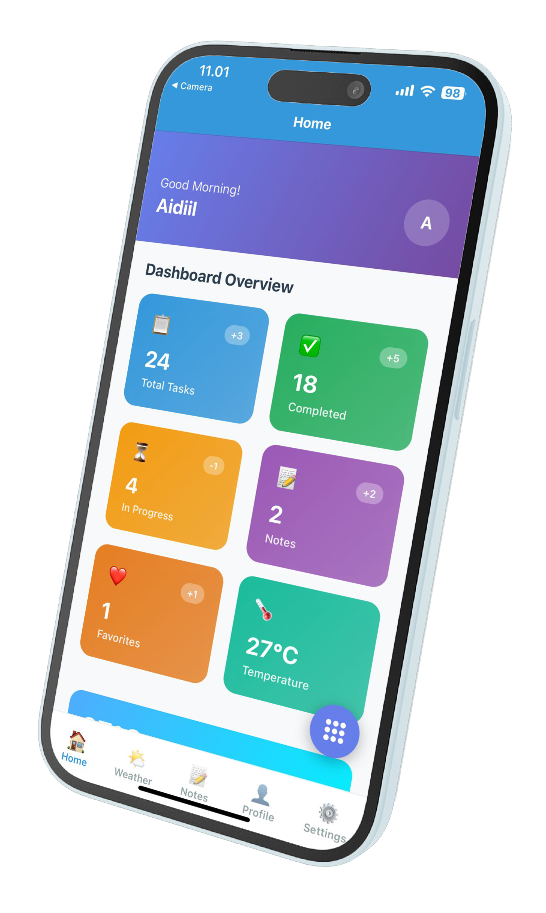
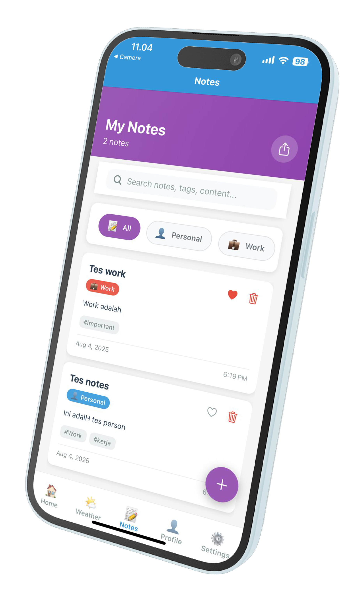
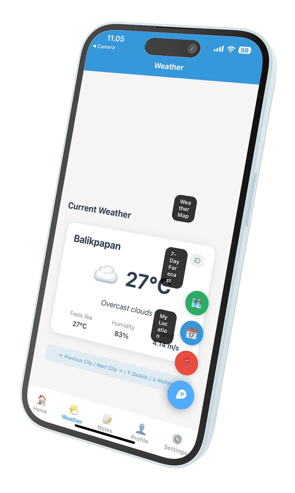

# Modul Praktikum Week 7
## Advanced UI & Animation - Interactive Dashboard Development

**Mata Kuliah:** Pemrograman Mobile  
**Durasi:** 3 jam (1 sesi praktikum)  
**Tools:** VS Code, Node.js, Expo CLI, Expo Go

---

## 🎯 Learning Objectives
Setelah menyelesaikan praktikum ini, mahasiswa diharapkan mampu:
1. Memahami advanced Flexbox layouts untuk responsive design
2. Mengimplementasikan React Native Animations dengan Animated API
3. Menguasai gesture handling dengan react-native-gesture-handler
4. Membuat interactive dashboard dengan smooth animations
5. Mengimplementasikan swipe gestures dan pan gestures
6. Membangun micro-interactions untuk better user experience
7. Mengoptimalkan performance animasi di mobile devices

---

## 📋 Prerequisites
- **Hasil Week 1-6:** Complete authentication flow, notes app, weather integration ✅
- **Enhanced Authentication:** Authentication context dan user flow terimplementasi ✅
- **Notes App:** Local storage dengan AsyncStorage sudah berfungsi ✅
- **Weather App:** API integration dengan real-time data ✅
- **Hardware:** Laptop/PC dengan RAM minimal 4GB
- **Software:**
  - VS Code dengan project HelloWorld dari week sebelumnya
  - Node.js, Expo CLI, Expo Go
  - All Week 6 features working properly ✅
- **Knowledge:**
  - React Native fundamentals dan navigation
  - State management dan AsyncStorage
  - API integration patterns
  - Component composition dan reusability

---

## 📖 Teori Singkat

### React Native Animations
**React Native** menyediakan dua API utama untuk animations:
- **Animated API** - JavaScript-driven animations untuk complex sequences
- **LayoutAnimation** - Native-driven animations untuk layout changes

### Animation Types
| Animation Type | Use Case | Performance | Complexity |
|----------------|----------|-------------|------------|
| **Timing** | Fade in/out, slide transitions | Good | Low |
| **Spring** | Natural bounce effects | Good | Medium |
| **Sequence** | Multi-step animations | Medium | High |
| **Parallel** | Multiple simultaneous animations | Medium | Medium |

### Gesture Handling Patterns
```javascript
// 1. Basic Pan Gesture
const panGesture = Gesture.Pan()
  .onStart(() => {
    // Gesture started
  })
  .onUpdate((event) => {
    // Handle gesture updates
    translateX.value = event.translationX;
  })
  .onEnd(() => {
    // Gesture ended
  });

// 2. Swipe Detection
const detectSwipe = (gestureState) => {
  const { dx, dy, vx, vy } = gestureState;
  if (Math.abs(dx) > Math.abs(dy)) {
    return dx > 0 ? 'right' : 'left';
  }
  return dy > 0 ? 'down' : 'up';
};

// 3. Animation Triggers
const fadeIn = () => {
  Animated.timing(fadeAnim, {
    toValue: 1,
    duration: 300,
    useNativeDriver: true,
  }).start();
};
```

### Advanced Flexbox Patterns
```css
/* Responsive Grid Pattern */
.gridContainer {
  flexDirection: 'row';
  flexWrap: 'wrap';
  justifyContent: 'space-between';
}

.gridItem {
  width: '48%'; /* 2 columns with gap */
  marginBottom: 16;
}

/* Dynamic Spacing */
.dynamicContainer {
  flex: 1;
  justifyContent: 'space-evenly'; /* Equal spacing */
}

/* Sticky Header Pattern */
.stickyHeader {
  position: 'absolute';
  top: 0;
  zIndex: 100;
}
```

### Interactive Dashboard Architecture
```
Dashboard Features:
├── Animated Statistics Cards    # Slide in animations
├── Interactive Weather Widget   # Swipe for details
├── Quick Notes Access          # Gesture-based shortcuts
├── Activity Timeline           # Scroll-based animations
├── Navigation Shortcuts        # Bounce animations
└── Floating Action Button      # Multi-action expandable
```

---

## 🛠️ Bagian 1: Setup Advanced UI Dependencies

### Step 1: Install Animation Libraries
```bash
# Masuk ke project HelloWorld
cd ReactNativeProjects/HelloWorld

# Install React Native Reanimated untuk advanced animations
npx expo install react-native-reanimated

# Install Gesture Handler untuk advanced gestures
npx expo install react-native-gesture-handler

# Install AsyncStorage (jika belum ada dari Week 6)
npx expo install @react-native-async-storage/async-storage

# Install additional UI libraries
npx expo install expo-linear-gradient

# Install performance monitoring (optional)
npm install react-native-performance

# Clear cache dan restart
npx expo start --clear
```

### Step 2: Configure Reanimated & Gesture Handler
Buat file `babel.config.js` di root project (jika belum ada):

```javascript
module.exports = function(api) {
  api.cache(true);
  return {
    presets: ['babel-preset-expo'],
    plugins: [
      'react-native-reanimated/plugin', // Add this line
    ],
  };
};
```

Update `metro.config.js` (buat jika belum ada):

```javascript
const { getDefaultConfig } = require('expo/metro-config');

const config = getDefaultConfig(__dirname);

module.exports = config;
```

### Step 3: Setup GestureHandlerRootView (CRITICAL for iOS)
Update file `app/_layout.tsx` untuk include GestureHandlerRootView:

```typescript
import { Stack } from 'expo-router';
import { StyleSheet } from 'react-native';
import { GestureHandlerRootView } from 'react-native-gesture-handler';
import { SafeAreaProvider } from 'react-native-safe-area-context';
import { AuthProvider, useAuth } from '../contexts/AuthContext';
import { useRouter, useSegments } from 'expo-router';
import { useEffect } from 'react';

// Navigation component that handles auth-based routing
function RootLayoutNav() {
  const { isAuthenticated, isLoading } = useAuth();
  const segments = useSegments();
  const router = useRouter();

  useEffect(() => {
    if (isLoading) return; // Don't redirect while loading

    const inAuthGroup = segments[0] === '(tabs)';

    if (!isAuthenticated && inAuthGroup) {
      // Redirect to login if not authenticated and trying to access protected routes
      router.replace('/login');
    } else if (isAuthenticated && !inAuthGroup) {
      // Redirect to home if authenticated and not in protected routes
      router.replace('/(tabs)');
    }
  }, [isAuthenticated, segments, isLoading]);

  return (
    <Stack>
      <Stack.Screen name="login" options={{ headerShown: false }} />
      <Stack.Screen name="(tabs)" options={{ headerShown: false }} />
    </Stack>
  );
}

export default function RootLayout() {
  return (
    <GestureHandlerRootView style={styles.container}>
      <SafeAreaProvider>
        <AuthProvider>
          <RootLayoutNav />
        </AuthProvider>
      </SafeAreaProvider>
    </GestureHandlerRootView>
  );
}

const styles = StyleSheet.create({
  container: {
    flex: 1,
  },
});
```

**⚠️ IMPORTANT:** GestureHandlerRootView harus di-wrap di root level untuk iOS compatibility!

### Step 4: Project Structure untuk Advanced UI
```
HelloWorld/
├── app/
│   ├── _layout.tsx               # Root Stack Navigator (Enhanced with GestureHandlerRootView ✅)
│   ├── login.tsx                 # Login route wrapper
│   └── (tabs)/                   # Tab navigation group
│       ├── _layout.tsx           # Tab Navigator configuration
│       ├── index.tsx             # Home route wrapper
│       ├── weather.tsx           # Weather route wrapper
│       ├── notes.tsx             # Notes route wrapper
│       ├── profile.tsx           # Profile route wrapper
│       └── settings.tsx          # Settings route wrapper
├── contexts/                     # Authentication context ✅
│   └── AuthContext.tsx           # Auth provider & hooks ✅
├── screens/
│   ├── auth/
│   │   └── LoginScreen.tsx       # Login screen component ✅
│   ├── main/
│   │   ├── HomeScreen.tsx        # Enhanced Dashboard (UPDATED)
│   │   ├── WeatherScreen.tsx     # Weather with animations (UPDATED)
│   │   ├── NotesScreen.tsx       # Notes with gestures (UPDATED)
│   │   ├── ProfileScreen.tsx     # Animated profile (UPDATED)
│   │   └── SettingsScreen.tsx    # Settings screen ✅
│   └── components/               # Enhanced components
│       ├── WeatherCard.tsx       # Weather display component ✅
│       ├── LoadingSpinner.tsx    # Loading component ✅
│       ├── ErrorMessage.tsx      # Error display component ✅
│       ├── SearchBar.tsx         # Search component ✅
│       ├── NoteCard.tsx          # Note display component ✅
│       ├── NoteEditor.tsx        # Note editing component ✅
│       ├── AnimatedCard.tsx      # Animated card component (NEW)
│       ├── GestureHandler.tsx    # Gesture wrapper component (NEW - Fixed)
│       ├── FloatingButton.tsx    # Floating action button (NEW)
│       └── InteractiveWidget.tsx # Interactive dashboard widget (NEW)
├── animations/                   # Animation utilities (NEW)
│   ├── fadeAnimations.ts         # Fade in/out animations
│   ├── slideAnimations.ts        # Slide animations
│   ├── springAnimations.ts       # Spring physics animations
│   └── gestureAnimations.ts      # Gesture-based animations
├── services/                     # Data services ✅
│   ├── weatherService.ts         # Weather API calls ✅
│   └── notesService.ts           # Notes storage service ✅
├── utils/                        # Helper functions ✅
│   ├── constants.ts              # API keys and constants ✅
│   ├── dateUtils.ts              # Date formatting utilities ✅
│   └── animationUtils.ts         # Animation helper functions (NEW)
├── types/                        # TypeScript types ✅
│   ├── weather.ts                # Weather data types ✅
│   ├── notes.ts                  # Notes data types ✅
│   └── animations.ts             # Animation types (NEW)
├── babel.config.js               # Babel configuration with Reanimated plugin (UPDATED)
└── metro.config.js               # Metro bundler configuration (NEW)
```

---

## 🎨 Bagian 2: Animation Utilities & Types

### Step 1: Animation Types
Buat file `types/animations.ts`:

```typescript
// Animation configuration types
export interface AnimationConfig {
  duration: number;
  useNativeDriver: boolean;
  easing?: (value: number) => number;
}

// Gesture event types
export interface GestureEvent {
  translationX: number;
  translationY: number;
  velocityX: number;
  velocityY: number;
}

// Animation sequence types
export interface AnimationSequence {
  id: string;
  type: 'timing' | 'spring' | 'sequence' | 'parallel';
  config: AnimationConfig;
  toValue: number;
}

// Interactive widget states
export interface WidgetState {
  isExpanded: boolean;
  isAnimating: boolean;
  scale: number;
  opacity: number;
  translateX: number;
  translateY: number;
}

// Swipe direction types
export type SwipeDirection = 'left' | 'right' | 'up' | 'down';

// Animation easing functions
export enum EasingType {
  LINEAR = 'linear',
  EASE_IN = 'easeIn',
  EASE_OUT = 'easeOut',
  EASE_IN_OUT = 'easeInOut',
  BOUNCE = 'bounce',
  ELASTIC = 'elastic',
}

// Dashboard card animation states
export interface CardAnimationState {
  id: string;
  opacity: number;
  translateY: number;
  scale: number;
  delay: number;
}

// Floating button action item
export interface FloatingAction {
  id: string;
  label: string;
  icon: string;
  color: string;
  onPress: () => void;
}
```

### Step 2: Animation Utilities
Buat file `utils/animationUtils.ts`:

```typescript
import { Animated, Easing } from 'react-native';
import { AnimationConfig, EasingType, SwipeDirection } from '../types/animations';

// Animation utility class
export class AnimationUtils {
  // Create fade animation
  static createFadeAnimation(
    animatedValue: Animated.Value,
    toValue: number,
    duration: number = 300
  ): Animated.CompositeAnimation {
    return Animated.timing(animatedValue, {
      toValue,
      duration,
      useNativeDriver: true,
      easing: Easing.ease,
    });
  }

  // Create slide animation
  static createSlideAnimation(
    animatedValue: Animated.Value,
    toValue: number,
    duration: number = 400
  ): Animated.CompositeAnimation {
    return Animated.timing(animatedValue, {
      toValue,
      duration,
      useNativeDriver: true,
      easing: Easing.out(Easing.ease),
    });
  }

  // Create spring animation
  static createSpringAnimation(
    animatedValue: Animated.Value,
    toValue: number,
    tension: number = 100,
    friction: number = 8
  ): Animated.CompositeAnimation {
    return Animated.spring(animatedValue, {
      toValue,
      tension,
      friction,
      useNativeDriver: true,
    });
  }

  // Create scale animation
  static createScaleAnimation(
    animatedValue: Animated.Value,
    toValue: number,
    duration: number = 200
  ): Animated.CompositeAnimation {
    return Animated.timing(animatedValue, {
      toValue,
      duration,
      useNativeDriver: true,
      easing: Easing.elastic(1),
    });
  }

  // Create sequence animation
  static createSequenceAnimation(
    animations: Animated.CompositeAnimation[]
  ): Animated.CompositeAnimation {
    return Animated.sequence(animations);
  }

  // Create parallel animation
  static createParallelAnimation(
    animations: Animated.CompositeAnimation[]
  ): Animated.CompositeAnimation {
    return Animated.parallel(animations);
  }

  // Create staggered animation
  static createStaggeredAnimation(
    animatedValues: Animated.Value[],
    toValue: number,
    duration: number = 300,
    stagger: number = 100
  ): Animated.CompositeAnimation {
    const animations = animatedValues.map((value, index) =>
      Animated.timing(value, {
        toValue,
        duration,
        delay: index * stagger,
        useNativeDriver: true,
        easing: Easing.out(Easing.ease),
      })
    );
    return Animated.parallel(animations);
  }

  // Detect swipe direction
  static detectSwipeDirection(
    dx: number,
    dy: number,
    threshold: number = 50
  ): SwipeDirection | null {
    if (Math.abs(dx) > Math.abs(dy)) {
      if (Math.abs(dx) > threshold) {
        return dx > 0 ? 'right' : 'left';
      }
    } else {
      if (Math.abs(dy) > threshold) {
        return dy > 0 ? 'down' : 'up';
      }
    }
    return null;
  }

  // Get easing function by type
  static getEasingFunction(easingType: EasingType): (value: number) => number {
    switch (easingType) {
      case EasingType.LINEAR:
        return Easing.linear;
      case EasingType.EASE_IN:
        return Easing.in(Easing.ease);
      case EasingType.EASE_OUT:
        return Easing.out(Easing.ease);
      case EasingType.EASE_IN_OUT:
        return Easing.inOut(Easing.ease);
      case EasingType.BOUNCE:
        return Easing.bounce;
      case EasingType.ELASTIC:
        return Easing.elastic(1);
      default:
        return Easing.ease;
    }
  }

  // Create loading animation (continuous rotation)
  static createLoadingAnimation(
    animatedValue: Animated.Value,
    duration: number = 2000
  ): Animated.CompositeAnimation {
    return Animated.loop(
      Animated.timing(animatedValue, {
        toValue: 1,
        duration,
        useNativeDriver: true,
        easing: Easing.linear,
      })
    );
  }

  // Create pulse animation
  static createPulseAnimation(
    animatedValue: Animated.Value,
    minValue: number = 0.8,
    maxValue: number = 1.2,
    duration: number = 1000
  ): Animated.CompositeAnimation {
    return Animated.loop(
      Animated.sequence([
        Animated.timing(animatedValue, {
          toValue: maxValue,
          duration: duration / 2,
          useNativeDriver: true,
          easing: Easing.ease,
        }),
        Animated.timing(animatedValue, {
          toValue: minValue,
          duration: duration / 2,
          useNativeDriver: true,
          easing: Easing.ease,
        }),
      ])
    );
  }

  // Create shake animation
  static createShakeAnimation(
    animatedValue: Animated.Value,
    intensity: number = 10,
    duration: number = 500
  ): Animated.CompositeAnimation {
    return Animated.sequence([
      Animated.timing(animatedValue, {
        toValue: intensity,
        duration: duration / 8,
        useNativeDriver: true,
      }),
      Animated.timing(animatedValue, {
        toValue: -intensity,
        duration: duration / 4,
        useNativeDriver: true,
      }),
      Animated.timing(animatedValue, {
        toValue: intensity / 2,
        duration: duration / 4,
        useNativeDriver: true,
      }),
      Animated.timing(animatedValue, {
        toValue: -intensity / 2,
        duration: duration / 4,
        useNativeDriver: true,
      }),
      Animated.timing(animatedValue, {
        toValue: 0,
        duration: duration / 8,
        useNativeDriver: true,
      }),
    ]);
  }
}
```

### Step 3: Specific Animation Files
Buat file `animations/fadeAnimations.ts`:

```typescript
import { Animated } from 'react-native';
import { AnimationUtils } from '../utils/animationUtils';

export class FadeAnimations {
  // Fade in animation
  static fadeIn(
    animatedValue: Animated.Value,
    duration: number = 300
  ): Promise<void> {
    return new Promise((resolve) => {
      AnimationUtils.createFadeAnimation(animatedValue, 1, duration).start(
        () => resolve()
      );
    });
  }

  // Fade out animation
  static fadeOut(
    animatedValue: Animated.Value,
    duration: number = 300
  ): Promise<void> {
    return new Promise((resolve) => {
      AnimationUtils.createFadeAnimation(animatedValue, 0, duration).start(
        () => resolve()
      );
    });
  }

  // Fade in with delay
  static fadeInWithDelay(
    animatedValue: Animated.Value,
    delay: number = 0,
    duration: number = 300
  ): Promise<void> {
    return new Promise((resolve) => {
      setTimeout(() => {
        this.fadeIn(animatedValue, duration).then(resolve);
      }, delay);
    });
  }

  // Cross fade between two elements
  static crossFade(
    fadeOutValue: Animated.Value,
    fadeInValue: Animated.Value,
    duration: number = 300
  ): Promise<void> {
    return new Promise((resolve) => {
      Animated.parallel([
        AnimationUtils.createFadeAnimation(fadeOutValue, 0, duration),
        AnimationUtils.createFadeAnimation(fadeInValue, 1, duration),
      ]).start(() => resolve());
    });
  }
}
```

Buat file `animations/slideAnimations.ts`:

```typescript
import { Animated, Dimensions } from 'react-native';
import { AnimationUtils } from '../utils/animationUtils';

const { width: screenWidth, height: screenHeight } = Dimensions.get('window');

export class SlideAnimations {
  // Slide in from right
  static slideInFromRight(
    animatedValue: Animated.Value,
    duration: number = 400
  ): Promise<void> {
    return new Promise((resolve) => {
      AnimationUtils.createSlideAnimation(animatedValue, 0, duration).start(
        () => resolve()
      );
    });
  }

  // Slide in from left
  static slideInFromLeft(
    animatedValue: Animated.Value,
    duration: number = 400
  ): Promise<void> {
    return new Promise((resolve) => {
      AnimationUtils.createSlideAnimation(animatedValue, 0, duration).start(
        () => resolve()
      );
    });
  }

  // Slide in from bottom
  static slideInFromBottom(
    animatedValue: Animated.Value,
    duration: number = 400
  ): Promise<void> {
    return new Promise((resolve) => {
      AnimationUtils.createSlideAnimation(animatedValue, 0, duration).start(
        () => resolve()
      );
    });
  }

  // Slide out to right
  static slideOutToRight(
    animatedValue: Animated.Value,
    duration: number = 400
  ): Promise<void> {
    return new Promise((resolve) => {
      AnimationUtils.createSlideAnimation(
        animatedValue,
        screenWidth,
        duration
      ).start(() => resolve());
    });
  }

  // Slide up modal
  static slideUpModal(
    animatedValue: Animated.Value,
    duration: number = 400
  ): Promise<void> {
    return new Promise((resolve) => {
      AnimationUtils.createSlideAnimation(animatedValue, 0, duration).start(
        () => resolve()
      );
    });
  }

  // Slide down modal
  static slideDownModal(
    animatedValue: Animated.Value,
    duration: number = 400
  ): Promise<void> {
    return new Promise((resolve) => {
      AnimationUtils.createSlideAnimation(
        animatedValue,
        screenHeight,
        duration
      ).start(() => resolve());
    });
  }
}
```

---

## 🎛️ Bagian 3: Animated Components

### Step 1: Animated Card Component
Buat file `screens/components/AnimatedCard.tsx`:

```typescript
import React, { useEffect, useRef } from 'react';
import { Animated, StyleSheet, ViewStyle } from 'react-native';
import { FadeAnimations } from '../../animations/fadeAnimations';
import { SlideAnimations } from '../../animations/slideAnimations';
import { AnimationUtils } from '../../utils/animationUtils';

interface AnimatedCardProps {
  children: React.ReactNode;
  delay?: number;
  duration?: number;
  animationType?: 'fade' | 'slideUp' | 'slideLeft' | 'scale' | 'bounce';
  style?: ViewStyle;
  onAnimationComplete?: () => void;
}

export default function AnimatedCard({
  children,
  delay = 0,
  duration = 400,
  animationType = 'fade',
  style,
  onAnimationComplete,
}: AnimatedCardProps) {
  // Animation values
  const opacity = useRef(new Animated.Value(0)).current;
  const translateY = useRef(new Animated.Value(50)).current;
  const translateX = useRef(new Animated.Value(-50)).current;
  const scale = useRef(new Animated.Value(0.8)).current;

  // Start animation on mount
  useEffect(() => {
    const timer = setTimeout(() => {
      startAnimation();
    }, delay);

    return () => clearTimeout(timer);
  }, [delay]);

  // Start animation based on type
  const startAnimation = () => {
    let animation: Animated.CompositeAnimation;

    switch (animationType) {
      case 'fade':
        animation = AnimationUtils.createFadeAnimation(opacity, 1, duration);
        break;

      case 'slideUp':
        animation = Animated.parallel([
          AnimationUtils.createFadeAnimation(opacity, 1, duration),
          AnimationUtils.createSlideAnimation(translateY, 0, duration),
        ]);
        break;

      case 'slideLeft':
        animation = Animated.parallel([
          AnimationUtils.createFadeAnimation(opacity, 1, duration),
          AnimationUtils.createSlideAnimation(translateX, 0, duration),
        ]);
        break;

      case 'scale':
        animation = Animated.parallel([
          AnimationUtils.createFadeAnimation(opacity, 1, duration),
          AnimationUtils.createScaleAnimation(scale, 1, duration),
        ]);
        break;

      case 'bounce':
        animation = Animated.parallel([
          AnimationUtils.createFadeAnimation(opacity, 1, duration),
          AnimationUtils.createSpringAnimation(scale, 1, 100, 8),
        ]);
        break;

      default:
        animation = AnimationUtils.createFadeAnimation(opacity, 1, duration);
    }

    animation.start(() => {
      onAnimationComplete?.();
    });
  };

  // Get transform style based on animation type
  const getTransformStyle = () => {
    const transforms: any[] = [];

    if (animationType === 'slideUp') {
      transforms.push({ translateY });
    }

    if (animationType === 'slideLeft') {
      transforms.push({ translateX });
    }

    if (animationType === 'scale' || animationType === 'bounce') {
      transforms.push({ scale });
    }

    return transforms;
  };

  return (
    <Animated.View
      style={[
        styles.container,
        {
          opacity,
          transform: getTransformStyle(),
        },
        style,
      ]}
    >
      {children}
    </Animated.View>
  );
}

const styles = StyleSheet.create({
  container: {
    // Base styles will be overridden by style prop
  },
});
```

### Step 2: Gesture Handler Component
Buat file `screens/components/GestureHandler.tsx`:

```typescript
import React, { useRef } from 'react';
import {
  Animated,
  StyleSheet,
  ViewStyle,
} from 'react-native';
import {
  PanGestureHandler,
  PanGestureHandlerGestureEvent,
  State,
} from 'react-native-gesture-handler';
import { AnimationUtils } from '../../utils/animationUtils';
import { SwipeDirection } from '../../types/animations';

interface GestureHandlerProps {
  children: React.ReactNode;
  onSwipe?: (direction: SwipeDirection) => void;
  onPan?: (translationX: number, translationY: number) => void;
  swipeThreshold?: number;
  style?: ViewStyle;
  enableSwipe?: boolean;
  enablePan?: boolean;
}

export default function GestureHandler({
  children,
  onSwipe,
  onPan,
  swipeThreshold = 100,
  style,
  enableSwipe = true,
  enablePan = false,
}: GestureHandlerProps) {
  // Animation values
  const translateX = useRef(new Animated.Value(0)).current;
  const translateY = useRef(new Animated.Value(0)).current;
  const scale = useRef(new Animated.Value(1)).current;

  // Handle gesture event
  const handleGestureEvent = Animated.event(
    [
      {
        nativeEvent: {
          translationX: translateX,
          translationY: translateY,
        },
      },
    ],
    { useNativeDriver: true }
  );

  // Handle gesture state change
  const handleStateChange = (event: PanGestureHandlerGestureEvent) => {
    const { state, translationX: dx, translationY: dy, velocityX, velocityY } = event.nativeEvent;

    if (state === State.BEGAN) {
      // Scale down slightly when gesture starts
      AnimationUtils.createScaleAnimation(scale, 0.95, 100).start();
    }

    if (state === State.END || state === State.CANCELLED) {
      // Reset scale
      AnimationUtils.createScaleAnimation(scale, 1, 150).start();

      // Handle swipe detection
      if (enableSwipe && (Math.abs(dx) > swipeThreshold || Math.abs(dy) > swipeThreshold)) {
        const direction = AnimationUtils.detectSwipeDirection(dx, dy, swipeThreshold);
        if (direction && onSwipe) {
          onSwipe(direction);
        }
      }

      // Handle pan gesture
      if (enablePan && onPan) {
        onPan(dx, dy);
      }

      // Reset position
      Animated.parallel([
        AnimationUtils.createSpringAnimation(translateX, 0),
        AnimationUtils.createSpringAnimation(translateY, 0),
      ]).start();
    }
  };

  return (
    <PanGestureHandler
      onGestureEvent={handleGestureEvent}
      onHandlerStateChange={handleStateChange}
      minDist={10}
    >
      <Animated.View
        style={[
          styles.container,
          {
            transform: [
              { translateX },
              { translateY },
              { scale },
            ],
          },
          style,
        ]}
      >
        {children}
      </Animated.View>
    </PanGestureHandler>
  );
}

const styles = StyleSheet.create({
  container: {
    // Base container styles
  },
});
```

### Step 3: Floating Action Button
Buat file `screens/components/FloatingButton.tsx`:

```typescript
import React, { useRef, useState } from 'react';
import {
  Animated,
  TouchableOpacity,
  Text,
  StyleSheet,
  View,
  Dimensions,
} from 'react-native';
import { Ionicons } from '@expo/vector-icons';
import { AnimationUtils } from '../../utils/animationUtils';
import { FloatingAction } from '../../types/animations';

interface FloatingButtonProps {
  actions: FloatingAction[];
  mainButtonColor?: string;
  mainButtonIcon?: string;
  position?: 'bottom-right' | 'bottom-left' | 'top-right' | 'top-left';
  onMainPress?: () => void;
}

const { width, height } = Dimensions.get('window');

export default function FloatingButton({
  actions,
  mainButtonColor = '#3498db',
  mainButtonIcon = 'add',
  position = 'bottom-right',
  onMainPress,
}: FloatingButtonProps) {
  // State
  const [isExpanded, setIsExpanded] = useState(false);

  // Animation values
  const rotation = useRef(new Animated.Value(0)).current;
  const scale = useRef(new Animated.Value(1)).current;
  const actionAnimations = useRef(
    actions.map(() => ({
      scale: new Animated.Value(0),
      opacity: new Animated.Value(0),
      translateY: new Animated.Value(0),
    }))
  ).current;

  // Toggle expanded state
  const toggleExpanded = () => {
    const newState = !isExpanded;
    setIsExpanded(newState);

    // Main button rotation
    Animated.timing(rotation, {
      toValue: newState ? 1 : 0,
      duration: 300,
      useNativeDriver: true,
    }).start();

    // Actions animations
    if (newState) {
      // Expand actions
      const animations = actionAnimations.map((anim, index) =>
        Animated.parallel([
          Animated.timing(anim.scale, {
            toValue: 1,
            duration: 200,
            delay: index * 50,
            useNativeDriver: true,
          }),
          Animated.timing(anim.opacity, {
            toValue: 1,
            duration: 200,
            delay: index * 50,
            useNativeDriver: true,
          }),
          Animated.timing(anim.translateY, {
            toValue: -(index + 1) * 60,
            duration: 300,
            delay: index * 50,
            useNativeDriver: true,
          }),
        ])
      );
      Animated.parallel(animations).start();
    } else {
      // Collapse actions
      const animations = actionAnimations.map((anim) =>
        Animated.parallel([
          Animated.timing(anim.scale, {
            toValue: 0,
            duration: 150,
            useNativeDriver: true,
          }),
          Animated.timing(anim.opacity, {
            toValue: 0,
            duration: 150,
            useNativeDriver: true,
          }),
          Animated.timing(anim.translateY, {
            toValue: 0,
            duration: 200,
            useNativeDriver: true,
          }),
        ])
      );
      Animated.parallel(animations).start();
    }

    onMainPress?.();
  };

  // Handle action press
  const handleActionPress = (action: FloatingAction) => {
    action.onPress();
    toggleExpanded(); // Close menu after action
  };

  // Get position styles
  const getPositionStyles = () => {
    const baseStyles = {
      position: 'absolute' as const,
      zIndex: 1000,
    };

    switch (position) {
      case 'bottom-right':
        return { ...baseStyles, bottom: 30, right: 20 };
      case 'bottom-left':
        return { ...baseStyles, bottom: 30, left: 20 };
      case 'top-right':
        return { ...baseStyles, top: 100, right: 20 };
      case 'top-left':
        return { ...baseStyles, top: 100, left: 20 };
      default:
        return { ...baseStyles, bottom: 30, right: 20 };
    }
  };

  // Rotation interpolation
  const rotateInterpolate = rotation.interpolate({
    inputRange: [0, 1],
    outputRange: ['0deg', '45deg'],
  });

  return (
    <View style={[styles.container, getPositionStyles()]}>
      {/* Action Buttons */}
      {actions.map((action, index) => (
        <Animated.View
          key={action.id}
          style={[
            styles.actionButton,
            {
              backgroundColor: action.color,
              transform: [
                { scale: actionAnimations[index].scale },
                { translateY: actionAnimations[index].translateY },
              ],
              opacity: actionAnimations[index].opacity,
            },
          ]}
        >
          <TouchableOpacity
            style={styles.actionTouchable}
            onPress={() => handleActionPress(action)}
            activeOpacity={0.8}
          >
            <Text style={styles.actionIcon}>{action.icon}</Text>
          </TouchableOpacity>
          
          {/* Action Label */}
          <Animated.View
            style={[
              styles.actionLabel,
              {
                opacity: actionAnimations[index].opacity,
                transform: [{ translateY: actionAnimations[index].translateY }],
              },
            ]}
          >
            <Text style={styles.actionLabelText}>{action.label}</Text>
          </Animated.View>
        </Animated.View>
      ))}

      {/* Main Button */}
      <Animated.View
        style={[
          styles.mainButton,
          {
            backgroundColor: mainButtonColor,
            transform: [
              { rotate: rotateInterpolate },
              { scale },
            ],
          },
        ]}
      >
        <TouchableOpacity
          style={styles.mainTouchable}
          onPress={toggleExpanded}
          activeOpacity={0.8}
          onPressIn={() => {
            AnimationUtils.createScaleAnimation(scale, 0.9, 100).start();
          }}
          onPressOut={() => {
            AnimationUtils.createScaleAnimation(scale, 1, 100).start();
          }}
        >
          <Ionicons name={mainButtonIcon as any} size={28} color="white" />
        </TouchableOpacity>
      </Animated.View>

      {/* Backdrop */}
      {isExpanded && (
        <TouchableOpacity
          style={styles.backdrop}
          onPress={toggleExpanded}
          activeOpacity={1}
        />
      )}
    </View>
  );
}

const styles = StyleSheet.create({
  container: {
    alignItems: 'center',
  },
  mainButton: {
    width: 56,
    height: 56,
    borderRadius: 28,
    justifyContent: 'center',
    alignItems: 'center',
    shadowColor: '#000',
    shadowOffset: {
      width: 0,
      height: 4,
    },
    shadowOpacity: 0.3,
    shadowRadius: 8,
    elevation: 8,
  },
  mainTouchable: {
    width: '100%',
    height: '100%',
    borderRadius: 28,
    justifyContent: 'center',
    alignItems: 'center',
  },
  actionButton: {
    position: 'absolute',
    width: 48,
    height: 48,
    borderRadius: 24,
    justifyContent: 'center',
    alignItems: 'center',
    shadowColor: '#000',
    shadowOffset: {
      width: 0,
      height: 2,
    },
    shadowOpacity: 0.2,
    shadowRadius: 4,
    elevation: 4,
  },
  actionTouchable: {
    width: '100%',
    height: '100%',
    borderRadius: 24,
    justifyContent: 'center',
    alignItems: 'center',
  },
  actionIcon: {
    fontSize: 20,
  },
  actionLabel: {
    position: 'absolute',
    right: 60,
    backgroundColor: 'rgba(0, 0, 0, 0.8)',
    paddingHorizontal: 12,
    paddingVertical: 6,
    borderRadius: 12,
  },
  actionLabelText: {
    color: 'white',
    fontSize: 12,
    fontWeight: '600',
  },
  backdrop: {
    position: 'absolute',
    top: -height,
    left: -width,
    width: width * 2,
    height: height * 2,
    backgroundColor: 'transparent',
  },
});
```

---

## 🏠 Bagian 4: Enhanced Dashboard Screen

### Step 1: Update HomeScreen dengan Animations
Update file `screens/main/HomeScreen.tsx`:

```typescript
import React, { useState, useEffect, useRef } from 'react';
import {
  StyleSheet,
  Text,
  View,
  ScrollView,
  TouchableOpacity,
  RefreshControl,
  Animated,
  Dimensions,
} from 'react-native';
import { LinearGradient } from 'expo-linear-gradient';
import { Ionicons } from '@expo/vector-icons';
import { useAuth } from '../../contexts/AuthContext';
import { notesService } from '../../services/notesService';
import { weatherService } from '../../services/weatherService';
import { NotesStats } from '../../types/notes';
import { WeatherData } from '../../types/weather';

// Import animated components
import AnimatedCard from '../components/AnimatedCard';
import GestureHandler from '../components/GestureHandler';
import FloatingButton from '../components/FloatingButton';
import { AnimationUtils } from '../../utils/animationUtils';
import { SwipeDirection, FloatingAction } from '../../types/animations';

const { width } = Dimensions.get('window');

export default function HomeScreen() {
  const { user } = useAuth();
  
  // State management
  const [notesStats, setNotesStats] = useState<NotesStats | null>(null);
  const [weatherData, setWeatherData] = useState<WeatherData | null>(null);
  const [refreshing, setRefreshing] = useState(false);
  const [greeting, setGreeting] = useState('');

  // Animation values
  const headerAnimation = useRef(new Animated.Value(0)).current;
  const cardAnimations = useRef([
    new Animated.Value(0),
    new Animated.Value(0),
    new Animated.Value(0),
    new Animated.Value(0),
    new Animated.Value(0),
    new Animated.Value(0),
  ]).current;

  // Initialize data and animations
  useEffect(() => {
    loadDashboardData();
    setGreetingMessage();
    startHeaderAnimation();
    startCardAnimations();
  }, []);

  // Set greeting based on time
  const setGreetingMessage = () => {
    const hour = new Date().getHours();
    if (hour < 12) {
      setGreeting('Good Morning');
    } else if (hour < 17) {
      setGreeting('Good Afternoon');
    } else {
      setGreeting('Good Evening');
    }
  };

  // Load dashboard data
  const loadDashboardData = async () => {
    try {
      const [stats, weather] = await Promise.all([
        notesService.getNotesStats(),
        weatherService.getWeatherByCity('Balikpapan'),
      ]);
      setNotesStats(stats);
      setWeatherData(weather);
    } catch (error) {
      console.error('Failed to load dashboard data:', error);
    }
  };

  // Start header animation
  const startHeaderAnimation = () => {
    AnimationUtils.createSlideAnimation(headerAnimation, 1, 800).start();
  };

  // Start staggered card animations
  const startCardAnimations = () => {
    AnimationUtils.createStaggeredAnimation(
      cardAnimations,
      1,
      600,
      150
    ).start();
  };

  // Handle refresh
  const handleRefresh = async () => {
    setRefreshing(true);
    await loadDashboardData();
    setRefreshing(false);
  };

  // Handle card swipe
  const handleCardSwipe = (direction: SwipeDirection, cardType: string) => {
    console.log(`Swiped ${direction} on ${cardType} card`);
    // Add haptic feedback or additional actions here
  };

  // Floating button actions
  const floatingActions: FloatingAction[] = [
    {
      id: 'add-note',
      label: 'Add Note',
      icon: '📝',
      color: '#9b59b6',
      onPress: () => console.log('Add Note'),
    },
    {
      id: 'check-weather',
      label: 'Weather',
      icon: '🌤️',
      color: '#3498db',
      onPress: () => console.log('Check Weather'),
    },
    {
      id: 'quick-task',
      label: 'Quick Task',
      icon: '⚡',
      color: '#f39c12',
      onPress: () => console.log('Quick Task'),
    },
  ];

  // Dashboard data with animations
  const dashboardData = [
    {
      id: '1',
      title: 'Total Tasks',
      value: '24',
      color: '#3498db',
      icon: '📋',
      change: '+3',
    },
    {
      id: '2',
      title: 'Completed',
      value: '18',
      color: '#27ae60',
      icon: '✅',
      change: '+5',
    },
    {
      id: '3',
      title: 'In Progress',
      value: '4',
      color: '#f39c12',
      icon: '⏳',
      change: '-1',
    },
    {
      id: '4',
      title: 'Notes',
      value: notesStats?.totalNotes.toString() || '0',
      color: '#9b59b6',
      icon: '📝',
      change: '+2',
    },
    {
      id: '5',
      title: 'Favorites',
      value: notesStats?.favoriteNotes.toString() || '0',
      color: '#e67e22',
      icon: '❤️',
      change: '+1',
    },
    {
      id: '6',
      title: 'Temperature',
      value: weatherData ? `${Math.round(weatherData.main.temp)}°C` : '--',
      color: '#1abc9c',
      icon: '🌡️',
      change: '',
    },
  ];

  // Header interpolation
  const headerTranslateY = headerAnimation.interpolate({
    inputRange: [0, 1],
    outputRange: [-50, 0],
  });

  const headerOpacity = headerAnimation.interpolate({
    inputRange: [0, 1],
    outputRange: [0, 1],
  });

  return (
    <View style={styles.container}>
      <ScrollView
        style={styles.scrollView}
        refreshControl={
          <RefreshControl refreshing={refreshing} onRefresh={handleRefresh} />
        }
        showsVerticalScrollIndicator={false}
      >
        {/* Animated Header */}
        <Animated.View
          style={[
            styles.header,
            {
              opacity: headerOpacity,
              transform: [{ translateY: headerTranslateY }],
            },
          ]}
        >
          <LinearGradient
            colors={['#667eea', '#764ba2']}
            start={{ x: 0, y: 0 }}
            end={{ x: 1, y: 1 }}
            style={styles.headerGradient}
          >
            <View style={styles.headerContent}>
              <View>
                <Text style={styles.greetingText}>{greeting}!</Text>
                <Text style={styles.userNameText}>
                  {user?.fullName || 'Welcome'}
                </Text>
              </View>
              <TouchableOpacity style={styles.avatarContainer}>
                <Text style={styles.avatarText}>
                  {user?.fullName?.charAt(0) || 'U'}
                </Text>
              </TouchableOpacity>
            </View>
          </LinearGradient>
        </Animated.View>

        {/* Dashboard Cards Grid */}
        <View style={styles.cardsContainer}>
          <Text style={styles.sectionTitle}>Dashboard Overview</Text>
          <View style={styles.cardsGrid}>
            {dashboardData.map((item, index) => (
              <AnimatedCard
                key={item.id}
                delay={index * 100}
                duration={600}
                animationType="slideUp"
                style={styles.cardWrapper}
              >
                <GestureHandler
                  onSwipe={(direction) => handleCardSwipe(direction, item.title)}
                  swipeThreshold={80}
                >
                  <LinearGradient
                    colors={[item.color, `${item.color}CC`]}
                    start={{ x: 0, y: 0 }}
                    end={{ x: 1, y: 1 }}
                    style={styles.dashboardCard}
                  >
                    <View style={styles.cardHeader}>
                      <Text style={styles.cardIcon}>{item.icon}</Text>
                      {item.change && (
                        <View style={styles.changeIndicator}>
                          <Text style={styles.changeText}>{item.change}</Text>
                        </View>
                      )}
                    </View>
                    <Text style={styles.cardValue}>{item.value}</Text>
                    <Text style={styles.cardTitle}>{item.title}</Text>
                  </LinearGradient>
                </GestureHandler>
              </AnimatedCard>
            ))}
          </View>
        </View>

        {/* Quick Weather Widget */}
        {weatherData && (
          <AnimatedCard
            delay={800}
            duration={600}
            animationType="slideLeft"
            style={styles.weatherContainer}
          >
            <GestureHandler
              onSwipe={(direction) => {
                if (direction === 'right') {
                  console.log('Navigate to Weather Details');
                }
              }}
            >
              <LinearGradient
                colors={['#4facfe', '#00f2fe']}
                start={{ x: 0, y: 0 }}
                end={{ x: 1, y: 1 }}
                style={styles.weatherWidget}
              >
                <View style={styles.weatherContent}>
                  <View style={styles.weatherMain}>
                    <Text style={styles.weatherTemp}>
                      {Math.round(weatherData.main.temp)}°C
                    </Text>
                    <Text style={styles.weatherLocation}>
                      {weatherData.name}
                    </Text>
                  </View>
                  <View style={styles.weatherDetails}>
                    <Text style={styles.weatherDescription}>
                      {weatherData.weather[0].description}
                    </Text>
                    <Text style={styles.weatherFeels}>
                      Feels like {Math.round(weatherData.main.feels_like)}°C
                    </Text>
                  </View>
                </View>
                <View style={styles.swipeHint}>
                  <Text style={styles.swipeHintText}>Swipe right for details →</Text>
                </View>
              </LinearGradient>
            </GestureHandler>
          </AnimatedCard>
        )}

        {/* Quick Actions */}
        <AnimatedCard
          delay={1000}
          duration={600}
          animationType="bounce"
          style={styles.quickActionsContainer}
        >
          <Text style={styles.sectionTitle}>Quick Actions</Text>
          <View style={styles.quickActionsGrid}>
            <TouchableOpacity style={styles.quickAction}>
              <View style={[styles.quickActionIcon, { backgroundColor: '#3498db' }]}>
                <Ionicons name="add-circle" size={24} color="white" />
              </View>
              <Text style={styles.quickActionText}>New Task</Text>
            </TouchableOpacity>
            
            <TouchableOpacity style={styles.quickAction}>
              <View style={[styles.quickActionIcon, { backgroundColor: '#9b59b6' }]}>
                <Ionicons name="document-text" size={24} color="white" />
              </View>
              <Text style={styles.quickActionText}>Quick Note</Text>
            </TouchableOpacity>
            
            <TouchableOpacity style={styles.quickAction}>
              <View style={[styles.quickActionIcon, { backgroundColor: '#e67e22' }]}>
                <Ionicons name="camera" size={24} color="white" />
              </View>
              <Text style={styles.quickActionText}>Scan</Text>
            </TouchableOpacity>
            
            <TouchableOpacity style={styles.quickAction}>
              <View style={[styles.quickActionIcon, { backgroundColor: '#27ae60' }]}>
                <Ionicons name="checkmark-circle" size={24} color="white" />
              </View>
              <Text style={styles.quickActionText}>Complete</Text>
            </TouchableOpacity>
          </View>
        </AnimatedCard>

        {/* Spacing for floating button */}
        <View style={styles.bottomSpacing} />
      </ScrollView>

      {/* Floating Action Button */}
      <FloatingButton
        actions={floatingActions}
        mainButtonColor="#667eea"
        mainButtonIcon="apps"
        position="bottom-right"
      />
    </View>
  );
}

const styles = StyleSheet.create({
  container: {
    flex: 1,
    backgroundColor: '#f8f9fa',
  },
  scrollView: {
    flex: 1,
  },
  header: {
    marginBottom: 20,
  },
  headerGradient: {
    paddingHorizontal: 20,
    paddingVertical: 30,
    paddingTop: 50,
  },
  headerContent: {
    flexDirection: 'row',
    justifyContent: 'space-between',
    alignItems: 'center',
  },
  greetingText: {
    fontSize: 16,
    color: 'rgba(255, 255, 255, 0.9)',
    marginBottom: 4,
  },
  userNameText: {
    fontSize: 24,
    fontWeight: 'bold',
    color: 'white',
  },
  avatarContainer: {
    width: 50,
    height: 50,
    borderRadius: 25,
    backgroundColor: 'rgba(255, 255, 255, 0.2)',
    justifyContent: 'center',
    alignItems: 'center',
  },
  avatarText: {
    fontSize: 20,
    fontWeight: 'bold',
    color: 'white',
  },
  cardsContainer: {
    paddingHorizontal: 20,
    marginBottom: 24,
  },
  sectionTitle: {
    fontSize: 20,
    fontWeight: 'bold',
    color: '#2c3e50',
    marginBottom: 16,
  },
  cardsGrid: {
    flexDirection: 'row',
    flexWrap: 'wrap',
    justifyContent: 'space-between',
  },
  cardWrapper: {
    width: (width - 60) / 2,
    marginBottom: 16,
  },
  dashboardCard: {
    padding: 20,
    borderRadius: 16,
    minHeight: 120,
    shadowColor: '#000',
    shadowOffset: {
      width: 0,
      height: 4,
    },
    shadowOpacity: 0.1,
    shadowRadius: 8,
    elevation: 5,
  },
  cardHeader: {
    flexDirection: 'row',
    justifyContent: 'space-between',
    alignItems: 'center',
    marginBottom: 12,
  },
  cardIcon: {
    fontSize: 24,
  },
  changeIndicator: {
    backgroundColor: 'rgba(255, 255, 255, 0.3)',
    paddingHorizontal: 8,
    paddingVertical: 4,
    borderRadius: 12,
  },
  changeText: {
    fontSize: 12,
    color: 'white',
    fontWeight: '600',
  },
  cardValue: {
    fontSize: 28,
    fontWeight: 'bold',
    color: 'white',
    marginBottom: 4,
  },
  cardTitle: {
    fontSize: 14,
    color: 'rgba(255, 255, 255, 0.9)',
    fontWeight: '500',
  },
  weatherContainer: {
    paddingHorizontal: 20,
    marginBottom: 24,
  },
  weatherWidget: {
    borderRadius: 16,
    padding: 20,
    shadowColor: '#000',
    shadowOffset: {
      width: 0,
      height: 4,
    },
    shadowOpacity: 0.1,
    shadowRadius: 8,
    elevation: 5,
  },
  weatherContent: {
    flexDirection: 'row',
    justifyContent: 'space-between',
    alignItems: 'center',
    marginBottom: 12,
  },
  weatherMain: {
    flex: 1,
  },
  weatherTemp: {
    fontSize: 36,
    fontWeight: 'bold',
    color: 'white',
  },
  weatherLocation: {
    fontSize: 16,
    color: 'rgba(255, 255, 255, 0.9)',
    fontWeight: '500',
  },
  weatherDetails: {
    alignItems: 'flex-end',
  },
  weatherDescription: {
    fontSize: 16,
    color: 'white',
    fontWeight: '500',
    textTransform: 'capitalize',
  },
  weatherFeels: {
    fontSize: 14,
    color: 'rgba(255, 255, 255, 0.8)',
  },
  swipeHint: {
    alignItems: 'center',
    marginTop: 8,
  },
  swipeHintText: {
    fontSize: 12,
    color: 'rgba(255, 255, 255, 0.7)',
    fontStyle: 'italic',
  },
  quickActionsContainer: {
    paddingHorizontal: 20,
    marginBottom: 24,
  },
  quickActionsGrid: {
    flexDirection: 'row',
    justifyContent: 'space-between',
    flexWrap: 'wrap',
  },
  quickAction: {
    alignItems: 'center',
    width: '22%',
    marginBottom: 16,
  },
  quickActionIcon: {
    width: 60,
    height: 60,
    borderRadius: 30,
    justifyContent: 'center',
    alignItems: 'center',
    marginBottom: 8,
    shadowColor: '#000',
    shadowOffset: {
      width: 0,
      height: 2,
    },
    shadowOpacity: 0.1,
    shadowRadius: 4,
    elevation: 3,
  },
  quickActionText: {
    fontSize: 12,
    color: '#34495e',
    fontWeight: '500',
    textAlign: 'center',
  },
  bottomSpacing: {
    height: 100,
  },
});
```

---

## 📝 Bagian 5: Enhanced Notes Screen dengan Gestures

### Step 1: Enhanced NotesScreen dengan Swipe Gestures
Update file `screens/main/NotesScreen.tsx`:

```typescript
import React, { useState, useEffect, useCallback, useRef } from 'react';
import {
  StyleSheet,
  Text,
  View,
  ScrollView,
  TouchableOpacity,
  RefreshControl,
  Alert,
  FlatList,
  Animated,
  Dimensions,
} from 'react-native';
import { Ionicons } from '@expo/vector-icons';
import { useFocusEffect } from '@react-navigation/native';
import { LinearGradient } from 'expo-linear-gradient';

import { notesService } from '../../services/notesService';
import { Note, NoteCategory, NotesState, NoteInput } from '../../types/notes';
import { SwipeDirection } from '../../types/animations';

// Import components
import LoadingSpinner from '../components/LoadingSpinner';
import ErrorMessage from '../components/ErrorMessage';
import SearchBar from '../components/SearchBar';
import NoteCard from '../components/NoteCard';
import NoteEditor from '../components/NoteEditor';
import AnimatedCard from '../components/AnimatedCard';
import GestureHandler from '../components/GestureHandler';
import FloatingButton from '../components/FloatingButton';
import { FloatingAction } from '../../types/animations';
import { AnimationUtils } from '../../utils/animationUtils';

const { width } = Dimensions.get('window');

export default function NotesScreen() {
  // State management untuk notes
  const [notesState, setNotesState] = useState<NotesState>({
    notes: [],
    categories: [],
    loading: true,
    error: null,
    searchQuery: '',
    selectedCategory: null,
  });

  // State untuk UI
  const [filteredNotes, setFilteredNotes] = useState<Note[]>([]);
  const [refreshing, setRefreshing] = useState(false);
  const [showEditor, setShowEditor] = useState(false);
  const [editingNote, setEditingNote] = useState<Note | undefined>(undefined);

  // Animation values
  const headerAnimation = useRef(new Animated.Value(0)).current;
  const searchAnimation = useRef(new Animated.Value(0)).current;
  const fabAnimation = useRef(new Animated.Value(0)).current;

  // Load data ketika screen focus
  useFocusEffect(
    useCallback(() => {
      loadNotesData();
      startAnimations();
    }, [])
  );

  // Filter notes berdasarkan search dan category
  useEffect(() => {
    filterNotes();
  }, [notesState.notes, notesState.searchQuery, notesState.selectedCategory]);

  // Start initial animations
  const startAnimations = () => {
    Animated.sequence([
      AnimationUtils.createFadeAnimation(headerAnimation, 1, 600),
      AnimationUtils.createSlideAnimation(searchAnimation, 1, 400),
      AnimationUtils.createSpringAnimation(fabAnimation, 1),
    ]).start();
  };

  // Load semua data notes dan categories
  const loadNotesData = async () => {
    setNotesState(prev => ({ ...prev, loading: true, error: null }));

    try {
      const [notes, categories] = await Promise.all([
        notesService.getAllNotes(),
        notesService.getCategories(),
      ]);

      setNotesState(prev => ({
        ...prev,
        notes,
        categories,
        loading: false,
      }));
    } catch (error) {
      setNotesState(prev => ({
        ...prev,
        loading: false,
        error: error instanceof Error ? error.message : 'Failed to load notes',
      }));
    }
  };

  // Filter notes berdasarkan search query dan selected category
  const filterNotes = () => {
    let filtered = [...notesState.notes];

    // Filter by search query
    if (notesState.searchQuery.trim()) {
      const query = notesState.searchQuery.toLowerCase();
      filtered = filtered.filter(note =>
        note.title.toLowerCase().includes(query) ||
        note.content.toLowerCase().includes(query) ||
        note.tags.some(tag => tag.toLowerCase().includes(query))
      );
    }

    // Filter by category
    if (notesState.selectedCategory) {
      filtered = filtered.filter(note => note.category === notesState.selectedCategory);
    }

    setFilteredNotes(filtered);
  };

  // Handle pull to refresh
  const handleRefresh = async () => {
    setRefreshing(true);
    await loadNotesData();
    setRefreshing(false);
  };

  // Handle search
  const handleSearch = (query: string) => {
    setNotesState(prev => ({ ...prev, searchQuery: query }));
  };

  // Clear search
  const clearSearch = () => {
    setNotesState(prev => ({ ...prev, searchQuery: '' }));
  };

  // Handle category filter
  const handleCategoryFilter = (categoryId: string | null) => {
    setNotesState(prev => ({ ...prev, selectedCategory: categoryId }));
  };

  // Open editor untuk create new note
  const handleCreateNote = () => {
    setEditingNote(undefined);
    setShowEditor(true);
  };

  // Open editor untuk edit existing note
  const handleEditNote = (note: Note) => {
    setEditingNote(note);
    setShowEditor(true);
  };

  // Save note (create atau update)
  const handleSaveNote = async (noteInput: NoteInput) => {
    try {
      if (editingNote) {
        // Update existing note
        await notesService.updateNote(editingNote.id, noteInput);
      } else {
        // Create new note
        await notesService.createNote(noteInput);
      }

      // Reload notes data
      await loadNotesData();
      setShowEditor(false);
    } catch (error) {
      throw error; // Let NoteEditor handle the error
    }
  };

  // Cancel editor
  const handleCancelEditor = () => {
    setShowEditor(false);
    setEditingNote(undefined);
  };

  // Toggle favorite
  const handleToggleFavorite = async (noteId: string) => {
    try {
      await notesService.toggleFavorite(noteId);
      await loadNotesData();
    } catch (error) {
      Alert.alert('Error', 'Failed to update favorite status');
    }
  };

  // Delete note
  const handleDeleteNote = async (noteId: string) => {
    try {
      await notesService.deleteNote(noteId);
      await loadNotesData();
    } catch (error) {
      Alert.alert('Error', 'Failed to delete note');
    }
  };

  // Handle note swipe gestures
  const handleNoteSwipe = (direction: SwipeDirection, note: Note) => {
    switch (direction) {
      case 'right':
        // Swipe right to favorite
        handleToggleFavorite(note.id);
        break;
      case 'left':
        // Swipe left to delete with confirmation
        Alert.alert(
          'Delete Note',
          `Are you sure you want to delete "${note.title}"?`,
          [
            { text: 'Cancel', style: 'cancel' },
            { text: 'Delete', style: 'destructive', onPress: () => handleDeleteNote(note.id) },
          ]
        );
        break;
      case 'up':
        // Swipe up to edit
        handleEditNote(note);
        break;
      case 'down':
        // Swipe down to share (placeholder)
        Alert.alert('Share Note', `Share functionality for "${note.title}" would be implemented here.`);
        break;
    }
  };

  // Get category by ID
  const getCategoryById = (categoryId: string): NoteCategory | undefined => {
    return notesState.categories.find(cat => cat.id === categoryId);
  };

  // Floating action button actions
  const floatingActions: FloatingAction[] = [
    {
      id: 'create-note',
      label: 'New Note',
      icon: '📝',
      color: '#9b59b6',
      onPress: handleCreateNote,
    },
    {
      id: 'voice-note',
      label: 'Voice Note',
      icon: '🎤',
      color: '#e74c3c',
      onPress: () => Alert.alert('Voice Note', 'Voice note feature would be implemented here.'),
    },
    {
      id: 'scan-text',
      label: 'Scan Text',
      icon: '📷',
      color: '#3498db',
      onPress: () => Alert.alert('Scan Text', 'Text scanning feature would be implemented here.'),
    },
  ];

  // Render loading state
  if (notesState.loading) {
    return <LoadingSpinner message="Loading notes..." />;
  }

  // Render error state
  if (notesState.error) {
    return (
      <ErrorMessage 
        message={notesState.error} 
        onRetry={loadNotesData}
      />
    );
  }

  // Header interpolation
  const headerTranslateY = headerAnimation.interpolate({
    inputRange: [0, 1],
    outputRange: [-50, 0],
  });

  const searchTranslateY = searchAnimation.interpolate({
    inputRange: [0, 1],
    outputRange: [30, 0],
  });

  return (
    <View style={styles.container}>
      {/* Animated Header */}
      <Animated.View
        style={[
          styles.headerContainer,
          {
            opacity: headerAnimation,
            transform: [{ translateY: headerTranslateY }],
          },
        ]}
      >
        <LinearGradient
          colors={['#9b59b6', '#8e44ad']}
          start={{ x: 0, y: 0 }}
          end={{ x: 1, y: 1 }}
          style={styles.headerGradient}
        >
          <View style={styles.headerContent}>
            <View>
              <Text style={styles.headerTitle}>My Notes</Text>
              <Text style={styles.headerSubtitle}>
                {filteredNotes.length} {filteredNotes.length === 1 ? 'note' : 'notes'}
                {notesState.searchQuery && ' found'}
              </Text>
            </View>
            <TouchableOpacity 
              style={styles.headerAction}
              onPress={() => Alert.alert('Export', 'Export notes feature would be implemented here.')}
            >
              <Ionicons name="share-outline" size={24} color="white" />
            </TouchableOpacity>
          </View>
        </LinearGradient>
      </Animated.View>

      {/* Animated Search Bar */}
      <Animated.View
        style={[
          styles.searchContainer,
          {
            opacity: searchAnimation,
            transform: [{ translateY: searchTranslateY }],
          },
        ]}
      >
        <SearchBar
          value={notesState.searchQuery}
          onChangeText={handleSearch}
          onClear={clearSearch}
          placeholder="Search notes, tags, content..."
        />
      </Animated.View>

      {/* Category Filter */}
      <AnimatedCard
        delay={400}
        duration={500}
        animationType="slideLeft"
        style={styles.categoriesSection}
      >
        <ScrollView 
          horizontal 
          showsHorizontalScrollIndicator={false}
          style={styles.categoriesScrollView}
          contentContainerStyle={styles.categoriesContainer}
        >
          {/* All Notes Button */}
          <TouchableOpacity
            style={[
              styles.categoryFilterButton,
              !notesState.selectedCategory && styles.categoryFilterButtonActive,
            ]}
            onPress={() => handleCategoryFilter(null)}
          >
            <Text style={styles.categoryFilterIcon}>📝</Text>
            <Text style={[
              styles.categoryFilterText,
              !notesState.selectedCategory && styles.categoryFilterTextActive,
            ]}>
              All
            </Text>
          </TouchableOpacity>

          {/* Category Filter Buttons */}
          {notesState.categories.map((category) => (
            <TouchableOpacity
              key={category.id}
              style={[
                styles.categoryFilterButton,
                notesState.selectedCategory === category.id && styles.categoryFilterButtonActive,
              ]}
              onPress={() => handleCategoryFilter(
                notesState.selectedCategory === category.id ? null : category.id
              )}
            >
              <Text style={styles.categoryFilterIcon}>{category.icon}</Text>
              <Text style={[
                styles.categoryFilterText,
                notesState.selectedCategory === category.id && styles.categoryFilterTextActive,
              ]}>
                {category.name}
              </Text>
            </TouchableOpacity>
          ))}
        </ScrollView>
      </AnimatedCard>

      {/* Notes List */}
      <View style={styles.notesContainer}>
        {/* Notes List atau Empty State */}
        {filteredNotes.length === 0 ? (
          <AnimatedCard
            delay={600}
            duration={600}
            animationType="bounce"
            style={styles.emptyContainer}
          >
            <Text style={styles.emptyIcon}>
              {notesState.searchQuery ? '🔍' : '📝'}
            </Text>
            <Text style={styles.emptyTitle}>
              {notesState.searchQuery 
                ? 'No notes found' 
                : 'No notes yet'
              }
            </Text>
            <Text style={styles.emptySubtitle}>
              {notesState.searchQuery 
                ? 'Try searching with different keywords' 
                : 'Tap the + button to create your first note'
              }
            </Text>
            <View style={styles.gestureHints}>
              <Text style={styles.gestureHintText}>
                {`Swipe gestures: ← Delete | → Favorite | ↑ Edit | ↓ Share`}
              </Text>
            </View>
          </AnimatedCard>
        ) : (
          <FlatList
            data={filteredNotes}
            keyExtractor={(item) => item.id}
            renderItem={({ item, index }) => (
              <AnimatedCard
                delay={600 + (index * 50)}
                duration={400}
                animationType="slideUp"
              >
                <GestureHandler
                  onSwipe={(direction) => handleNoteSwipe(direction, item)}
                  swipeThreshold={80}
                >
                  <NoteCard
                    note={item}
                    category={getCategoryById(item.category)}
                    onPress={() => handleEditNote(item)}
                    onToggleFavorite={() => handleToggleFavorite(item.id)}
                    onDelete={() => handleDeleteNote(item.id)}
                  />
                </GestureHandler>
              </AnimatedCard>
            )}
            refreshControl={
              <RefreshControl
                refreshing={refreshing}
                onRefresh={handleRefresh}
                colors={['#9b59b6']}
                tintColor="#9b59b6"
              />
            }
            contentContainerStyle={styles.notesList}
            showsVerticalScrollIndicator={false}
          />
        )}
      </View>

      {/* Note Editor Modal */}
      <NoteEditor
        visible={showEditor}
        note={editingNote}
        categories={notesState.categories}
        onSave={handleSaveNote}
        onCancel={handleCancelEditor}
      />

      {/* Floating Action Button */}
      <Animated.View style={{ opacity: fabAnimation }}>
        <FloatingButton
          actions={floatingActions}
          mainButtonColor="#9b59b6"
          mainButtonIcon="add"
          position="bottom-right"
          onMainPress={handleCreateNote}
        />
      </Animated.View>
    </View>
  );
}

const styles = StyleSheet.create({
  container: {
    flex: 1,
    backgroundColor: '#f5f5f5',
  },
  headerContainer: {
    marginBottom: 8,
  },
  headerGradient: {
    paddingHorizontal: 20,
    paddingVertical: 20,
    paddingTop: 50,
  },
  headerContent: {
    flexDirection: 'row',
    justifyContent: 'space-between',
    alignItems: 'center',
  },
  headerTitle: {
    fontSize: 28,
    fontWeight: 'bold',
    color: 'white',
    marginBottom: 4,
  },
  headerSubtitle: {
    fontSize: 16,
    color: 'rgba(255, 255, 255, 0.9)',
  },
  headerAction: {
    width: 44,
    height: 44,
    borderRadius: 22,
    backgroundColor: 'rgba(255, 255, 255, 0.2)',
    justifyContent: 'center',
    alignItems: 'center',
  },
  searchContainer: {
    backgroundColor: 'white',
    marginHorizontal: 20,
    marginBottom: 16,
    borderRadius: 12,
    shadowColor: '#000',
    shadowOffset: {
      width: 0,
      height: 2,
    },
    shadowOpacity: 0.1,
    shadowRadius: 4,
    elevation: 3,
  },
  categoriesSection: {
    backgroundColor: 'white',
    borderRadius: 12,
    marginHorizontal: 20,
    marginBottom: 16,
    shadowColor: '#000',
    shadowOffset: {
      width: 0,
      height: 2,
    },
    shadowOpacity: 0.1,
    shadowRadius: 4,
    elevation: 3,
  },
  categoriesScrollView: {
    paddingVertical: 16,
  },
  categoriesContainer: {
    paddingHorizontal: 20,
    gap: 12,
  },
  categoryFilterButton: {
    flexDirection: 'row',
    alignItems: 'center',
    paddingHorizontal: 16,
    paddingVertical: 10,
    borderRadius: 20,
    backgroundColor: '#f8f9fa',
    borderWidth: 1,
    borderColor: '#dee2e6',
  },
  categoryFilterButtonActive: {
    backgroundColor: '#9b59b6',
    borderColor: '#9b59b6',
  },
  categoryFilterIcon: {
    fontSize: 16,
    marginRight: 8,
  },
  categoryFilterText: {
    fontSize: 14,
    fontWeight: '600',
    color: '#6c757d',
  },
  categoryFilterTextActive: {
    color: 'white',
  },
  notesContainer: {
    flex: 1,
    paddingHorizontal: 20,
  },
  notesList: {
    paddingBottom: 100,
  },
  emptyContainer: {
    flex: 1,
    justifyContent: 'center',
    alignItems: 'center',
    paddingHorizontal: 40,
    paddingVertical: 60,
  },
  emptyIcon: {
    fontSize: 64,
    marginBottom: 16,
  },
  emptyTitle: {
    fontSize: 24,
    fontWeight: 'bold',
    color: '#2c3e50',
    marginBottom: 8,
    textAlign: 'center',
  },
  emptySubtitle: {
    fontSize: 16,
    color: '#7f8c8d',
    textAlign: 'center',
    lineHeight: 24,
    marginBottom: 24,
  },
  gestureHints: {
    backgroundColor: 'rgba(155, 89, 182, 0.1)',
    padding: 16,
    borderRadius: 12,
    marginTop: 20,
  },
  gestureHintText: {
    fontSize: 12,
    color: '#9b59b6',
    textAlign: 'center',
    lineHeight: 18,
  },
});
```

---

## 🌤️ Bagian 6: Enhanced Weather Screen dengan Animations

### Step 2: Enhanced WeatherScreen dengan Interactive Elements
Update file `screens/main/WeatherScreen.tsx`:

```typescript
import React, { useState, useEffect, useRef } from 'react';
import {
  StyleSheet,
  Text,
  View,
  ScrollView,
  TextInput,
  TouchableOpacity,
  RefreshControl,
  Alert,
  Animated,
  Dimensions,
} from 'react-native';
import { LinearGradient } from 'expo-linear-gradient';
import { Ionicons } from '@expo/vector-icons';

import { weatherService } from '../../services/weatherService';
import { WeatherData, WeatherState } from '../../types/weather';
import { SwipeDirection, FloatingAction } from '../../types/animations';
import { DEFAULT_CITIES } from '../../utils/constants';

// Import components
import WeatherCard from '../components/WeatherCard';
import LoadingSpinner from '../components/LoadingSpinner';
import ErrorMessage from '../components/ErrorMessage';
import AnimatedCard from '../components/AnimatedCard';
import GestureHandler from '../components/GestureHandler';
import FloatingButton from '../components/FloatingButton';
import { AnimationUtils } from '../../utils/animationUtils';

const { width, height } = Dimensions.get('window');

export default function WeatherScreen() {
  // State management untuk weather data
  const [weatherState, setWeatherState] = useState<WeatherState>({
    data: null,
    loading: false,
    error: null,
    refreshing: false,
  });

  // State untuk search functionality
  const [searchQuery, setSearchQuery] = useState('');
  const [searchLoading, setSearchLoading] = useState(false);

  // State untuk multiple cities weather
  const [citiesWeather, setCitiesWeather] = useState<WeatherData[]>([]);
  const [selectedCityIndex, setSelectedCityIndex] = useState(0);

  // Animation values
  const headerAnimation = useRef(new Animated.Value(0)).current;
  const searchAnimation = useRef(new Animated.Value(0)).current;
  const mainCardAnimation = useRef(new Animated.Value(0)).current;
  const citiesAnimation = useRef(new Animated.Value(0)).current;
  const pulseAnimation = useRef(new Animated.Value(1)).current;

  // Load initial weather data (Balikpapan as default)
  useEffect(() => {
    loadDefaultWeather();
    loadCitiesWeather();
    startAnimations();
    startPulseAnimation();
  }, []);

  // Start initial animations
  const startAnimations = () => {
    Animated.sequence([
      AnimationUtils.createSlideAnimation(headerAnimation, 1, 600),
      AnimationUtils.createFadeAnimation(searchAnimation, 1, 400),
      AnimationUtils.createSpringAnimation(mainCardAnimation, 1),
      AnimationUtils.createSlideAnimation(citiesAnimation, 1, 500),
    ]).start();
  };

  // Start continuous pulse animation for refresh button
  const startPulseAnimation = () => {
    AnimationUtils.createPulseAnimation(pulseAnimation, 0.9, 1.1, 2000).start();
  };

  // Load default city weather (Balikpapan)
  const loadDefaultWeather = async () => {
    setWeatherState(prev => ({ ...prev, loading: true, error: null }));
    
    try {
      const data = await weatherService.getWeatherByCity('Balikpapan');
      setWeatherState({
        data,
        loading: false,
        error: null,
        refreshing: false,
      });
    } catch (error) {
      setWeatherState({
        data: null,
        loading: false,
        error: error instanceof Error ? error.message : 'Failed to load weather data',
        refreshing: false,
      });
    }
  };

  // Load weather for multiple cities
  const loadCitiesWeather = async () => {
    try {
      const cityNames = DEFAULT_CITIES.map(city => city.name);
      const data = await weatherService.getWeatherForCities(cityNames);
      setCitiesWeather(data);
    } catch (error) {
      console.error('Failed to load cities weather:', error);
    }
  };

  // Handle search functionality
  const handleSearch = async () => {
    if (!searchQuery.trim()) {
      Alert.alert('Error', 'Please enter a city name');
      return;
    }

    setSearchLoading(true);
    
    try {
      const data = await weatherService.getWeatherByCity(searchQuery.trim());
      setWeatherState({
        data,
        loading: false,
        error: null,
        refreshing: false,
      });
      setSearchQuery(''); // Clear search input
      
      // Animate main card
      AnimationUtils.createSpringAnimation(mainCardAnimation, 1).start();
    } catch (error) {
      Alert.alert(
        'Search Error',
        error instanceof Error ? error.message : 'Failed to search weather data'
      );
    } finally {
      setSearchLoading(false);
    }
  };

  // Handle refresh functionality
  const handleRefresh = async () => {
    setWeatherState(prev => ({ ...prev, refreshing: true }));
    
    if (weatherState.data) {
      // Refresh current city weather
      try {
        const data = await weatherService.getWeatherByCity(weatherState.data.name);
        setWeatherState({
          data,
          loading: false,
          error: null,
          refreshing: false,
        });
      } catch (error) {
        setWeatherState(prev => ({
          ...prev,
          refreshing: false,
          error: error instanceof Error ? error.message : 'Failed to refresh weather data',
        }));
      }
    } else {
      // Load default weather if no current data
      await loadDefaultWeather();
    }
    
    // Also refresh cities weather
    await loadCitiesWeather();
  };

  // Handle city card press
  const handleCityPress = async (cityName: string) => {
    setWeatherState(prev => ({ ...prev, loading: true, error: null }));
    
    try {
      const data = await weatherService.getWeatherByCity(cityName);
      setWeatherState({
        data,
        loading: false,
        error: null,
        refreshing: false,
      });
      
      // Animate transition
      AnimationUtils.createSpringAnimation(mainCardAnimation, 1).start();
    } catch (error) {
      setWeatherState(prev => ({
        ...prev,
        loading: false,
        error: error instanceof Error ? error.message : 'Failed to load weather data',
      }));
    }
  };

  // Handle weather swipe gestures
  const handleWeatherSwipe = (direction: SwipeDirection) => {
    switch (direction) {
      case 'left':
        // Swipe left for next city
        if (citiesWeather.length > 0) {
          const nextIndex = (selectedCityIndex + 1) % citiesWeather.length;
          setSelectedCityIndex(nextIndex);
          handleCityPress(citiesWeather[nextIndex].name);
        }
        break;
      case 'right':
        // Swipe right for previous city
        if (citiesWeather.length > 0) {
          const prevIndex = selectedCityIndex === 0 ? citiesWeather.length - 1 : selectedCityIndex - 1;
          setSelectedCityIndex(prevIndex);
          handleCityPress(citiesWeather[prevIndex].name);
        }
        break;
      case 'up':
        // Swipe up to show details
        Alert.alert('Weather Details', 'Detailed forecast view would be implemented here.');
        break;
      case 'down':
        // Swipe down to refresh
        handleRefresh();
        break;
    }
  };

  // Handle cities list swipe
  const handleCitiesSwipe = (direction: SwipeDirection) => {
    if (direction === 'left' || direction === 'right') {
      Alert.alert('Cities', 'Horizontal scroll through cities.');
    }
  };

  // Floating action button actions
  const floatingActions: FloatingAction[] = [
    {
      id: 'current-location',
      label: 'My Location',
      icon: '📍',
      color: '#e74c3c',
      onPress: () => Alert.alert('Location', 'Current location weather would be implemented here.'),
    },
    {
      id: 'forecast',
      label: '7-Day Forecast',
      icon: '📅',
      color: '#3498db',
      onPress: () => Alert.alert('Forecast', '7-day forecast would be implemented here.'),
    },
    {
      id: 'weather-map',
      label: 'Weather Map',
      icon: '🗺️',
      color: '#27ae60',
      onPress: () => Alert.alert('Map', 'Weather map would be implemented here.'),
    },
  ];

  // Header interpolation
  const headerTranslateY = headerAnimation.interpolate({
    inputRange: [0, 1],
    outputRange: [-50, 0],
  });

  const searchTranslateX = searchAnimation.interpolate({
    inputRange: [0, 1],
    outputRange: [-100, 0],
  });

  const citiesTranslateY = citiesAnimation.interpolate({
    inputRange: [0, 1],
    outputRange: [100, 0],
  });

  // Render loading state
  if (weatherState.loading && !weatherState.refreshing) {
    return <LoadingSpinner message="Loading weather data..." />;
  }

  // Render error state
  if (weatherState.error && !weatherState.data) {
    return (
      <ErrorMessage 
        message={weatherState.error} 
        onRetry={loadDefaultWeather}
      />
    );
  }

  return (
    <View style={styles.container}>
      <ScrollView 
        style={styles.scrollView}
        refreshControl={
          <RefreshControl
            refreshing={weatherState.refreshing}
            onRefresh={handleRefresh}
            colors={['#3498db']}
            tintColor="#3498db"
          />
        }
        showsVerticalScrollIndicator={false}
      >
        {/* Animated Header */}
        <Animated.View
          style={[
            styles.headerContainer,
            {
              opacity: headerAnimation,
              transform: [{ translateY: headerTranslateY }],
            },
          ]}
        >
          <LinearGradient
            colors={['#4facfe', '#00f2fe']}
            start={{ x: 0, y: 0 }}
            end={{ x: 1, y: 1 }}
            style={styles.headerGradient}
          >
            <View style={styles.headerContent}>
              <View>
                <Text style={styles.headerTitle}>Weather</Text>
                <Text style={styles.headerSubtitle}>
                  {weatherState.data ? weatherState.data.name : 'Current Location'}
                </Text>
              </View>
              <Animated.View style={{ transform: [{ scale: pulseAnimation }] }}>
                <TouchableOpacity 
                  style={styles.refreshButton}
                  onPress={handleRefresh}
                >
                  <Ionicons name="refresh" size={24} color="white" />
                </TouchableOpacity>
              </Animated.View>
            </View>
          </LinearGradient>
        </Animated.View>

        {/* Animated Search Section */}
        <Animated.View
          style={[
            styles.searchContainer,
            {
              opacity: searchAnimation,
              transform: [{ translateX: searchTranslateX }],
            },
          ]}
        >
          <Text style={styles.searchTitle}>Search Weather</Text>
          <View style={styles.searchInputContainer}>
            <TextInput
              style={styles.searchInput}
              placeholder="Enter city name..."
              value={searchQuery}
              onChangeText={setSearchQuery}
              onSubmitEditing={handleSearch}
              returnKeyType="search"
              placeholderTextColor="#95a5a6"
            />
            <TouchableOpacity 
              style={[styles.searchButton, searchLoading && styles.searchButtonDisabled]}
              onPress={handleSearch}
              disabled={searchLoading}
            >
              <Ionicons 
                name={searchLoading ? "hourglass" : "search"} 
                size={20} 
                color="white" 
              />
            </TouchableOpacity>
          </View>
        </Animated.View>

        {/* Current Weather Section */}
        {weatherState.data && (
          <AnimatedCard
            delay={800}
            duration={600}
            animationType="slideUp"
            style={styles.currentWeatherContainer}
          >
            <Text style={styles.sectionTitle}>Current Weather</Text>
            <GestureHandler
              onSwipe={handleWeatherSwipe}
              swipeThreshold={80}
            >
              <WeatherCard weather={weatherState.data} />
              <View style={styles.swipeHints}>
                <Text style={styles.swipeHintText}>
                  {`← Previous City | Next City → | ↑ Details | ↓ Refresh`}
                </Text>
              </View>
            </GestureHandler>
          </AnimatedCard>
        )}

        {/* Cities Weather Section */}
        <Animated.View
          style={[
            styles.citiesContainer,
            {
              opacity: citiesAnimation,
              transform: [{ translateY: citiesTranslateY }],
            },
          ]}
        >
          <Text style={styles.sectionTitle}>Other Cities</Text>
          <ScrollView
            horizontal
            showsHorizontalScrollIndicator={false}
            contentContainerStyle={styles.citiesScrollContainer}
          >
            {citiesWeather.map((weather, index) => (
              <AnimatedCard
                key={weather.id}
                delay={1000 + (index * 100)}
                duration={500}
                animationType="slideLeft"
                style={styles.cityCardContainer}
              >
                <GestureHandler
                  onSwipe={handleCitiesSwipe}
                  swipeThreshold={60}
                >
                  <TouchableOpacity
                    onPress={() => handleCityPress(weather.name)}
                    activeOpacity={0.8}
                  >
                    <WeatherCard
                      weather={weather}
                      style={[
                        styles.cityCard,
                        selectedCityIndex === index && styles.selectedCityCard
                      ]}
                    />
                  </TouchableOpacity>
                </GestureHandler>
              </AnimatedCard>
            ))}
          </ScrollView>
        </Animated.View>

        {/* Weather Tips */}
        <AnimatedCard
          delay={1400}
          duration={600}
          animationType="bounce"
          style={styles.tipsContainer}
        >
          <Text style={styles.sectionTitle}>Weather Tips</Text>
          <View style={styles.tipsGrid}>
            <View style={styles.tipItem}>
              <Text style={styles.tipIcon}>☂️</Text>
              <Text style={styles.tipText}>{`Carry umbrella if humidity > 80%`}</Text>
            </View>
            <View style={styles.tipItem}>
              <Text style={styles.tipIcon}>🧥</Text>
              <Text style={styles.tipText}>{`Wear jacket if temp < 20°C`}</Text>
            </View>
            <View style={styles.tipItem}>
              <Text style={styles.tipIcon}>🕶️</Text>
              <Text style={styles.tipText}>Use sunglasses on clear days</Text>
            </View>
            <View style={styles.tipItem}>
              <Text style={styles.tipIcon}>💧</Text>
              <Text style={styles.tipText}>Stay hydrated in hot weather</Text>
            </View>
          </View>
        </AnimatedCard>

        {/* Pull to Refresh Hint */}
        <View style={styles.refreshHint}>
          <Text style={styles.refreshHintText}>
            Pull down to refresh weather data
          </Text>
        </View>

        {/* Spacing for floating button */}
        <View style={styles.bottomSpacing} />
      </ScrollView>

      {/* Floating Action Button */}
      <FloatingButton
        actions={floatingActions}
        mainButtonColor="#4facfe"
        mainButtonIcon="location"
        position="bottom-right"
      />
    </View>
  );
}

const styles = StyleSheet.create({
  container: {
    flex: 1,
    backgroundColor: '#f5f5f5',
  },
  scrollView: {
    flex: 1,
  },
  headerContainer: {
    marginBottom: 20,
  },
  headerGradient: {
    paddingHorizontal: 20,
    paddingVertical: 20,
    paddingTop: 50,
  },
  headerContent: {
    flexDirection: 'row',
    justifyContent: 'space-between',
    alignItems: 'center',
  },
  headerTitle: {
    fontSize: 28,
    fontWeight: 'bold',
    color: 'white',
    marginBottom: 4,
  },
  headerSubtitle: {
    fontSize: 16,
    color: 'rgba(255, 255, 255, 0.9)',
  },
  refreshButton: {
    width: 44,
    height: 44,
    borderRadius: 22,
    backgroundColor: 'rgba(255, 255, 255, 0.2)',
    justifyContent: 'center',
    alignItems: 'center',
  },
  searchContainer: {
    backgroundColor: 'white',
    marginHorizontal: 20,
    marginBottom: 20,
    padding: 20,
    borderRadius: 12,
    shadowColor: '#000',
    shadowOffset: {
      width: 0,
      height: 2,
    },
    shadowOpacity: 0.1,
    shadowRadius: 4,
    elevation: 3,
  },
  searchTitle: {
    fontSize: 18,
    fontWeight: 'bold',
    color: '#2c3e50',
    marginBottom: 12,
  },
  searchInputContainer: {
    flexDirection: 'row',
    gap: 12,
  },
  searchInput: {
    flex: 1,
    borderWidth: 1,
    borderColor: '#ddd',
    borderRadius: 8,
    padding: 12,
    fontSize: 16,
    backgroundColor: '#f9f9f9',
    color: '#2c3e50',
  },
  searchButton: {
    backgroundColor: '#3498db',
    paddingHorizontal: 20,
    paddingVertical: 12,
    borderRadius: 8,
    justifyContent: 'center',
    alignItems: 'center',
  },
  searchButtonDisabled: {
    backgroundColor: '#bdc3c7',
  },
  currentWeatherContainer: {
    paddingHorizontal: 20,
    marginBottom: 24,
  },
  sectionTitle: {
    fontSize: 20,
    fontWeight: 'bold',
    color: '#2c3e50',
    marginBottom: 16,
  },
  swipeHints: {
    marginTop: 12,
    alignItems: 'center',
    backgroundColor: 'rgba(52, 152, 219, 0.1)',
    padding: 12,
    borderRadius: 8,
  },
  swipeHintText: {
    fontSize: 12,
    color: '#3498db',
    fontStyle: 'italic',
    textAlign: 'center',
  },
  citiesContainer: {
    marginBottom: 24,
  },
  citiesScrollContainer: {
    paddingHorizontal: 20,
    paddingVertical: 8,
  },
  cityCardContainer: {
    marginRight: 16,
    width: width * 0.75,
  },
  cityCard: {
    borderWidth: 2,
    borderColor: 'transparent',
  },
  selectedCityCard: {
    borderColor: '#3498db',
    transform: [{ scale: 1.02 }],
  },
  tipsContainer: {
    paddingHorizontal: 20,
    marginBottom: 24,
  },
  tipsGrid: {
    flexDirection: 'row',
    flexWrap: 'wrap',
    justifyContent: 'space-between',
  },
  tipItem: {
    backgroundColor: 'white',
    width: (width - 60) / 2,
    padding: 16,
    borderRadius: 12,
    marginBottom: 12,
    alignItems: 'center',
    shadowColor: '#000',
    shadowOffset: {
      width: 0,
      height: 2,
    },
    shadowOpacity: 0.1,
    shadowRadius: 4,
    elevation: 3,
  },
  tipIcon: {
    fontSize: 24,
    marginBottom: 8,
  },
  tipText: {
    fontSize: 12,
    color: '#34495e',
    textAlign: 'center',
    lineHeight: 16,
  },
  refreshHint: {
    padding: 20,
    alignItems: 'center',
  },
  refreshHintText: {
    fontSize: 14,
    color: '#7f8c8d',
    fontStyle: 'italic',
  },
  bottomSpacing: {
    height: 100,
  },
});
```

---

## 🔧 Bagian 7: Testing dan Troubleshooting

### Testing Animation Performance
1. **Web Browser Testing** → `npx expo start` works but limited gesture support
2. **Mobile Device Testing** → `npx expo start --tunnel` required for full gesture testing
3. **Frame Rate Monitoring** → Check for smooth 60fps animations on device
4. **Gesture Responsiveness** → Test swipe gestures on different cards (iOS/Android)
5. **Memory Usage** → Monitor memory during complex animations
6. **Device Performance** → Test on various device specs
7. **Animation Timing** → Verify staggered animations work correctly
8. **Gesture Conflicts** → Ensure gestures don't conflict with scrolling

### Platform-Specific Testing Notes
- **Web Browser:** Basic animations work, but gesture handling limited
- **iOS Device:** Requires GestureHandlerRootView setup, more strict gesture handling
- **Android Device:** Generally more forgiving, test performance on lower-end devices
- **Tunnel Mode:** Required for external device testing with full gesture support

### Troubleshooting Guide

**Problem 1: Animations running slowly or choppy**
```bash
# Solution: Enable native driver dan optimize animations
# Pastikan semua animations menggunakan useNativeDriver: true
# Reduce animation complexity dan duration jika perlu
```

**Problem 2: Gesture handler not responding**
```javascript
// Solution: Check gesture handler installation
npx expo install react-native-gesture-handler

// Pastikan babel.config.js sudah include reanimated plugin
// Restart development server setelah config changes
```

**Problem 3: Memory leaks dengan animations**
```typescript
// Solution: Cleanup animations di useEffect
useEffect(() => {
  return () => {
    // Stop any running animations
    fadeAnim.stopAnimation();
    slideAnim.stopAnimation();
  };
}, []);
```

**Problem 4: Animations not smooth on older devices**
```typescript
// Solution: Conditional animation complexity
const animationDuration = Platform.OS === 'ios' ? 400 : 300;
const enableComplexAnimations = Platform.OS === 'ios';
```

### Recommended Testing Flow
1. **Start Development Server:**
   ```bash
   npx expo start --clear
   ```

2. **Test di Web Browser first:**
   - Press `w` untuk web browser
   - Verify basic animations work
   - Test basic navigation

3. **Test di Mobile Device:**
   ```bash
   # Use tunnel for external device testing
   npx expo start --tunnel
   ```
   - Scan QR code dengan Expo Go
   - Test all gesture interactions
   - Verify smooth animations

4. **Performance Testing:**
   - Test scroll performance dengan many animated cards
   - Test memory usage dengan React DevTools
   - Verify 60fps animations on target devices

**Hasil Testing Animations:**
<div align="center" style="max-width: 320px; margin: 15px auto;">
  
</div>
<div align="center" style="max-width: 320px; margin: 15px auto;">
  
</div>
<div align="center" style="max-width: 320px; margin: 15px auto;">
  
</div>

---

## 📝 Tugas Praktikum

### Tugas 1: Advanced Gesture Implementation (Wajib)
1. **Multi-touch Gestures:**
   - Implement pinch-to-zoom pada weather cards
   - Double-tap to favorite notes
   - Long press untuk context menu

2. **Complex Swipe Patterns:**
   - Swipe velocity detection untuk different actions
   - Multi-directional swipe handling
   - Gesture combination (swipe + hold)

3. **Visual Feedback:**
   - Haptic feedback untuk gesture actions
   - Visual indicators untuk available gestures
   - Animation feedback untuk successful gestures

### Tugas 2: Advanced Animation Sequences (Bonus)
1. **Page Transitions:**
   - Custom transition animations antar screens
   - Hero animations untuk shared elements
   - Page curl atau flip animations

2. **Micro-interactions:**
   - Button press animations dengan spring physics
   - Loading state animations yang engaging
   - Success/error animation feedback

3. **Physics-based Animations:**
   - Gravity effects untuk falling elements
   - Collision detection untuk draggable items
   - Realistic bounce dan friction effects

### Tugas 3: Performance Optimization (Bonus)
1. **Animation Performance:**
   - FPS monitoring dan optimization
   - Memory usage optimization
   - Battery usage considerations

2. **Gesture Performance:**
   - Smooth gesture handling tanpa lag
   - Optimized gesture recognizers
   - Conflict resolution antar gestures

3. **Adaptive Animations:**
   - Device capability detection
   - Reduced motion accessibility support
   - Power-saving mode adaptations

---

## 📤 Submission

**Deadline:** [Sesuaikan dengan jadwal]

**Yang dikumpulkan:**
1. **Source Code:** `NIM_Nama_Week7_AdvancedUI.zip`
2. **Demo Video:** Interactive gestures dan animations demo (120-150 detik)
3. **Screenshots:** Dashboard dengan animations, gesture examples, floating actions
4. **Documentation:** `WEEK7_REPORT.md`

**Report Content:**
- Animation implementation strategy
- Gesture handling architecture
- Performance optimization techniques
- User experience improvements
- Challenges encountered dengan advanced UI
- Performance benchmarking results

**Struktur Submission:**
```
HelloWorld/
├── app/                          # Navigation structure
├── screens/
│   ├── auth/
│   ├── main/
│   │   ├── HomeScreen.tsx        # Enhanced Dashboard (UPDATED)
│   │   ├── WeatherScreen.tsx     # Animated Weather (UPDATED)
│   │   ├── NotesScreen.tsx       # Gesture Notes (UPDATED)
│   │   ├── ProfileScreen.tsx     # (Previous)
│   │   └── SettingsScreen.tsx    # (Previous)
│   └── components/               # Enhanced components
│       ├── AnimatedCard.tsx      # NEW
│       ├── GestureHandler.tsx    # NEW
│       ├── FloatingButton.tsx    # NEW
│       └── InteractiveWidget.tsx # NEW
├── animations/                   # Animation utilities (NEW)
│   ├── fadeAnimations.ts
│   ├── slideAnimations.ts
│   └── springAnimations.ts
├── types/
│   └── animations.ts             # NEW
├── utils/
│   └── animationUtils.ts         # NEW
├── screenshots/
├── WEEK7_REPORT.md
└── demo_video.mp4
```

---

## 📚 Resources

### React Native Animation Documentation
- [React Native Animated API](https://reactnative.dev/docs/animated)
- [React Native Reanimated](https://docs.swmansion.com/react-native-reanimated/)
- [React Native Gesture Handler](https://docs.swmansion.com/react-native-gesture-handler/)

### Animation Best Practices
- [Mobile Animation Guidelines](https://material.io/design/motion/understanding-motion.html)
- [iOS Human Interface Guidelines - Animation](https://developer.apple.com/design/human-interface-guidelines/motion)
- [Android Motion Design](https://material.io/design/motion/speed.html)

### Performance Optimization
- [React Native Performance](https://reactnative.dev/docs/performance)
- [Animation Performance Tips](https://reactnative.dev/docs/animations#performance)
- [Memory Management](https://reactnative.dev/docs/performance#memory-usage)

### Gesture Handling Patterns
- [Touch and Gesture Patterns](https://developer.android.com/develop/ui/views/touch-and-input/gestures)
- [iOS Gesture Recognizers](https://developer.apple.com/documentation/uikit/touches_presses_and_gestures)
- [Accessibility in Gestures](https://developer.android.com/guide/topics/ui/accessibility/principles)

---

## 🎉 Summary

Hari ini Anda telah berhasil:
- Memahami advanced animation patterns dengan Animated API
- Mengimplementasikan complex gesture handling dengan react-native-gesture-handler
- Membuat interactive dashboard dengan smooth animations
- Membangun reusable animated components yang performant
- Mengelola animation sequences dan staggered animations
- Mengoptimalkan performance untuk smooth 60fps animations
- Memahami best practices untuk mobile UI interactions

**Key Concepts:**
- **Animated API** untuk JavaScript-driven animations
- **Gesture Handler** untuk advanced touch interactions
- **Performance Optimization** dengan useNativeDriver
- **Animation Composition** dengan sequence dan parallel
- **Micro-interactions** untuk better user experience
- **Responsive Design** dengan adaptive animations

**Next Week:** UTS - Teori dan praktik comprehensive assessment!

---

*Good luck dan jangan ragu untuk bertanya jika ada kesulitan! 🚀*