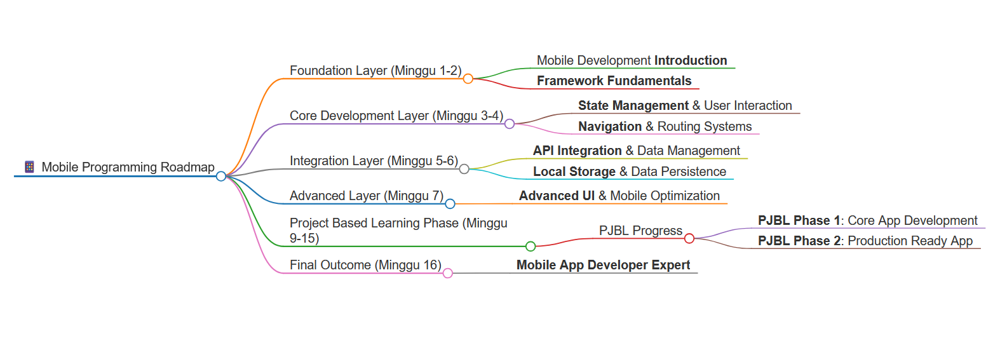

# RENCANA PEMBELAJARAN SEMESTER (RPS)
## 💻 PROGRAM STUDI SISTEM INFORMASI

---

## 📋 IDENTITAS MATA KULIAH

<table class="main-table">
<tr>
<td class="rps-label-alt">MATA KULIAH</td>
<td class="table-cell bold">PEMROGRAMAN MOBILE</td>
<td class="rps-label-alt" style="width: 120px;">KODE</td>
<td class="table-cell">SI2515045</td>
</tr>
<tr>
<td class="rps-label-alt">DOSEN PENGAMPU</td>
<td class="table-cell">Aidil Saputra Kirsan, S.ST., M.Tr.Kom</td>
<td class="rps-label-alt">BOBOT (SKS)</td>
<td class="table-cell">3</td>
</tr>
<tr>
<td class="rps-label-alt">SEMESTER</td>
<td class="table-cell">5-7</td>
<td class="rps-label-alt">TANGGAL PENYUSUNAN</td>
<td class="table-cell">01 Agustus 2025</td>
</tr>
</table>

### OTORISASI

<table class="main-table center">
<thead>
<tr>
<th class="table-header">KOORDINATOR MATA KULIAH</th>
<th class="table-header">PENYUSUN RPS</th>
<th class="table-header">KOORDINATOR PROGRAM STUDI</th>
</tr>
</thead>
<tbody>
<tr>
<td class="table-cell">Aidil Saputra Kirsan, S.ST., M.Tr.Kom</td>
<td class="table-cell">Aidil Saputra Kirsan, S.ST., M.Tr.Kom</td>
<td class="table-cell">Sri Rahayu Natasia, S.Komp, M.Si., M.Sc.</td>
</tr>
</tbody>
</table>

---

## 🎯 CAPAIAN PEMBELAJARAN (CP)

### CAPAIAN PEMBELAJARAN LULUSAN (CPL)
> Mampu membangun sistem informasi untuk mencapai tujuan organisasi dengan menggunakan berbagai metodologi pengembangan sistem, alat pemodelan sistem, dan analisa kebutuhan pengguna

### CAPAIAN PEMBELAJARAN MATA KULIAH (CPMK)
> Mampu merancang dan mengembangkan aplikasi mobile multi-platform dengan fitur navigasi, integrasi API, dan autentikasi, serta melakukan optimisasi dan deployment ke Play Store atau App Store **(C5)**

---

## 📊 METODE PENILAIAN & SUB-CPMK MAPPING

<table class="main-table">
<thead>
<tr>
<th class="table-header" style="width: 150px;">Komponen Penilaian</th>
<th class="table-header center" style="width: 50px;">%</th>
<th class="table-header center" style="width: 50px;">1</th>
<th class="table-header center" style="width: 50px;">2</th>
<th class="table-header center" style="width: 50px;">3</th>
<th class="table-header center" style="width: 50px;">4</th>
<th class="table-header center" style="width: 50px;">5</th>
<th class="table-header center" style="width: 50px;">6</th>
<th class="table-header center" style="width: 50px;">7</th>
<th class="table-header center" style="width: 50px;">8</th>
</tr>
<tr>
<th class="table-subheader" colspan="2">Sub-CPMK</th>
<th class="table-subheader">1</th>
<th class="table-subheader">2</th>
<th class="table-subheader">3</th>
<th class="table-subheader">4</th>
<th class="table-subheader">5</th>
<th class="table-subheader">6</th>
<th class="table-subheader">7</th>
<th class="table-subheader">8</th>
</tr>
</thead>
<tbody>
<tr>
<td class="table-cell">Tugas 1 - Mobile development introduction & environment</td>
<td class="table-cell center bold">15%</td>
<td class="table-cell center">✓</td>
<td class="table-cell center">—</td>
<td class="table-cell center">—</td>
<td class="table-cell center">—</td>
<td class="table-cell center">—</td>
<td class="table-cell center">—</td>
<td class="table-cell center">—</td>
<td class="table-cell center">—</td>
</tr>
<tr>
<td class="table-cell-alt">Tugas 2 - Framework fundamentals implementation</td>
<td class="table-cell-alt center bold">—</td>
<td class="table-cell-alt center">—</td>
<td class="table-cell-alt center">✓</td>
<td class="table-cell-alt center">—</td>
<td class="table-cell-alt center">—</td>
<td class="table-cell-alt center">—</td>
<td class="table-cell-alt center">—</td>
<td class="table-cell-alt center">—</td>
<td class="table-cell-alt center">—</td>
</tr>
<tr>
<td class="table-cell">Tugas 3 - State management & user interaction</td>
<td class="table-cell center bold">—</td>
<td class="table-cell center">—</td>
<td class="table-cell center">—</td>
<td class="table-cell center">✓</td>
<td class="table-cell center">—</td>
<td class="table-cell center">—</td>
<td class="table-cell center">—</td>
<td class="table-cell center">—</td>
<td class="table-cell center">—</td>
</tr>
<tr>
<td class="table-cell-alt">Tugas 4 - Navigation & routing systems</td>
<td class="table-cell-alt center bold">—</td>
<td class="table-cell-alt center">—</td>
<td class="table-cell-alt center">—</td>
<td class="table-cell-alt center">—</td>
<td class="table-cell-alt center">✓</td>
<td class="table-cell-alt center">—</td>
<td class="table-cell-alt center">—</td>
<td class="table-cell-alt center">—</td>
<td class="table-cell-alt center">—</td>
</tr>
<tr>
<td class="table-cell">Tugas 5 - API integration & data management</td>
<td class="table-cell center bold">—</td>
<td class="table-cell center">—</td>
<td class="table-cell center">—</td>
<td class="table-cell center">—</td>
<td class="table-cell center">—</td>
<td class="table-cell center">✓</td>
<td class="table-cell center">—</td>
<td class="table-cell center">—</td>
<td class="table-cell center">—</td>
</tr>
<tr>
<td class="table-cell-alt">Tugas 6 - Local storage & data persistence</td>
<td class="table-cell-alt center bold">—</td>
<td class="table-cell-alt center">—</td>
<td class="table-cell-alt center">—</td>
<td class="table-cell-alt center">—</td>
<td class="table-cell-alt center">—</td>
<td class="table-cell-alt center">✓</td>
<td class="table-cell-alt center">—</td>
<td class="table-cell-alt center">—</td>
<td class="table-cell-alt center">—</td>
</tr>
<tr>
<td class="table-cell">Tugas 7 - Advanced UI & mobile optimization</td>
<td class="table-cell center bold">—</td>
<td class="table-cell center">—</td>
<td class="table-cell center">—</td>
<td class="table-cell center">—</td>
<td class="table-cell center">—</td>
<td class="table-cell center">—</td>
<td class="table-cell center">—</td>
<td class="table-cell center">✓</td>
<td class="table-cell center">—</td>
</tr>
<tr>
<td class="table-cell-highlight bold">Peer-Review</td>
<td class="table-cell-highlight center bold">5%</td>
<td class="table-cell-highlight center">—</td>
<td class="table-cell-highlight center">—</td>
<td class="table-cell-highlight center">—</td>
<td class="table-cell-highlight center">—</td>
<td class="table-cell-highlight center">—</td>
<td class="table-cell-highlight center">✓</td>
<td class="table-cell-highlight center">✓</td>
<td class="table-cell-highlight center">✓</td>
</tr>
<tr>
<td class="table-cell bold">UTS</td>
<td class="table-cell center bold">10%</td>
<td class="table-cell center">✓</td>
<td class="table-cell center">✓</td>
<td class="table-cell center">✓</td>
<td class="table-cell center">✓</td>
<td class="table-cell center">—</td>
<td class="table-cell center">—</td>
<td class="table-cell center">—</td>
<td class="table-cell center">—</td>
</tr>
<tr>
<td class="table-cell-alt bold">UAS (Proyek PJBL)</td>
<td class="table-cell-alt center bold" style="font-size: 16px;">60%</td>
<td class="table-cell-alt center">—</td>
<td class="table-cell-alt center">—</td>
<td class="table-cell-alt center">—</td>
<td class="table-cell-alt center">—</td>
<td class="table-cell-alt center">✓</td>
<td class="table-cell-alt center">✓</td>
<td class="table-cell-alt center">✓</td>
<td class="table-cell-alt center">✓</td>
</tr>
<tr>
<td class="table-cell bold">Praktikum</td>
<td class="table-cell center bold">10%</td>
<td class="table-cell center">—</td>
<td class="table-cell center">✓</td>
<td class="table-cell center">✓</td>
<td class="table-cell center">✓</td>
<td class="table-cell center">✓</td>
<td class="table-cell center">✓</td>
<td class="table-cell center">✓</td>
<td class="table-cell center">✓</td>
</tr>
<tr>
<td class="table-header center bold">TOTAL</td>
<td class="table-header center bold" style="font-size: 18px;">100%</td>
<td class="table-header center">—</td>
<td class="table-header center">—</td>
<td class="table-header center">—</td>
<td class="table-header center">—</td>
<td class="table-header center">—</td>
<td class="table-header center">—</td>
<td class="table-header center">—</td>
<td class="table-header center">—</td>
</tr>
</tbody>
</table>

---

## 📖 DESKRIPSI MATA KULIAH

> Mata kuliah ini membahas konsep, pengembangan, dan implementasi aplikasi mobile multi-platform dengan fokus pada navigasi, state management, integrasi API, autentikasi, dan optimisasi untuk deployment ke platform mobile store.

## 📚 BAHAN KAJIAN

1. **Pengenalan Pemrograman Mobile**
2. **Dasar-Dasar Framework** 
3. **Navigasi dan Routing di Mobile**
4. **State Management untuk Mobile Apps**
5. **Integrasi dengan API dan Database**
6. **Autentikasi di Aplikasi Mobile**
7. **Fitur Mobile Khusus**
8. **Optimisasi Aplikasi Mobile**

## 🗺️ PETA KOMPETENSI

## 📅 RENCANA PEMBELAJARAN SEMESTER

### WEEK 1: Mobile Development Introduction & Environment Setup
<table class="rps-table">
<tr>
<td class="rps-header">Sub-CPMK (1)</td>
<td class="rps-header">Mahasiswa mampu memahami konsep mobile development dan melakukan setup environment untuk pengembangan aplikasi mobile <strong>(C3, A1)</strong></td>
</tr>
<tr>
<td class="rps-label-alt">Bahan Kajian</td>
<td class="rps-content">Kontrak kuliah, Pengenalan Pemrograman Mobile (mobile platforms overview, development environment setup)</td>
</tr>
<tr>
<td class="rps-label">Metode</td>
<td class="rps-content">Kuliah, Diskusi, Pre-test</td>
</tr>
<tr>
<td class="rps-label-alt">Online</td>
<td class="rps-content"><strong>LMS Tugas 1:</strong> Mobile development introduction & environment</td>
</tr>
<tr>
<td class="rps-label">Offline</td>
<td class="rps-content"><strong>[K]:</strong> Pemaparan materi, diskusi <strong>[P]:</strong> praktikum environment setup & "Hello World" app</td>
</tr>
<tr>
<td class="rps-label-alt">Penilaian</td>
<td class="rps-content"><strong>Kriteria:</strong> Tugas | <strong>Indikator:</strong> Ketepatan dalam memahami konsep mobile development dan setup environment</td>
</tr>
<tr>
<td class="rps-label">Durasi</td>
<td class="rps-content"><strong>Tatap Muka:</strong> 100 menit | <strong>Praktikum:</strong> 170 menit | <strong>Tugas & Mandiri:</strong> 240 menit</td>
</tr>
</table>

### WEEK 2: Framework Fundamentals Implementation
<table class="rps-table">
<tr>
<td class="rps-header">Sub-CPMK (2)</td>
<td class="rps-header">Mahasiswa mampu mengaplikasikan dasar-dasar framework mobile untuk membuat komponen UI sederhana <strong>(C3, A1, P2)</strong></td>
</tr>
<tr>
<td class="rps-label-alt">Bahan Kajian</td>
<td class="rps-content">Dasar-Dasar Framework (core components, styling, layout systems)</td>
</tr>
<tr>
<td class="rps-label">Metode</td>
<td class="rps-content">Kuliah, Diskusi, Praktikum, Pre-test</td>
</tr>
<tr>
<td class="rps-label-alt">Online</td>
<td class="rps-content"><strong>LMS Tugas 2:</strong> Framework fundamentals implementation</td>
</tr>
<tr>
<td class="rps-label">Offline</td>
<td class="rps-content"><strong>[K]:</strong> Pemaparan materi, diskusi <strong>[P]:</strong> praktikum UI components & styling</td>
</tr>
<tr>
<td class="rps-label-alt">Penilaian</td>
<td class="rps-content"><strong>Kriteria:</strong> Tugas, Praktikum | <strong>Indikator:</strong> Ketepatan dalam mengaplikasikan framework fundamentals</td>
</tr>
<tr>
<td class="rps-label">Durasi</td>
<td class="rps-content"><strong>Tatap Muka:</strong> 100 menit | <strong>Praktikum:</strong> 170 menit | <strong>Tugas & Mandiri:</strong> 240 menit</td>
</tr>
</table>

### WEEK 3: State Management & User Interaction
<table class="rps-table">
<tr>
<td class="rps-header">Sub-CPMK (3)</td>
<td class="rps-header">Mahasiswa mampu mengimplementasikan state management dan user interaction dalam aplikasi mobile <strong>(C3, A4, P2)</strong></td>
</tr>
<tr>
<td class="rps-label-alt">Bahan Kajian</td>
<td class="rps-content">State Management untuk Mobile Apps (state handling, user input, form validation)</td>
</tr>
<tr>
<td class="rps-label">Metode</td>
<td class="rps-content">Kuliah, Diskusi, Praktikum, Pre-test</td>
</tr>
<tr>
<td class="rps-label-alt">Online</td>
<td class="rps-content"><strong>LMS Tugas 3:</strong> State management & user interaction</td>
</tr>
<tr>
<td class="rps-label">Offline</td>
<td class="rps-content"><strong>[K]:</strong> Pemaparan materi, diskusi <strong>[P]:</strong> praktikum state management & interactive forms</td>
</tr>
<tr>
<td class="rps-label-alt">Penilaian</td>
<td class="rps-content"><strong>Kriteria:</strong> Tugas, Praktikum | <strong>Indikator:</strong> Ketepatan dalam mengimplementasikan state management dan user interaction</td>
</tr>
<tr>
<td class="rps-label">Durasi</td>
<td class="rps-content"><strong>Tatap Muka:</strong> 100 menit | <strong>Praktikum:</strong> 170 menit | <strong>Tugas & Mandiri:</strong> 240 menit</td>
</tr>
</table>

### WEEK 4: Navigation & Routing Systems
<table class="rps-table">
<tr>
<td class="rps-header">Sub-CPMK (4)</td>
<td class="rps-header">Mahasiswa mampu mengimplementasikan sistem navigasi dan routing untuk aplikasi multi-screen <strong>(C3, A4)</strong></td>
</tr>
<tr>
<td class="rps-label-alt">Bahan Kajian</td>
<td class="rps-content">Navigasi dan Routing di Mobile (screen navigation, routing systems, navigation patterns)</td>
</tr>
<tr>
<td class="rps-label">Metode</td>
<td class="rps-content">Kuliah, Diskusi, Praktikum</td>
</tr>
<tr>
<td class="rps-label-alt">Online</td>
<td class="rps-content"><strong>LMS Tugas 4:</strong> Navigation & routing systems</td>
</tr>
<tr>
<td class="rps-label">Offline</td>
<td class="rps-content"><strong>[K]:</strong> Pemaparan materi, diskusi <strong>[P]:</strong> praktikum multi-screen navigation</td>
</tr>
<tr>
<td class="rps-label-alt">Penilaian</td>
<td class="rps-content"><strong>Kriteria:</strong> Tugas, Praktikum | <strong>Indikator:</strong> Ketepatan dalam mengimplementasikan navigation & routing</td>
</tr>
<tr>
<td class="rps-label">Durasi</td>
<td class="rps-content"><strong>Tatap Muka:</strong> 100 menit | <strong>Praktikum:</strong> 170 menit | <strong>Tugas & Mandiri:</strong> 240 menit</td>
</tr>
</table>

### WEEK 5: API Integration & Data Management
<table class="rps-table">
<tr>
<td class="rps-header">Sub-CPMK (5)</td>
<td class="rps-header">Mahasiswa mampu mengintegrasikan API external dan mengelola data asynchronous <strong>(C3, A4)</strong></td>
</tr>
<tr>
<td class="rps-label-alt">Bahan Kajian</td>
<td class="rps-content">Integrasi dengan API dan Database (API integration, async data handling, error management)</td>
</tr>
<tr>
<td class="rps-label">Metode</td>
<td class="rps-content">Kuliah, Diskusi, Praktikum</td>
</tr>
<tr>
<td class="rps-label-alt">Online</td>
<td class="rps-content"><strong>LMS Tugas 5:</strong> API integration & data management</td>
</tr>
<tr>
<td class="rps-label">Offline</td>
<td class="rps-content"><strong>[K]:</strong> Pemaparan materi, diskusi <strong>[P]:</strong> praktikum API integration & data fetching</td>
</tr>
<tr>
<td class="rps-label-alt">Penilaian</td>
<td class="rps-content"><strong>Kriteria:</strong> Tugas, Praktikum | <strong>Indikator:</strong> Ketepatan dalam mengintegrasikan API dan mengelola data</td>
</tr>
<tr>
<td class="rps-label">Durasi</td>
<td class="rps-content"><strong>Tatap Muka:</strong> 100 menit | <strong>Praktikum:</strong> 170 menit | <strong>Tugas & Mandiri:</strong> 240 menit</td>
</tr>
</table>

### WEEK 6: Local Storage & Data Persistence
<table class="rps-table">
<tr>
<td class="rps-header">Sub-CPMK (6)</td>
<td class="rps-header">Mahasiswa mampu mengimplementasikan local storage dan data persistence untuk offline capability <strong>(C3, A4)</strong></td>
</tr>
<tr>
<td class="rps-label-alt">Bahan Kajian</td>
<td class="rps-content">Integrasi dengan API dan Database (local storage, data persistence, offline functionality)</td>
</tr>
<tr>
<td class="rps-label">Metode</td>
<td class="rps-content">Kuliah, Diskusi, Praktikum</td>
</tr>
<tr>
<td class="rps-label-alt">Online</td>
<td class="rps-content"><strong>LMS Tugas 6:</strong> Local storage & data persistence</td>
</tr>
<tr>
<td class="rps-label">Offline</td>
<td class="rps-content"><strong>[K]:</strong> Pemaparan materi, diskusi <strong>[P]:</strong> praktikum local storage & offline functionality</td>
</tr>
<tr>
<td class="rps-label-alt">Penilaian</td>
<td class="rps-content"><strong>Kriteria:</strong> Tugas, Praktikum | <strong>Indikator:</strong> Ketepatan dalam mengimplementasikan local storage dan data persistence</td>
</tr>
<tr>
<td class="rps-label">Durasi</td>
<td class="rps-content"><strong>Tatap Muka:</strong> 100 menit | <strong>Praktikum:</strong> 170 menit | <strong>Tugas & Mandiri:</strong> 240 menit</td>
</tr>
</table>

### WEEK 7: Advanced UI & Mobile Optimization
<table class="rps-table">
<tr>
<td class="rps-header">Sub-CPMK (7)</td>
<td class="rps-header">Mahasiswa mampu membuat advanced UI dengan optimisasi performa untuk aplikasi mobile <strong>(C3, A4)</strong></td>
</tr>
<tr>
<td class="rps-label-alt">Bahan Kajian</td>
<td class="rps-content">Optimisasi Aplikasi Mobile (advanced UI design, animations, performance optimization)</td>
</tr>
<tr>
<td class="rps-label">Metode</td>
<td class="rps-content">Kuliah, Diskusi, Praktikum</td>
</tr>
<tr>
<td class="rps-label-alt">Online</td>
<td class="rps-content"><strong>LMS Tugas 7:</strong> Advanced UI & mobile optimization</td>
</tr>
<tr>
<td class="rps-label">Offline</td>
<td class="rps-content"><strong>[K]:</strong> Pemaparan materi, diskusi <strong>[P]:</strong> praktikum advanced UI & optimization techniques</td>
</tr>
<tr>
<td class="rps-label-alt">Penilaian</td>
<td class="rps-content"><strong>Kriteria:</strong> Tugas, Praktikum | <strong>Indikator:</strong> Ketepatan dalam membuat advanced UI dan optimisasi mobile</td>
</tr>
<tr>
<td class="rps-label">Durasi</td>
<td class="rps-content"><strong>Tatap Muka:</strong> 100 menit | <strong>Praktikum:</strong> 170 menit | <strong>Tugas & Mandiri:</strong> 240 menit</td>
</tr>
</table>

### WEEK 8: UTS

<strong>🎯 Evaluasi mencakup semua materi dari Week 1-7 dalam bentuk ujian praktik terintegrasi.</strong>

---

## 🚀 PROJECT BASED LEARNING PHASE

### WEEK 9: Project Planning & Team Formation
<table class="rps-table">
<tr>
<td class="rps-header">Sub-CPMK (8)</td>
<td class="rps-header">Mahasiswa mampu merencanakan dan merancang project aplikasi mobile dengan tim <strong>(C3)</strong></td>
</tr>
<tr>
<td class="rps-label-alt">Bahan Kajian</td>
<td class="rps-content">Project management methodologies, mobile app design planning</td>
</tr>
<tr>
<td class="rps-label">Metode</td>
<td class="rps-content">Kuliah, Diskusi, <strong>(Project Based Learning)</strong></td>
</tr>
<tr>
<td class="rps-label-alt">Penilaian</td>
<td class="rps-content"><strong>Kriteria:</strong> Project proposal | <strong>Indikator:</strong> Kualitas perencanaan dan desain project</td>
</tr>
<tr>
<td class="rps-label">Durasi</td>
<td class="rps-content"><strong>Tatap Muka:</strong> 100 menit | <strong>Praktikum:</strong> 170 menit | <strong>Tugas & Mandiri:</strong> 240 menit</td>
</tr>
</table>

### WEEK 10-11: Core Features Development
<table class="rps-table">
<tr>
<td class="rps-header">Sub-CPMK (8)</td>
<td class="rps-header">Mahasiswa mampu mengimplementasikan authentication dan core features aplikasi mobile <strong>(C3)</strong></td>
</tr>
<tr>
<td class="rps-label-alt">Bahan Kajian</td>
<td class="rps-content">Autentikasi di Aplikasi Mobile (user authentication, authorization, secure login systems)</td>
</tr>
<tr>
<td class="rps-label">Metode</td>
<td class="rps-content">Kuliah, Diskusi, Praktikum, <strong>(Project Based Learning)</strong></td>
</tr>
<tr>
<td class="rps-label-alt">Offline</td>
<td class="rps-content"><strong>[K]:</strong> Pemaparan materi, diskusi, <strong>Progress Projek 1</strong> <strong>[P]:</strong> praktikum authentication implementation</td>
</tr>
<tr>
<td class="rps-label">Durasi</td>
<td class="rps-content"><strong>Tatap Muka:</strong> 100 menit | <strong>Praktikum:</strong> 170 menit | <strong>Tugas & Mandiri:</strong> 240 menit</td>
</tr>
</table>

### WEEK 12: Integration & Testing
<table class="rps-table">
<tr>
<td class="rps-header">Sub-CPMK (8)</td>
<td class="rps-header">Mahasiswa mampu mengintegrasikan semua komponen aplikasi dan melakukan testing <strong>(C3)</strong></td>
</tr>
<tr>
<td class="rps-label-alt">Bahan Kajian</td>
<td class="rps-content">Integrasi dengan API dan Database (integration testing, end-to-end testing)</td>
</tr>
<tr>
<td class="rps-label">Metode</td>
<td class="rps-content">Praktikum, <strong>(Project Based Learning)</strong></td>
</tr>
<tr>
<td class="rps-label-alt">Durasi</td>
<td class="rps-content"><strong>Tatap Muka:</strong> 100 menit | <strong>Praktikum:</strong> 170 menit | <strong>Tugas & Mandiri:</strong> 240 menit</td>
</tr>
</table>

### WEEK 13-14: Advanced Features & Native Mobile Features
<table class="rps-table">
<tr>
<td class="rps-header">Sub-CPMK (8)</td>
<td class="rps-header">Mahasiswa mampu mengimplementasikan fitur mobile khusus dan advanced features <strong>(C3, A4, P2)</strong></td>
</tr>
<tr>
<td class="rps-label-alt">Bahan Kajian</td>
<td class="rps-content">Fitur Mobile Khusus (camera integration, notifications, device sensors, location services)</td>
</tr>
<tr>
<td class="rps-label">Metode</td>
<td class="rps-content">Kuliah, Diskusi, Praktikum, <strong>(Project Based Learning)</strong></td>
</tr>
<tr>
<td class="rps-label-alt">Offline</td>
<td class="rps-content"><strong>[K]:</strong> Pemaparan materi, diskusi, <strong>Progress Projek 2</strong> <strong>[P]:</strong> praktikum native features implementation</td>
</tr>
<tr>
<td class="rps-label">Durasi</td>
<td class="rps-content"><strong>Tatap Muka:</strong> 100 menit | <strong>Praktikum:</strong> 170 menit | <strong>Tugas & Mandiri:</strong> 240 menit</td>
</tr>
</table>

### WEEK 15: App Store Deployment & Final Optimization
<table class="rps-table">
<tr>
<td class="rps-header">Sub-CPMK (8)</td>
<td class="rps-header">Mahasiswa mampu melakukan optimisasi final dan mempersiapkan deployment ke app store <strong>(C3, A4, P2)</strong></td>
</tr>
<tr>
<td class="rps-label-alt">Bahan Kajian</td>
<td class="rps-content">Optimisasi Aplikasi Mobile (performance tuning, app store deployment, production optimization)</td>
</tr>
<tr>
<td class="rps-label">Metode</td>
<td class="rps-content">Kuliah, Diskusi, Praktikum, <strong>(Project Based Learning)</strong></td>
</tr>
<tr>
<td class="rps-label-alt">Offline</td>
<td class="rps-content"><strong>[K]:</strong> Pemaparan materi, diskusi, <strong>Final Project Preparation</strong> <strong>[P]:</strong> praktikum deployment preparation</td>
</tr>
<tr>
<td class="rps-label">Durasi</td>
<td class="rps-content"><strong>Tatap Muka:</strong> 100 menit | <strong>Praktikum:</strong> 170 menit | <strong>Tugas & Mandiri:</strong> 240 menit</td>
</tr>
</table>

### WEEK 16: UAS

<strong>🏆 Evaluasi komprehensif melalui presentasi dan demonstrasi Proyek Akhir Mobile Application.</strong>

## 📊 KOMPOSISI NILAI EVALUASI

<table class="main-table">
<thead>
<tr>
<th class="table-header" style="text-align: left;">Komponen</th>
<th class="table-header center">Persentase</th>
<th class="table-header" style="text-align: left;">Detail</th>
</tr>
</thead>
<tbody>
<tr>
<td class="table-cell bold">Praktikum</td>
<td class="table-cell center bold" style="font-size: 16px;">10%</td>
<td class="table-cell">Implementasi hands-on setiap minggu</td>
</tr>
<tr>
<td class="table-cell-alt bold">Peer-Review</td>
<td class="table-cell-alt center bold" style="font-size: 16px;">5%</td>
<td class="table-cell-alt">Evaluasi kolaboratif antar mahasiswa</td>
</tr>
<tr>
<td class="table-cell-highlight bold">Perkuliahan</td>
<td class="table-cell-highlight center bold" style="font-size: 18px;">85%</td>
<td class="table-cell-highlight">Komponen utama penilaian</td>
</tr>
<tr>
<td class="table-cell" style="padding-left: 30px;">├── Tugas</td>
<td class="table-cell center bold">15%</td>
<td class="table-cell">7 tugas terstruktur</td>
</tr>
<tr>
<td class="table-cell-alt" style="padding-left: 30px;">├── UTS</td>
<td class="table-cell-alt center bold">10%</td>
<td class="table-cell-alt">Evaluasi tengah semester</td>
</tr>
<tr>
<td class="table-cell-final bold" style="padding-left: 30px;">└── UAS (Proyek PJBL)</td>
<td class="table-cell-final center bold" style="font-size: 18px;">60%</td>
<td class="table-cell-final bold">Project Based Learning</td>
</tr>
</tbody>
</table>

## SKALA PENILAIAN
<table class="main-table">
<thead>
<tr>
<th class="table-header">Nilai Angka</th>
<th class="table-header">Nilai Huruf</th>
<th class="table-header">Kategori</th>
</tr>
</thead>
<tbody>
<tr>
<td class="table-cell center">86 ≤ Nilai ≤ 100</td>
<td class="table-cell center bold" style="font-size: 16px;">A</td>
<td class="table-cell bold">Sangat Baik</td>
</tr>
<tr>
<td class="table-cell-alt center">76 ≤ Nilai < 86</td>
<td class="table-cell-alt center bold">AB</td>
<td class="table-cell-alt">Baik Sekali</td>
</tr>
<tr>
<td class="table-cell center">66 ≤ Nilai < 76</td>
<td class="table-cell center bold">B</td>
<td class="table-cell">Baik</td>
</tr>
<tr>
<td class="table-cell-alt center">56 ≤ Nilai < 66</td>
<td class="table-cell-alt center bold">BC</td>
<td class="table-cell-alt">Cukup Baik</td>
</tr>
<tr>
<td class="table-cell center">51 ≤ Nilai < 56</td>
<td class="table-cell center bold">C</td>
<td class="table-cell">Cukup</td>
</tr>
<tr>
<td class="table-cell-alt center">41 ≤ Nilai < 51</td>
<td class="table-cell-alt center bold">D</td>
<td class="table-cell-alt">Kurang</td>
</tr>
<tr>
<td class="table-cell center">0 ≤ Nilai < 41</td>
<td class="table-cell center bold">E</td>
<td class="table-cell">Sangat Kurang</td>
</tr>
</tbody>
</table>

---

## 📋 KONTRAK KULIAH

### LARANGAN & SANKSI
- **KECURANGAN** (plagiat, menyontek) → **Nilai 0**
- **MANIPULASI PRESENSI** → **Tidak Lulus**

### KETENTUAN PRESENSI
- **Online**: E-Learning (30 menit pertama)
- **Offline**: Tertulis di kelas
- **Syarat**: Baca RPS untuk akses online
- **Keterlambatan**: Diperbolehkan tanpa gaduh
- **Minimum**: 70% kehadiran untuk UAS

### KERJA KELOMPOK
- **Tidak hadir presentasi** → **Nilai 0**
- **Tidak aktif** → **Maksimal -50% nilai kelompok**
- **Izin sakit/izin**: Upload surat dalam 1 minggu

## 📊 RUBRIK PENILAIAN TUGAS (15% Total Nilai)

<table class="main-table">
<thead>
<tr>
<th class="table-header" style="text-align: left;">Aktivitas</th>
<th class="table-header center" style="width: 80px;">%</th>
<th class="table-header center">51-56 (C)</th>
<th class="table-header center">56-66 (BC)</th>
<th class="table-header center">66-76 (B)</th>
<th class="table-header center">76-86 (AB)</th>
<th class="table-header center">86-100 (A)</th>
</tr>
</thead>
<tbody>
<tr>
<td class="table-cell bold">Mobile Development Introduction</td>
<td class="table-cell center bold">15%</td>
<td class="table-cell center">Tidak mengerjakan</td>
<td class="table-cell center">Tidak sesuai harapan</td>
<td class="table-cell center">Basic understanding</td>
<td class="table-cell center">Good comprehension</td>
<td class="table-cell center">Excellent mastery</td>
</tr>
<tr>
<td class="table-cell-alt bold">Framework Fundamentals</td>
<td class="table-cell-alt center bold">15%</td>
<td class="table-cell-alt center">Tidak mengerjakan</td>
<td class="table-cell-alt center">Tidak sesuai harapan</td>
<td class="table-cell-alt center">Basic components</td>
<td class="table-cell-alt center">Good implementation</td>
<td class="table-cell-alt center">Advanced UI components</td>
</tr>
<tr>
<td class="table-cell bold">State Management & User Interaction</td>
<td class="table-cell center bold">15%</td>
<td class="table-cell center">Tidak mengerjakan</td>
<td class="table-cell center">Tidak sesuai harapan</td>
<td class="table-cell center">Basic state handling</td>
<td class="table-cell center">Interactive forms</td>
<td class="table-cell center">Complex state management</td>
</tr>
<tr>
<td class="table-cell-alt bold">Navigation & Routing Systems</td>
<td class="table-cell-alt center bold">15%</td>
<td class="table-cell-alt center">Tidak mengerjakan</td>
<td class="table-cell-alt center">Tidak sesuai harapan</td>
<td class="table-cell-alt center">Basic navigation</td>
<td class="table-cell-alt center">Multi-screen app</td>
<td class="table-cell-alt center">Advanced routing patterns</td>
</tr>
<tr>
<td class="table-cell bold">API Integration & Data Management</td>
<td class="table-cell center bold">15%</td>
<td class="table-cell center">Tidak mengerjakan</td>
<td class="table-cell center">Tidak sesuai harapan</td>
<td class="table-cell center">Basic API calls</td>
<td class="table-cell center">Data handling</td>
<td class="table-cell center">Error handling & optimization</td>
</tr>
<tr>
<td class="table-cell-alt bold">Local Storage & Data Persistence</td>
<td class="table-cell-alt center bold">15%</td>
<td class="table-cell-alt center">Tidak mengerjakan</td>
<td class="table-cell-alt center">Tidak ada tahapan</td>
<td class="table-cell-alt center">Basic storage</td>
<td class="table-cell-alt center">Data persistence</td>
<td class="table-cell-alt center">Offline functionality</td>
</tr>
<tr>
<td class="table-cell bold">Advanced UI & Mobile Optimization</td>
<td class="table-cell center bold">10%</td>
<td class="table-cell center">Tidak mengerjakan</td>
<td class="table-cell center">Tidak sesuai harapan</td>
<td class="table-cell center">Basic animations</td>
<td class="table-cell center">Good performance</td>
<td class="table-cell center">Optimized mobile experience</td>
</tr>
</tbody>
</table>

---

## 🏆 RUBRIK PENILAIAN UAS/PJBL (60% Total Nilai)

<table class="main-table">
<thead>
<tr>
<th class="table-header" style="text-align: left;">Kriteria</th>
<th class="table-header center" style="width: 80px;">%</th>
<th class="table-header center">51-56 (C)</th>
<th class="table-header center">56-66 (BC)</th>
<th class="table-header center">66-76 (B)</th>
<th class="table-header center">76-86 (AB)</th>
<th class="table-header center">86-100 (A)</th>
</tr>
</thead>
<tbody>
<tr>
<td class="table-cell bold">Mobile App Functionality</td>
<td class="table-cell center bold" style="font-size: 16px;">25%</td>
<td class="table-cell center">Tidak berfungsi</td>
<td class="table-cell center">Basic functionality</td>
<td class="table-cell center">Core features work</td>
<td class="table-cell center">Full functionality</td>
<td class="table-cell center">Advanced features integrated</td>
</tr>
<tr>
<td class="table-cell-alt bold">User Interface & Experience</td>
<td class="table-cell-alt center bold" style="font-size: 16px;">20%</td>
<td class="table-cell-alt center">Poor UI design</td>
<td class="table-cell-alt center">Basic interface</td>
<td class="table-cell-alt center">Good UI design</td>
<td class="table-cell-alt center">Responsive design</td>
<td class="table-cell-alt center">Excellent UX with animations</td>
</tr>
<tr>
<td class="table-cell bold">Navigation & Routing Implementation</td>
<td class="table-cell center bold" style="font-size: 16px;">10%</td>
<td class="table-cell center">No navigation</td>
<td class="table-cell center">Basic navigation</td>
<td class="table-cell center">Multi-screen app</td>
<td class="table-cell center">Smooth navigation</td>
<td class="table-cell center">Advanced routing patterns</td>
</tr>
<tr>
<td class="table-cell-alt bold">API Integration & Data Management</td>
<td class="table-cell-alt center bold" style="font-size: 16px;">15%</td>
<td class="table-cell-alt center">No API integration</td>
<td class="table-cell-alt center">Basic API calls</td>
<td class="table-cell-alt center">Working API integration</td>
<td class="table-cell-alt center">Good data handling</td>
<td class="table-cell-alt center">Optimized data management</td>
</tr>
<tr>
<td class="table-cell bold">Authentication System</td>
<td class="table-cell center bold" style="font-size: 16px;">10%</td>
<td class="table-cell center">No authentication</td>
<td class="table-cell center">Basic login</td>
<td class="table-cell center">User authentication</td>
<td class="table-cell center">Secure authentication</td>
<td class="table-cell center">Advanced auth with roles</td>
</tr>
<tr>
<td class="table-cell-alt bold">Mobile-Specific Features</td>
<td class="table-cell-alt center bold" style="font-size: 16px;">10%</td>
<td class="table-cell-alt center">No mobile features</td>
<td class="table-cell-alt center">Basic mobile features</td>
<td class="table-cell-alt center">Some native features</td>
<td class="table-cell-alt center">Multiple native features</td>
<td class="table-cell-alt center">Advanced mobile capabilities</td>
</tr>
<tr>
<td class="table-cell bold">Performance & Optimization</td>
<td class="table-cell center bold" style="font-size: 16px;">5%</td>
<td class="table-cell center">Poor performance</td>
<td class="table-cell center">Basic performance</td>
<td class="table-cell center">Good performance</td>
<td class="table-cell center">Optimized performance</td>
<td class="table-cell center">Production-ready optimization</td>
</tr>
<tr>
<td class="table-cell-alt bold">Code Quality & Documentation</td>
<td class="table-cell-alt center bold" style="font-size: 16px;">5%</td>
<td class="table-cell-alt center">Poor code quality</td>
<td class="table-cell-alt center">Basic code structure</td>
<td class="table-cell-alt center">Good code organization</td>
<td class="table-cell-alt center">Well-documented code</td>
<td class="table-cell-alt center">Excellent code & documentation</td>
</tr>
</tbody>
</table>

---
<!--

<strong>TM</strong>=Tatap Muka | <strong>PT</strong>=Penugasan Terstruktur | <strong>P</strong>=Praktikum | <strong>BM</strong>=Belajar Mandiri

-->